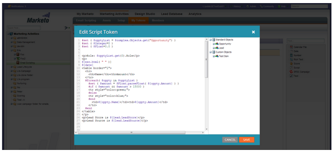
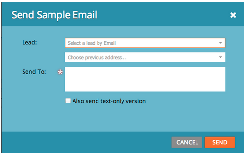

# 릴리스 정보: 2013년 9월 {#release-notes-september}

9월 릴리스에는 다음 기능이 포함되어 있습니다.

## 짧은 URL {#shorter-urls}

이메일 URL은 모든 추적 기능을 유지하면서 수신자에게 친숙한 클릭 트리밍이 제공되었습니다

>[!CAUTION]
>
>짧은 URL로 전환하면 9월 릴리스 이전에 전송된 이메일의 링크는 이 릴리스 이후 90일 후에 만료됩니다.

Marketo 사용자 지정 개체의 데이터를 사용하거나 Velocity 템플릿 언어를 사용하여 이메일 콘텐츠에 조건부 논리를 추가하십시오.

## 테스트 보내기를 샘플 보내기로 변경 {#change-send-test-to-send-sample}

테스트 보내기 작업의 이름을 샘플 보내기로 변경했습니다.

## 개인화된 [!UICONTROL Send Sample Email] {#personalized-send-sample-email}

이메일 샘플을 보낼 때 잠재 고객의 이름을 선택하여 샘플 이메일을 개인화할 수 있습니다.

## [!DNL GoToWebinar]에 대한 추가 필드 동기화 {#additional-field-sync-for-gotowebinar}

Marketo 양식에서 회사 이름 및 직함을 [!DNL GoToWebinar]&#x200B;(으)로 동기화할 수 있습니다. 이러한 추가 필드를 활성화하려면 이벤트 파트너로 이동하여 &quot;추가 필드 활성화&quot;를 선택하십시오.

## SSO로만 사용자 로그인 제한 {#restrict-user-login-to-sso-only}

구독을 구성하여 Marketo 사용자가 SSO를 통해 로그인하고 일반 로그인 화면을 통하지 않도록 합니다.

## 업로드된 파일의 바이러스 검사 {#virus-scan-of-uploaded-files}

이제 Design Studio에 업로드된 파일이 바이러스에 감염된 경우 자동으로 검사되고 차단됩니다

## 영업 기회 영향 분석기 내보내기 {#export-opportunity-influence-analyzer}

이제 영업 기회 영향 분석기의 데이터를 [!DNL Excel]&#x200B;(으)로 내보낼 수 있습니다. 내보낸 각 [!DNL Excel] 파일에는 분석기에서 선택한 계정에 속한 모든 기회뿐만 아니라 모든 잠재 고객(기회에 역할이 없는 고객 포함)에 대한 모든 마케팅 상호 작용이 포함되어 있습니다. 영업 기회 행은 녹색으로 강조 표시됩니다. 특정 리드 또는 마케팅 활동에 집중해야 하는 경우 [!DNL Excel]의 기본 데이터 필터링 기능을 사용할 수 있습니다.

## 프로그램 속성 설정 {#program-attribution-settings}

계정 기반 속성을 수행하는 기능을 포함하여 첫 번째 및 다중 터치 속성 지표에 대해 Marketo이 연락처와 기회를 연결하는 방식을 변경할 수 있습니다. 이러한 설정은 프로그램 영업 기회 분석 영역 및 영업 기회 분석 영역 아래의 [!UICONTROL Revenue Explorer] 보고서에 있는 속성 지표에 영향을 줍니다. 이는 프로그램 분석기의 속성 지표에도 영향을 줍니다.

프로그램 속성 설정을 세 가지 선택 사항 중 하나로 변경할 수 있습니다. 이 설정을 변경해도 Marketo 또는 CRM 데이터는 수정되지 않습니다. 보고서가 실행되는 방식만 변경하면 언제든지 되돌릴 수 있습니다.

명시적 설정은 역할이 있는 연락처(현재 동작)만 검사합니다. 암시적 은 역할에 관계없이 계정과 연결된 모든 연락처를 검사합니다. 가능하면 명시적 모드를 사용하는 것이 좋습니다. 암시적 사용을 사용하면 기회에 실질적인 영향력이 없음에도 불구하고 기회에 대한 신용을 가진 사람들이 거짓 긍정을 만들 수 있다.

## 프랑스어 및 독일어로 사용 가능한 [!UICONTROL Sales Insight]&#x200B;([!DNL Salesforce]만) {#sales-insight-available-in-french-and-german-salesforce-only}

[!UICONTROL Sales Insight]에서 최신 버전의 Marketo 리드 관리 및 Marketo [!DNL AppExchange]을(를) 다운로드하면 프랑스어 및 독일어 영업 사원이 선호하는 언어로 [!UICONTROL Sales Insight] 콘텐츠를 볼 수 있습니다.

## 코발트 사용자 인터페이스 {#cobalt-user-interface}

다음 몇 달 동안 애플리케이션의 여러 부분에서 새로운 테마가 롤아웃됩니다. 이번 달에는 더 많은 파란색 모달 창이 표시될 수 있습니다.
