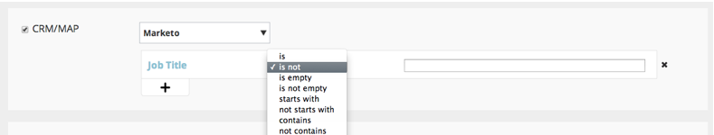

# 릴리스 정보: 2014년 8월 {#release-notes-august}

다음 기능은 2014년 8월 릴리스에 포함되어 있습니다. Marketo 버전에서 사용 가능한 기능이 있는지 확인하십시오. 자세한 기능 설명서에 대한 링크를 보려면 릴리스 이후 다시 돌아오십시오.

## 마케팅 캘린더 라이선스 {#marketing-calendar-licenses}

2014년 9월 5일 이후에는 5명의 사용자만 마케팅 캘린더에 무료로 액세스할 수 있습니다. 그 전에 선택한 사용자에게 마케팅 일정 라이선스를 [발급/취소](/help/marketo/product-docs/core-marketo-concepts/marketing-calendar/understanding-the-calendar/issue-revoke-a-marketing-calendar-license.md)하여 계속 액세스하십시오.

## 새 사용자 권한 {#new-user-permissions}

다음과 같은 새 사용자 권한이 추가되었습니다.

| 사용 권한 | 설명 |
|---|---|
| 매출 탐색기 액세스 | RCA를 구매한 경우 이제 액세스할 수 있는 사용자를 제어합니다. |
| 목록 가져오기 | 목록을 리드 데이터베이스로 가져오지 않도록 사용자를 제한합니다. |
| 목록 가져오기 | 마케팅 활동에서 프로그램을 통해 목록을 가져오지 못하도록 사용자를 제한합니다. |
| 트리거 캠페인 활성화 | 트리거 캠페인을 활성화할 수 있고 활성화할 수 없는 사용자를 제어합니다. |
| 배치 캠페인 예약 | 배치 캠페인 실행을 예약할 수 있는 사용자와 예약할 수 없는 사용자를 제어합니다. |

## [!UICONTROL Admin]에서 사용자 및 역할 내보내기 {#export-users-and-roles-from-admin}

이제 Marketo에서 [사용자 및 역할 목록을 내보내기](/help/marketo/product-docs/administration/users-and-roles/export-a-list-of-users-and-roles.md)할 수 있습니다. 내보내기에 포함할 &quot;마지막 로그인&quot; 타임스탬프를 포함할 수도 있습니다.

## 채널 및 태그 삭제 {#delete-channels-and-tags}

이제 사용하지 않는 채널 및 상태를 삭제할 수 있습니다. 항상 그렇듯이 현재 사용 중인 하나만 숨길 수 있습니다.

## 자동화된 [!DNL DKIM] {#automated-dkim}

게재 기능을 개선하기 위해 모든 발신 전자 메일은 [!DNL DKIM]&#x200B;(DomainKeys Identified Mail)이(가) 서명됩니다. 기본적으로 전자 메일은 Marketo의 공유 [!DNL DKIM] 서명을 사용합니다. 이 서명을 사용자 지정할 수 있습니다.

>[!NOTE]
>
>[!DNL DKIM]이(가) 느리게 롤아웃됩니다. 몇 주 동안 표시되지 않을 수 있습니다.

## 실시간 Personalization 업데이트 {#real-time-personalization-updates}

하트 콘텐츠에 태그를 지정할 수 있도록 캠페인 페이지에 레이블을 추가했습니다.

## 모바일 타깃팅 {#mobile-targeting}

커뮤니티에 문의했고 배달을 했습니다! 이제 모바일 및 태블릿 사용자를 위한 특정 call to action을 포함, 제외 또는 설정할 수 있습니다.

## 향상된 1:1 세분화 및 타깃팅 {#enhanced-segmentation-and-targeting}

이제 알려진 방문자를 타깃팅하는 데 고급 필터 연산자를 사용할 수 있습니다.

## 캠페인 공유 {#campaign-sharing}

이제 RTP Campaign 미리 보기 링크를 빠르고 쉽게 공유할 수 있습니다.

## 콘텐츠 추천 엔진 보고서 {#content-recommendation-engine-report}

멋진 요약을 볼 수 있도록 새 콘텐츠 추천 엔진 보고서가 추가되었습니다.

## 향상된 사용자 관리 {#enhanced-user-administration}

이제 관리자 사용자는 여러 번 로그인 실패 때문에 사용자를 잠글 수 있습니다. 원하는 경우 해당 사용자의 잠금을 해제할 수도 있습니다.

## 추적 제어 {#tracking-control}

이제 Real-Time Personalization에서 특정 IP를 모든 추적 및 보고에서 제외할 수 있습니다.

