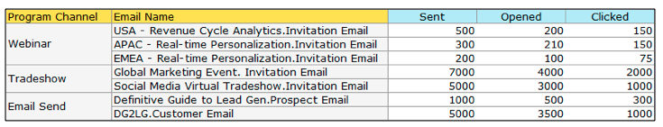

# 릴리스 정보: 2014년 2월 {#release-notes-february}

다음 기능은 2014년 2월 릴리스에 포함되어 있습니다. Marketo 버전에서 사용 가능한 기능이 있는지 확인하십시오. 릴리스 후에 다시 돌아와 각 기능에 대한 자세한 기술 자료 문서에 대한 링크를 찾으십시오.

## 우승 기준으로 [!UICONTROL Engagement Score] {#engagement-score-as-winning-criteria}

[참여 점수를 사용](/help/marketo/product-docs/email-marketing/email-programs/email-program-actions/email-test-a-b-test/define-the-a-b-test-winner-criteria.md)하여 A/B 분할 테스트 또는 챔피언/챌린저 테스트에서 채택 변형을 결정하십시오. 적절한 참여 점수를 부여하려면 테스트를 최소 24시간 실행해야 합니다.

## 전자 메일 프로그램 [!UICONTROL Results] 탭 {#email-program-results-tab}

전자 메일 프로그램에 대해 기록된 [결과를 봅니다](/help/marketo/product-docs/email-marketing/email-programs/email-program-data/view-email-program-results.md).

## 메일링이 차단된 사용자/[!UICONTROL Leads]명 {#people-leads-blocked-from-mailing}

[메일링이 차단된 사람/잠재 고객](/help/marketo/product-docs/email-marketing/email-programs/managing-people-in-email-programs/define-an-audience-with-a-smart-list.md) 번호를 클릭하여 구독 취소되거나, 블랙리스트에 등록되거나, 이메일 주소가 잘못되었거나 비어 있거나, 마케팅이 일시 중단되어 이메일을 받지 못할 사용자를 확인하십시오.

## 이메일 프로그램 데이터 내보내기 {#export-email-program-data}

AB 테스트 변형 데이터를 포함하여 [전자 메일 지표를  [!DNL Excel]](/help/marketo/product-docs/email-marketing/email-programs/email-program-data/export-email-program-dashboard-to-excel.md)에 내보냅니다.

## [!UICONTROL Engagement Score] 보고서의 [!UICONTROL Engagement Stream Performance] {#engagement-score-in-engagement-stream-performance-report}

참여 프로그램의 콘텐츠가 얼마나 효과적인지 확인하는 데 도움이 되도록 [[!UICONTROL Engagement Stream Performance] 보고서](/help/marketo/product-docs/email-marketing/drip-nurturing/reports-and-notifications/engagement-stream-performance-report.md)에 참여 점수를 추가했습니다.

## 이메일 분석의 프로그램 세부 정보 {#program-details-in-email-analysis}

[이제 전자 메일 지표를 프로그램 이름, 채널 및 태그로 그룹화할 수 있습니다](/help/marketo/product-docs/reporting/revenue-cycle-analytics/email-analysis/build-an-email-analysis-report-that-shows-program-information.md). 이메일이 프로그램의 로컬 자산인 경우 프로그램 이름이 이메일 이름 필드에 추가됩니다. 새 프로그램 이름 필드에는 이메일을 보낸 스마트 캠페인의 프로그램 이름이 표시됩니다. 이메일이 다른 프로그램의 로컬 자산인 경우 이메일 이름 필드에 있는 프로그램과 다를 수 있습니다.

## 링크 필터 및 트리거 클릭 업데이트 {#update-to-clicks-link-filters-and-trigger}

다음 필터 및 트리거 이름이 업데이트되었습니다.

* [!UICONTROL Clicks Link on Web Page] 링크 클릭
* [!UICONTROL Clicked Link on Web Page]에 연결된 링크를 클릭함
* [!UICONTROL Not Clicked Link on Web Page]에 대한 링크를 클릭하지 않음

## Forms 2.0 개선 사항 {#forms-enhancements}

이 릴리스에서는 Forms 2.0에 몇 가지 &quot;삶의 질&quot; 업데이트를 제공했습니다. 포함된 양식에 점진적 프로파일링을 사용할 수 있을 뿐만 아니라, [가시성 규칙 포함](/help/marketo/product-docs/demand-generation/forms/form-fields/dynamically-toggle-visibility-of-a-form-field.md), 고급 감사 페이지 및 숨겨진 필드를 포함하는 편집기에서 고급 기능을 더 쉽게 사용할 수 있도록 워크플로 및 UX 변경 사항이 적용되었습니다.

