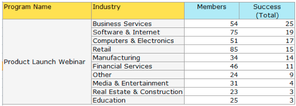

# 릴리스 정보: 2014년 1월 {#release-notes-january}

다음 기능은 2014년 1월 릴리스에 포함되어 있습니다. [Marketo 버전](https://www.marketo.com/pricing/)에서 사용 가능한 기능을 확인하십시오.

## Forms 2.0 {#forms}

앞으로 표시: Forms 2.0 설명서가 곧 제공됩니다!

양식 만들기 프로세스를 제어하고 웹 개발자에게 휴식을 제공합니다. Forms 2.0은 마케터가 프로그래밍 지식 없이도 시각적으로 및 기능적으로 강력한 양식을 만들 수 있도록 설계되었습니다.

**Forms에 필요한 시각적 변경 사항을 제공하십시오.**

테마 디자인, 버튼 사용자 지정 및 유연한 레이아웃을 통해 사이트의 모양과 느낌에 바로 어울리는 현대적인 스타일의 양식을 디자인할 수 있습니다.

**조건부 표시 및 후속 페이지 논리:**

사용자가 미국을 &quot;국가&quot;로 선택하는 경우에만 &quot;국가&quot;가 표시되게 하시겠습니까? 양식에 대한 질문에 답변하는 방법에 따라 고객에게 다양한 백서를 제공하는 것은 어떻습니까? 편집기에서 바로 양식에 조건부 논리를 빌드합니다. [!DNL javascript]은(는) 필요하지 않습니다!

**랜딩 페이지에 Forms을 쉽게 포함:**

Marketo 랜딩 페이지에 배치된 양식에서 html 코드를 들어 올려 [!DNL iFrame]에 놓는 시대는 지났습니다. 포함 코드를 가져와서 양식을 렌더링할 랜딩 페이지에 배치하면 됩니다. 표준 및 Lightbox의 두 가지 모드를 사용하면 사이트에서 Marketo 양식을 더욱 유연하게 사용할 수 있습니다.

## 이메일 프로그램에 대한 통신 제한 {#communication-limits-for-email-program}

[전자 메일 프로그램에 대한 통신 제한을 설정](/help/marketo/product-docs/email-marketing/email-programs/email-program-actions/enable-disable-communication-limits-in-an-email-program.md)하여 데이터베이스에 대해 과도한 통신을 하지 않도록 하십시오. 정의된 한도를 초과하는 사용자는 이메일을 받지 못합니다.

## 프로그램 멤버십 분석의 추가 필드 {#additional-fields-in-program-membership-analysis}

이제 리드 및 회사 특성별로 [프로그램 구성원 분석](/help/marketo/product-docs/reporting/revenue-cycle-analytics/program-analytics/build-a-program-membership-analysis-report-that-lists-leads.md) 지표를 추가하고 그룹화할 수 있습니다. 예를 들어 산업 필드를 추가하여 프로그램 멤버 및 성공 수를 분할할 수 있습니다.

