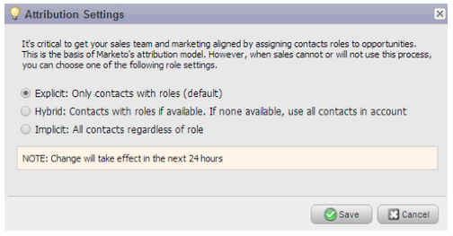

# 릴리스 정보: 2014년 3월 {#release-notes-march}

다음 기능은 2014년 3월 릴리스에 포함되어 있습니다. Marketo 버전에서 사용 가능한 기능이 있는지 확인하십시오. 릴리스 후에 각 기능에 대한 기술 자료 문서에 대한 링크를 다시 확인하십시오.

## 이메일 프로그램 대시보드 새로 고침 단추 {#email-program-dashboard-refresh-button}

[새로 고침 단추](/help/marketo/product-docs/email-marketing/email-programs/email-program-data/use-the-email-program-dashboard.md)를 사용하여 전자 메일 보내기 또는 AB 테스트에 대한 최신 전자 메일 지표를 가져옵니다!

## 이메일 편집기 및 코드 조각 편집기에서 실행 취소/다시 실행 {#undo-redo-in-the-email-editor-and-snippet-editor}

현재 세션에 대해 최대 50개의 작업을 [실행 취소 또는 다시 실행](/help/marketo/product-docs/email-marketing/general/email-editor-2/edit-elements-in-an-email.md)합니다.

## 프로그램 성과 보고서의 프로그램 상태 열 {#program-status-columns-in-program-performance-report}

이제 [프로그램 성과 보고서](/help/marketo/product-docs/core-marketo-concepts/programs/program-performance-report/add-program-status-columns-to-a-program-report.md)를 사용할 때 프로그램 상태에 있는 사람 수를 확인할 수 있습니다.

## Analytics를 위한 포괄적 및 운영 프로그램 {#inclusive-and-operational-programs-for-analytics}

이제 프로그램 채널을 편집할 때 분석 동작 옵션을 &quot;포함&quot;으로 설정하여 [&#x200B; 및 분석기에서 &#x200B;](/help/marketo/product-docs/reporting/revenue-cycle-analytics/program-analytics/make-a-program-without-a-period-cost-available-in-revenue-explorer-and-analyzers.md)기간 비용이 없는 프로그램을 포함[!UICONTROL Revenue Explorer]할 수 있습니다. &quot;운영&quot;을 선택하여 운영 프로그램을 모두 보고에서 제외할 수도 있습니다.

## 잠재 고객 전환을 위한 하이브리드 및 암시적 옵션 {#hybrid-and-implicit-options-for-lead-conversion}

리드 분석에서 Marketo이 리드 전환 지표에 대해 연락처 및 기회를 연결하는 방식을 변경할 수 있습니다. 속성 설정을 [변경](/help/marketo/product-docs/administration/settings/change-attribution-settings-for-analytics.md)할 수 있습니다. 이 설정을 변경해도 Marketo 또는 CRM 데이터는 수정되지 않습니다. 보고서가 실행되는 방식만 변경하면 언제든지 되돌릴 수 있습니다.

명시적 설정은 기회에 역할이 있는 연락처만 전환된 잠재 고객(기본 동작)으로 처리합니다. 암시적 은 역할에 관계없이 영업 기회에서 계정과 연결된 모든 연락처를 전환된 것으로 처리합니다. Hybrid는 사용 가능한 경우 역할이 전환된 연락처를 처리합니다. 그렇지 않은 경우 계정의 모든 연락처가 전환된 것으로 처리됩니다.

다시 말해서 이 설정은 프로그램 속성 지표도 변경합니다.

## 추가 사용자 언어 {#additional-user-language}

[Marketo 응용 프로그램 언어](/help/marketo/product-docs/administration/settings/select-your-language-locale-and-time-zone.md)를 선택하세요. Marketo 리드 관리 인터페이스를 원하는 언어로 볼 수 있습니다. 이제 일본어가 지원됩니다.

## Marketo 개발자 블로그 {#marketo-developer-blog}

[Marketo 개발자 블로그](https://developers.marketo.com/blog/)는 최신 마케터의 빠르게 진화하는 요구 사항을 지원하는 웹 개발자 및 소프트웨어 엔지니어를 위한 것입니다. 새로운 통합 옵션, API 버전 업데이트 및 Marketo 플랫폼과의 통합에 대한 코드 샘플 및 모범 사례를 포함하는 새로운 일련의 사용 방법 문서에 대한 공지를 구독할 수 있습니다.

이 시리즈의 [첫 번째 문서](https://developers.marketo.com/blog/retrieving-customer-and-prospect-information-from-marketo-using-the-api/)에서는 API를 사용하여 Marketo 내에 저장된 사람(고객/연락처/잠재 고객)에 대한 정보를 효율적으로 검색하는 방법을 설명합니다.
