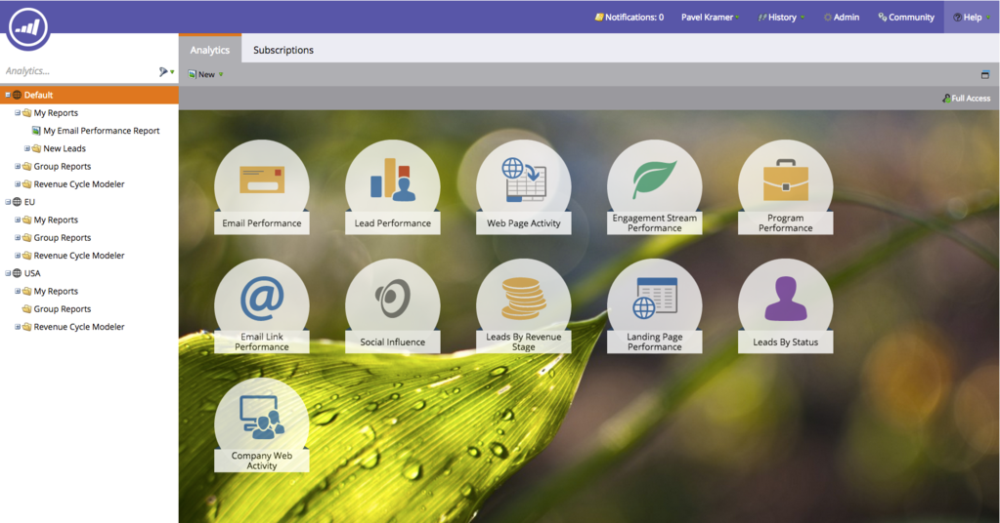
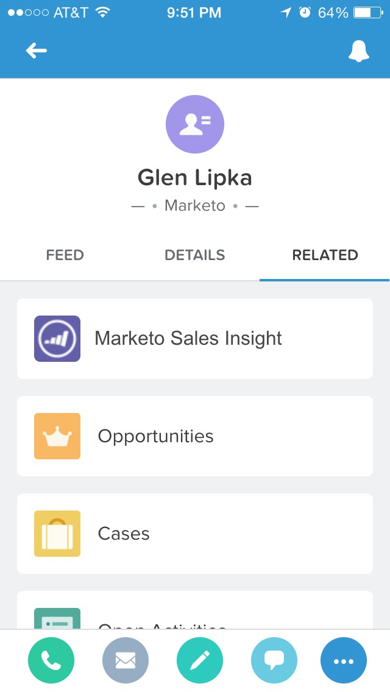

# 릴리스 정보: 2015년 4월 {#release-notes-april}

다음 기능은 2015년 4월 릴리스에 포함되어 있습니다. Marketo 버전에서 사용 가능한 기능이 있는지 확인하십시오. 릴리스 후에 다시 돌아와 각 기능에 대한 자세한 문서에 대한 링크를 찾으십시오.

## Analytics 홈 재디자인

[Analytics 홈 재디자인](/help/marketo/product-docs/reporting/basic-reporting/creating-reports/navigating-the-analytics-home-page.md)

>[!NOTE]
>
>이 기능은 4월 28일 화요일에 릴리스됩니다.

새 [[!UICONTROL Analytics] 홈 페이지](/help/marketo/product-docs/reporting/basic-reporting/creating-reports/navigating-the-analytics-home-page.md)을(를) 사용하면 사용 가능한 보고서 유형에서 임시 보고서를 실행할 수 있습니다.

또한 이제 비공개 및 공유 보고서 조직을 사용할 수 있습니다. 보고서를 만들거나 [!UICONTROL My Reports] 폴더로 드래그하여 다른 사용자가 보거나 편집하거나 삭제할 수 없도록 잠급니다. [!UICONTROL Group Reports]이(가) 모든 사용자에게 공유됩니다.

## Marketo Mobile Engagement {#marketo-mobile-engagement}

**Marketo Mobile Engagement**

Marketo Mobile Engagement를 사용하면 매력적인 모바일 경험을 쉽게 제공할 수 있습니다. 앱 개발 팀에 의존할 필요 없이 매력적인 콘텐츠를 제공하는 고도로 개인화된 캠페인을 만들 수 있습니다. 새로운 필터 및 트리거를 사용하면 푸시 알림을 통해 모바일 채널에서 수신 및 응답할 수 있습니다.

## [!DNL LinkedIn] 리드 가속기 통합

[[!DNL LinkedIn] 리드 가속기 통합](/help/marketo/product-docs/demand-generation/social/social-functions/use-a-marketo-list-or-smart-list-as-a-linkedin-audience-segment.md)

리드 육성 전략을 유료 디스플레이 및 소셜 광고로 확장하십시오. [&#x200B; 리드 가속기와 &#x200B;](/help/marketo/product-docs/demand-generation/ad-network-integrations/add-linkedin-matched-audiences-as-a-launchpoint-service.md)광고 네트워크 통합[!DNL LinkedIn]을(를) 사용하면 모든 스마트 또는 정적 목록의 구성원을 기반으로 [!DNL LinkedIn] 내에 대상 세그먼트를 안전하게 만들 수 있습니다. 그런 다음 [!DNL LinkedIn] 대상 세그먼트 내의 구성원을 관련 광고 시퀀스로 육성할 수 있습니다.

## [!DNL Sales Insight]용 Marketo [!DNL Salesforce1] {#marketo-sales-insight-for-salesforce}

[!DNL Sales Insight] 기능(리드 피드, 최고의 선택, 즐거운 순간 및 Marketo 캠페인에 추가)을 모두 [!DNL Salesforce1] 앱에서 사용할 수 있습니다.

 

## RTP - Account-Based Marketing Analytics {#rtp-account-based-marketing-analytics}

**RTP - Account-Based Marketing Analytics**

구매 주기의 각 단계에 따라 주요 명명 계정 목록의 성능을 즉시 확인할 수 있으며, 명명 계정 목록에 대한 새로운 성능 그래프가 제공됩니다. 그래프는 방문 횟수와 방문자 상태에 따라 인식에서 시작해 행동까지 이어지는 주요 조직의 방문 단계를 보여줍니다.
