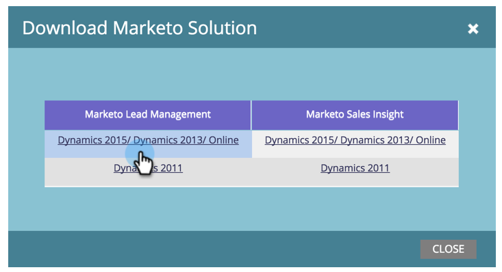

# 릴리스 정보: 2015년 3월 {#release-notes-march}

다음 기능은 2015년 3월 릴리스에 포함되어 있습니다. Marketo 버전에서 사용 가능한 기능이 있는지 확인하십시오. 릴리스 후에 다시 돌아와 각 기능에 대한 세부 문서에 대한 링크를 찾으십시오.

## 캘린더 HD {#calendar-hd}

달력의 새 프레젠테이션 모드로 팀의 마케팅 활동을 표시합니다. 이것들은 사무실 주변의 TV나 거대한 모니터에 아주 좋습니다! 스마트 목록 또는 사용자 지정 지표를 기반으로 목표를 설정하고 표시합니다.

>[!NOTE]
>
>이 기능은 Spark 및 [!DNL Standard] 버전에서 사용할 수 없습니다.

## [!DNL Google Adwords] 통합 {#google-adwords-integration}

[[!DNL Google AdWords] 계정을 Marketo에 연결](/help/marketo/product-docs/administration/additional-integrations/add-google-adwords-as-a-launchpoint-service.md)하여 Marketo에서 [!DNL Google AdWords]&#x200B;(으)로 오프라인 전환 데이터를 자동으로 업로드합니다. 그런 다음 [!DNL AdWords] UI에서 자격을 갖춘 리드, 기회 및 신규 고객(또는 추적하려는 매출 단계)을 일으킨 클릭 수를 쉽게 확인할 수 있습니다.

## [!UICONTROL Revenue Explorer] 다시 디자인 {#revenue-explorer-redesign}

[!UICONTROL Revenue Explorer]은(는) 새로운 Sunburst 차트 유형과 새로운 모양과 느낌을 가지고 있습니다. 4월 첫 2주 동안 이 프로젝트를 진행할 예정입니다.

## 새 자산 REST API {#new-asset-rest-apis}

[새 자산 REST API](https://experienceleague.adobe.com/en/docs/marketo-developer/marketo/rest/assets/assets)

이제 API를 통해 [전자 메일, 템플릿, 내 토큰, 파일 및 코드 조각을 만들고 편집할 수 있습니다](https://developer.adobe.com/marketo-apis/api/asset/)!

## [!DNL Microsoft Dynamics] 2015 On Premise {#microsoft-dynamics-on-premise}

이제 최신 설치 관리자로 지원되며 [앱을 통해 액세스할 수 있습니다](/help/marketo/product-docs/crm-sync/microsoft-dynamics-sync/sync-setup/update-the-marketo-solution-for-microsoft-dynamics.md).

## RTP - 잠재 고객 데이터가 있는 개인화된 웹 참여 {#rtp-personalized-web-engagement-with-lead-data}

Marketo 리드 데이터베이스에서 보유하고 있는 [리드 데이터 필드](/help/marketo/product-docs/web-personalization/using-web-segments/manage-person-data.md)를 활용하여 실시간 세분화 및 개인화된 콘텐츠 캠페인을 만드십시오. RTP에서 리드 데이터 필드를 관리하고 관련 리드 필드를 추가/삭제합니다.

## RTP - 이메일 또는 프로그램 캠페인 이름으로 웹 컨텐츠 개인화 {#rtp-personalize-web-content-by-email-or-program-campaign-name}

이메일과 웹의 채널을 통해 잠재 고객과 대화를 계속합니다. [Marketo의 마케팅 활동에 사용된 이메일 캠페인 또는 프로그램을 기반으로 인바운드 콘텐츠 개인화](/help/marketo/product-docs/web-personalization/using-web-segments/web-segments.md) 이름.
