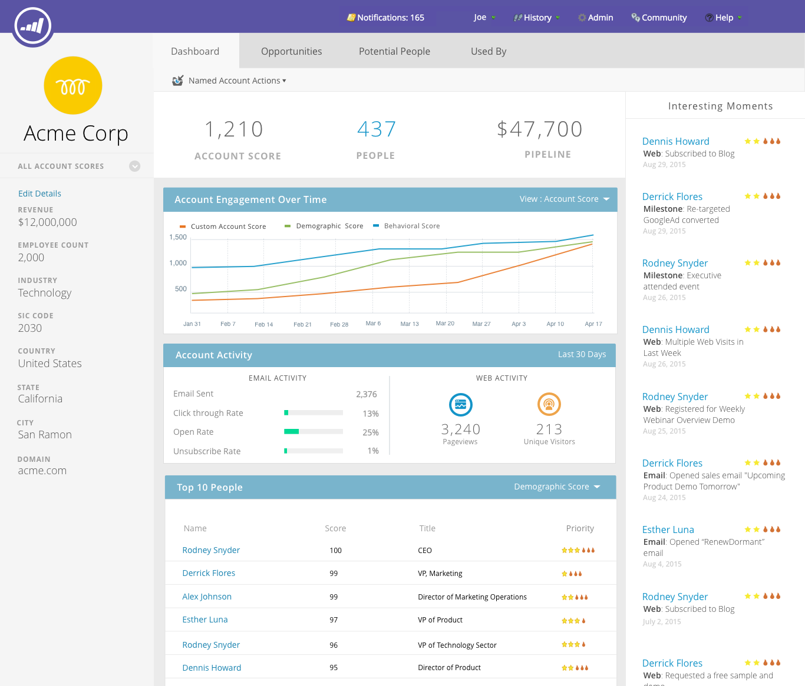
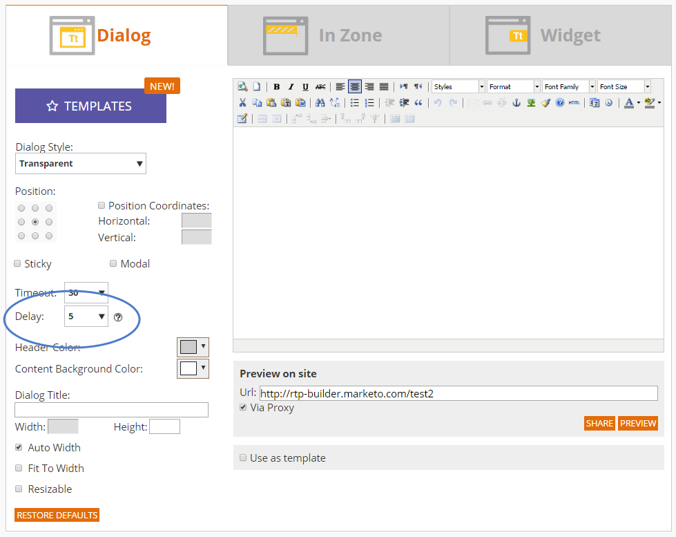

# 릴리스 노트: 2016년 여름 {#release-notes-summer}

다음 기능은 16년 여름 릴리스에 포함되어 있습니다. Marketo 버전에서 사용 가능한 기능이 있는지 확인하십시오. 각 기능에 대한 자세한 문서를 보려면 제목 링크를 클릭하십시오.

## [계정 기반 마케팅](https://docs.marketo.com/display/docs/account+based+marketing) {#account-based-marketing}

Marketo 계정 기반 마케팅은 하나의 통합 플랫폼에서 모든 핵심 기능을 제공합니다.

* **Target** - 계정 검색, 리드-계정 일치 및 명명된 계정 목록
* **참여** - 계정 기반 Personalization, 크로스 채널 참여 및 계정별 워크플로
* **측정** - 계정 및 목록 수준 인사이트, 계정 참여 점수, 파이프라인 및 매출에 미치는 영향

>[!NOTE]
>
>ABM은 Marketo 구독의 추가 기능으로 사용할 수 있으므로 판매 담당자에게 문의하여 이를 구현하십시오.

## [감사 추적](/help/marketo/product-docs/administration/audit-trail/audit-trail-overview.md) {#audit-trail}

감사 추적은 Marketo 구독 내에서 수행된 변경 사항에 대한 포괄적인 기록을 제공합니다. 사용자 및 관리자 간에 책임감을 조성하고, 예상치 못한 행동의 원인을 식별하며, 누가 무엇을 언제 하고 있는지 알 수 있는 보안을 제공합니다. 이 정보는 언제든지 사용할 수 있으며 다음과 같은 질문에 답변하는 데 사용할 수 있습니다.

* 이 에셋 또는 설정이 어떻게 되었으며 마지막으로 업데이트한 사람은 누구입니까?
* 사용자 X는 어떻게 지내?
* 누가 우리 계정에 로그인하고 있습니까?

## [Marketo-Vibes SMS LaunchPoint 통합 보기](/help/marketo/product-docs/mobile-marketing/vibes-sms-messages/create-an-sms-message.md) {#marketo-vibes-sms-launchpoint-integration}

Marketo 내에서 SMS 메시지를 쉽게 만들 수 있습니다. 풍부한 Marketo 데이터를 사용하여 메시지를 개인화하고 타겟팅하고 SMS 메시지 대시보드를 사용하여 성과를 쉽게 모니터링할 수 있습니다.

>[!NOTE]
>
>이 기능을 사용하려면 기존 Vibes SMS 계정이 있어야 합니다.

## [전자 메일 2.0 개선 사항](/help/marketo/product-docs/email-marketing/general/email-editor-2/email-editor-v2-0-overview.md) {#email-enhancements}

**모듈 수준 변수**

이전에는 전자 메일 2.0 템플릿에 지정된 모든 변수가 범위에서 &quot;전역&quot;이었습니다. 모듈 내에서 변수를 사용할 때 모듈의 여러 인스턴스를 사용하려는 경우 이 방법이 항상 바람직한 것은 아닙니다. 이번 릴리스에서는 변수를 &quot;모듈 수준&quot;으로 지정할 수 있으므로 사용자가 사용하는 각 모듈에 대해 고유한 값을 설정할 수 있음을 나타낼 수 있습니다.

**구문 업데이트**

* 이제 이메일 2.0 템플릿에 지정된 모듈에서 &quot;mktoAddByDefault&quot;를 사용하여 기본적으로 새 이메일에 표시되어야 하는 모듈을 나타낼 수 있습니다. 많은 모듈을 사용하여 이메일 템플릿을 작성하는 경우 훨씬 편리합니다.
* 이제 이미지 요소에서 기본 `` HTML 요소의 &quot;height&quot; 및 &quot;width&quot; 속성을 최종 사용자가 잠글 것인지 편집할 것인지 여부를 지정할 수 있습니다. mktoLockImgSize=&quot;true&quot;로 설정하면 이미지가 변경된 경우에도 높이/너비가 잠깁니다. 마찬가지로 mktoLockImgStyle=&quot;true&quot;이면 &quot;style&quot; 속성이 잠깁니다.

**코드 검색**

새로운 검색 기능을 사용하여 이메일 코드 내에서 콘텐츠를 효율적으로 찾고 바꿀 수 있습니다. 이 기능은 이메일 템플릿 편집기에서도 사용할 수 있습니다.

**이미지 요소에서 토큰 지원**

이제 삽입 이미지 경험의 &quot;외부 URL&quot; 영역에서 토큰을 사용할 수 있습니다! `{{my.tokens}}`을(를) 사용하여 이미지를 지정한 경우 이제 전자 메일 편집기 2.0 내에서 이러한 토큰을 참조할 수 있습니다. 이미지는 이메일 편집기 2.0 캔버스에서 계속 끊어진 상태로 표시됩니다. 그러나 이메일을 보내기 전에 미리 보기 및 샘플 보내기 내에서 렌더링된 메시지가 표시됩니다.

## 여러 브랜딩 도메인 {#multiple-branding-domains}

이메일 추적 링크를 단일 브랜딩 도메인으로만 브랜딩할 수 있던 시대는 지났습니다. 이제 여러 브랜딩 도메인을 추가하여 소비자 신뢰를 고취시키고, 브랜드에 집중할 수 있는 보다 간소화된 디자인을 만들고, 이메일 전달성을 개선하고, 각 이메일의 추적 링크에 사용할 브랜딩 도메인을 이메일 단위로 선택할 수 있습니다.

## [프로그램 토큰](/help/marketo/product-docs/demand-generation/landing-pages/personalizing-landing-pages/tokens-overview.md) {#program-tokens}

프로그램에 대한 새 토큰 유형을 만들었습니다. 이제 에셋 및 스마트 캠페인 흐름 단계에서 프로그램 이름, 설명 및 ID를 렌더링할 수 있습니다.

## [Enterprise 키](/help/marketo/product-docs/marketo-sales-insight/msi-outlook-plugin/authorize-the-marketo-outlook-plugin.md) {#enterprise-key}

Outlook용 Sales Insight Plugin을 설치하려면 영업 팀의 각 직원이 필요합니다. 지루할 수 있습니다. 엔터프라이즈 키를 사용하여 원격으로 Outlook용 플러그인을 설치하는 새로운 방법을 도입했습니다. 관리자의 Marketo Sales Insight 섹션에 있는 고유 키를 IT 팀에 보내고 나머지 작업을 수행하도록 합니다.

## [웹 Personalization 캠페인](/help/marketo/product-docs/web-personalization/working-with-web-campaigns/create-a-new-dialog-web-campaign.md) {#web-personalization-campaigns}

웹 캠페인이 웹 사이트에서 반응할 시간 지연을 지정합니다.

## [컨텐츠 분석 및 Recommendations 내보내기](/help/marketo/product-docs/web-personalization/understanding-web-personalization/understanding-content-analytics.md) {#content-analytics-and-recommendations-export}

컨텐츠 분석 및 권장 사항 데이터를 오프라인으로 봅니다.

## [전자 메일 편집기 2.0에 대한 API 지원](https://developer.adobe.com/marketo-apis/api/asset/) {#api-support-for-email-editor}

이전에 v1.0 이메일 및 템플릿과만 호환되는 기존 에셋 API가 이제 v2.0 이메일 에셋에 대해 활성화됩니다.

## [Marketo 개발자 사이트](https://experienceleague.adobe.com/en/docs/marketo-developer/marketo/home) {#marketo-developers-site}

새로운 기능과 향상된 기능을 제공합니다.

## [개인 정보 설정](/help/marketo/product-docs/administration/settings/understanding-privacy-settings.md) {#privacy-settings}

마케터는 개인 정보 설정을 사용하여 Munchkin 및 Web Personalization 기능을 사용하는 방문자를 추적할지 여부를 결정할 수 있습니다. 추적 수준은 브라우저의 추적 안 함 설정, 옵트아웃 쿠키 또는 비특정 IP를 사용하여 제어됩니다. 이러한 방법은 특정 영역에서 Marketo의 가치 및 기능에 영향을 줄 수 있지만 마케터가 변경하지 않으면 Marketo 기능은 그대로 유지됩니다.

이 기능은 6주 동안 점진적으로 고객에게 출시될 예정입니다. 지금 당장 필요한 경우 Marketo 지원 센터에 문의하십시오.
