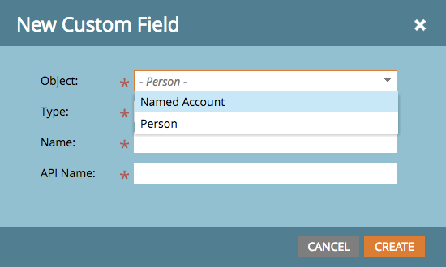

# 릴리스 정보: 2017년 4월 ABM 개선 사항 {#release-notes-april-abm-enhancements}

다음 기능은 2017년 4월 ABM 개선 릴리스에 포함되어 있습니다. Marketo 버전에서 사용 가능한 기능이 있는지 확인하십시오.

## CRM 매핑 표준 필드 동기화 {#synching-of-crm-mapped-standard-fields}

Marketo ABM이 CRM과 관련된 동작을 변경하고 있습니다. 앞으로 Marketo ABM은 ABM 계정과 CRM의 계정 간에 1 대 1 관계를 설정하고 유지합니다. 이렇게 하면 Marketo이 매핑된 계정 필드를 CRM과 동기화하도록 유지할 수 있습니다.

## CRM 검색을 위한 사용자 지정 필드 {#custom-fields-for-crm-discovery}

이제 계정에 사용자 지정 필드를 추가하고, CRM에 매핑하고, Marketo에서 CRM 계정 검색에 사용할 수 있습니다.

## 명명된 계정 그리드의 계정 기반 필터 {#account-based-filters-in-the-named-account-grid}

이제 계정 목록을 기반으로 명명 계정을 쉽게 필터링할 수 있습니다.

