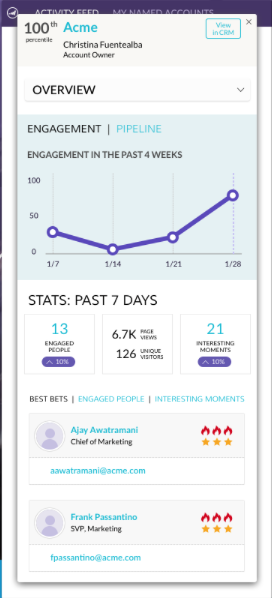

# 릴리스 노트: 2017년 8월 ABM 개선 사항 {#release-notes-august-abm-enhancements}

다음 기능은 2017년 8월 ABM 개선 릴리스에 포함되어 있습니다. Marketo 버전에서 사용 가능한 기능이 있는지 확인하십시오.

각 기능에 대한 자세한 문서를 보려면 제목 링크를 클릭하십시오.

## [!DNL Account Insight] {#account-insight}

**[[!DNL Account Insight]](/help/marketo/product-docs/target-account-management/setup-tam/account-insight-plug-in-overview.md)**&#x200B;은(는) 실행 가능한 ABM과 계정 통찰력을 판매 팀에 제공하는 [!DNL Google Chrome] 플러그인으로, 마케팅 팀과 긴밀히 협력하여 계정을 효과적으로 참여시킬 수 있습니다. 영업 팀은 보유하고 있는 각 명명 계정에 대해 생성된 데이터와 통찰력을 확인할 수 있습니다. 여기에는 계정 점수 백분위, 명명된 계정의 우선 순위 목록, 해당 계정 내의 참여 사용자 및 계정의 최근 활동에 대한 라이브 활동 스트림이 포함됩니다.

 

## [동적 계정 목록](/help/marketo/product-docs/target-account-management/target/account-lists.md) {#dynamic-account-lists}

ABM에서 계정 목록을 만드는 새로운 방법을 추가하고 있습니다. 이제 기존 계정 목록 외에도 공개 CRM 계정 보기에서 생성된 동적 계정 목록을 만들 수 있습니다. CRM 계정 보기는 계정을 표시할 때 필터 역할을 하는 규칙 세트입니다. 예를 들어, 업종이 의료 분야인 _과(와)_ 매출액이 1억 달러 이상인 계정을 찾는 데 사용할 수 있습니다.

