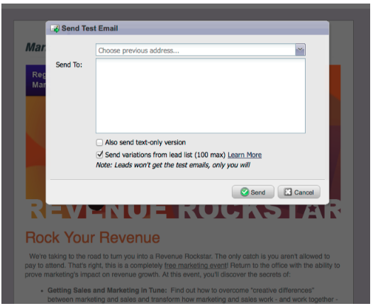
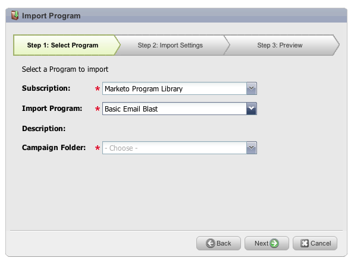
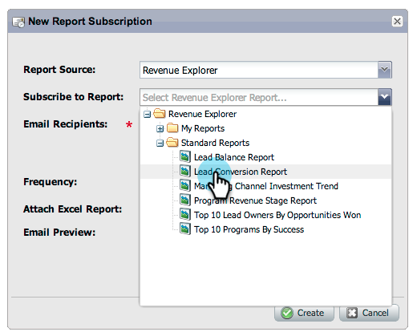
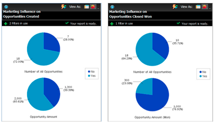
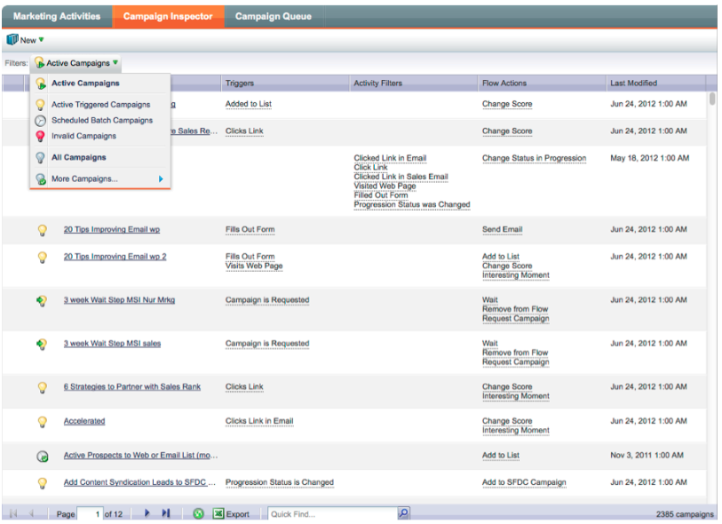

# 2012

## 2012년 1월/2월 {#january-february}

다음 기능은 1월/2월 릴리스에 포함되어 있습니다. Marketo 버전에서 사용 가능한 기능이 있는지 확인하십시오. 자세한 기능 설명서에 대한 링크를 보려면 릴리스 이후 다시 돌아오십시오.

## 고급 다이내믹 콘텐츠 {#advanced-dynamic-content}

_Pro 및 Enterprise 버전에서 사용 가능_

고급 다이내믹 콘텐츠를 사용하면 동일한 메시지에 대해 여러 자산을 만들지 않고도 대상과 관련된 매력적인 이메일 커뮤니케이션 및 랜딩 페이지를 만들 수 있습니다. 업그레이드된 미리보기를 사용하면 각 고유 버전을 한 화면에서 볼 수 있습니다.

## 세분화  {#segmentation}

_Pro 및 Enterprise 버전에서 사용 가능_

세그멘테이션은 마케팅하는 개인의 타겟팅된 그룹인 세그먼트 그룹입니다. 세그먼트는 스마트 목록과 유사한 필터 기준에 의해 제어되는 규칙으로 정의됩니다. 세그먼트는 직책 또는 업종과 같은 인구 통계학적 데이터나 방문 또는 클릭한 웹 페이지와 같은 비헤이비어를 기반으로 할 수 있습니다.

## 스니펫 {#snippets}

_Pro 및 Enterprise 버전에서 사용 가능_

정적 또는 동적 이메일 및 랜딩 페이지를 만드는 데 반복적으로 사용할 수 있는 풍부한 콘텐츠를 저장합니다.

## PURL {#purls}

_Pro 및 Enterprise 버전에서 사용 가능_

이제 개인화된 URL(PURL) 마케터를 사용하여 연락처별 URL을 만들어 DM 및 이메일 캠페인 모두에 대한 멀티 터치 마케팅 프로그램에서 개인화, 측정 가능성 및 응답을 높일 수 있습니다.

## 유럽 연합 개인 정보 보호 지침 지원 {#eu-privacy-directive-support}

브라우저 &quot;추적 안 함&quot; 설정을 준수하는 새로운 기능에는 익명 리드에 대한 추적을 비활성화하는 기능이 포함되어 있으므로 EU의 더 엄격한 개인 정보 보호 추적 규정을 보다 쉽게 준수할 수 있습니다.

## 단일 사인온 {#single-sign-on}

이제 조직은 기업 포털에서 SSO(Single Sign-On)를 위해 SAML 2.0을 사용하여 Marketo 애플리케이션에 원활하게 로그인할 수 있도록 지원할 수 있습니다.

## 업데이트된 이메일 및 랜딩 페이지 편집기 {#updated-email-and-landing-page-editors}

이메일 및 랜딩 페이지 편집기는 보다 매력적인 인터페이스, 직관적인 탐색 및 크게 향상된 사용자 경험으로 새롭게 디자인되었습니다. 여기에는 다음이 포함됩니다.

나란히 표시된 HTML 및 텍스트 보기

편집기에는 보낸 사람 이름, 보낸 사람 이메일, 회신 대상(신규) 및 제목이 표시됩니다. 다른 모든 설정은 설정 편집 단추를 통해 액세스할 수 있습니다.

## 브라우저 지원 {#browser-support}

* [!DNL Mozilla Firefox] 9.0
* [!DNL Google Chrome] 16
* [!DNL Microsoft Internet Explorer] 8 &amp; 9
* **참고**: [!DNL Internet Explorer] 7은 더 이상 지원되지 않습니다.

## 프로그램 관리 {#program-management}

간소화된 프로그램 관리를 통해 토큰 삭제 및 프로그램 삭제가 쉬워져 사용성이 향상됩니다.

## 구독 보고서에서 구독 취소 {#unsubscribe-from-subscription-report}

이제 보고서에서 바로 구독을 취소할 수 있습니다!

## Munchkin 업데이트 {#munchkin-updates}

새로운 Munchkin 호출은 웹 페이지 로드 시간을 줄이고 클릭 링크 이벤트에 대해 보다 일관된 성능을 제공합니다.

## 프로그램 영업 기회 분석(RCA만 해당) {#program-opportunity-analysis-rca-only}

개별 영업 기회 매출에 대한 마케팅 기여도 이해

## 프로그램 수익 단계 분석 {#program-revenue-stage-analysis}

Fast Mover를 획득한 프로그램을 파악하여 insight의 프로그램 리드 속도를 높입니다.

## 2012년 3월 {#march}

## 내 토큰 확인 {#resolve-my-tokens}

이메일을 미리 보고, 테스트 이메일을 보내고, 단일 흐름 작업을 통해 로컬 이메일을 보낼 때 내 토큰(프로그램 토큰)이 확인됩니다. 더 이상 내 토큰을 테스트하기 위해 프로그램 내에 스마트 캠페인을 만들 필요가 없습니다!

## 이메일 및 랜딩 페이지의 미리 보기 및 편집기 간 전환 {#toggle-between-previewer-and-editor-in-emails-and-landing-pages}

한 번의 클릭으로 편집기와 미리보기 사이를 쉽게 왔다 갔다 할 수 있습니다.

미리 보기 편집기:

미리 보기-편집기:

## 코드 조각 미리 보기 {#snippet-previewer}

메뉴에서 &quot;코드 조각 미리 보기&quot;를 선택하면 초안을 만들지 않고도 코드 조각을 볼 수 있습니다. 또한 작업 영역을 통해 공유 코드 조각에 대한 읽기 전용 액세스 권한이 있는 경우 이 작업으로 코드 조각을 볼 수 있습니다.

## 여러 테스트 이메일 보내기 {#send-multiple-test-emails}

다이내믹 콘텐츠를 추가하면 잠재 고객에게 전송할 수 있는 모든 이메일 변형을 미리 보고 테스트하는 것이 점점 더 중요해집니다. 리드 세부 정보별 보기를 사용하여 미리 보는 경우 리드 목록에서 변형에 대한 테스트를 전송할 수 있습니다(최대 100개의 테스트 이메일).

## URL 매개 변수 기반 동적 랜딩 페이지 {#dynamic-landing-pages-based-on-url-parameter}

익명 리드는 랜딩 페이지 방문의 상당한 양을 차지합니다. 동적 컨텐츠와 URL에 매개 변수로 세그멘테이션을 추가할 수 있으므로 익명 또는 알려진 잠재 고객이 링크를 클릭하면 랜딩 페이지 컨텐츠를 동적으로 표시할 수 있습니다.

## 2012년 4월 {#april}

## 세그먼테이션 필터 및 트리거 {#segmentation-filters-and-triggers}

동일한 리드 그룹을 지속적으로 타깃팅합니까? 그렇다면 타겟팅 리드에 대해 스마트 목록에서 세그먼테이션을 사용하십시오. 세분화를 통해 전체 리드 데이터베이스는 항상 세분화되며 일관성을 위해 프로그램 전체에서 다시 사용할 수 있습니다. 세분화 결과는 요청 시 스마트 목록을 실행할 필요가 없기 때문에 빠르게 가져옵니다.

## 확장된 API 기능을 통해 이메일 콘텐츠 및 기타 흐름 단계에 외부 값 삽입 {#insert-external-values-into-email-content-and-other-flow-steps-through-expanded-api-capabilities}

* 이제 캠페인 요청 API를 통해 특정 캠페인 실행에 대한 내 토큰 값을 보낼 수 있습니다. 이는 API를 통해 이메일 콘텐츠를 채우는 데 특히 유용합니다
* 새로운 목록 업로드 및 예약 캠페인 API는 리드 및 배치 캠페인 목록에 대해 위의 기능을 지원합니다.

## [!DNL GoToWebinar] 및 [!DNL WebEx]에 대한 보다 쉬운 확인 전자 메일(Adobe Connect 및 [!DNL ON24]이 곧 제공 예정) {#easier-confirmation-emails-for-gotowebinar-and-webex-adobe-connect-and-on-coming-soon}

각 리드에 대한 고유한 등록 확인 URL을 표시하는 멤버 토큰을 만들어 확인 URL을 간소화했습니다. 더 이상 다른 토큰을 사용하여 이 URL을 만들 필요가 없습니다. 이 기능은 현재 [!DNL GoToWebinar] 및 [!DNL WebEx] 고객이 사용할 수 있으며, 다음 릴리스에서 Adobe Connect 및 [!DNL ON24]이(가) 사용할 수 있습니다.

## 한 번의 클릭으로 여러 이미지와 파일을 업로드할 수 있습니다. {#upload-multiple-images-and-files-with-a-single-click}

이미지와 파일을 Marketo으로 가져올 때 시간을 절약하고 효율성을 높일 수 있습니다! [!DNL Firefox] 또는 [!DNL Google Chrome]을(를) 사용하는 경우 파일을 여러 개 선택하여 한 번에 모두 업로드할 수 있습니다. 업로드할 수 있는 파일 수에는 제한이 없지만 파일당 개별 크기 제한은 50MB입니다.

참고: 현재 이 기능은 브라우저의 제한 사항으로 인해 [!DNL Internet Explorer]에서 지원되지 않습니다.

## 전자 메일의 텍스트 이동 {#move-text-in-an-email}

이메일에서 텍스트 블록의 순서를 변경할 수 있습니다. 텍스트 편집기 내에서 텍스트 블록을 선택합니다. 편집 아이콘을 클릭하면 블록을 위나 아래로 이동하는 옵션이 표시됩니다.

## [!DNL Salesforce]명이 아닌 사용자에 대해 [!DNL Salesforce]개의 참조가 제거됨 {#salesforce-references-removed-for-non-salesforce-users}

구독을 [!DNL Salesforce]과(와) 동기화하지 않는 경우 [!DNL Salesforce]을(를) 참조하는 모든 폴더 및 흐름 작업이 제거됩니다.

## Marketo 수익 주기 분석 {#marketo-revenue-cycle-analytics}

**수익 주기 Modeler의 향상된 게이트 단계**

사용자가 전환 규칙에 대한 순서를 정의할 수 있습니다.

## 2012년 5월 {#may}

## 이메일 성과 보고서 재디자인 {#email-performance-report-redesign}

참고: 이는 5월 릴리스부터 시작되는 스테이지 롤아웃입니다

이메일 성과 및 캠페인 이메일 성과 보고서를 더 빨리 실행하도록 했습니다. 또한 특정 지표의 정의를 개선하고 &quot;보낸 메시지&quot; 및 &quot;보낸 리드&quot; 지표를 단일 지표 &quot;보낸 날짜&quot;로 통합했습니다. &quot;배달된 메시지&quot;와 &quot;배달된 잠재 고객&quot;을 &quot;배달된 고객&quot;으로 병합했습니다.

## 대기 단계 개선 사항 {#wait-step-enhancements}

새로운 고급 대기 속성을 사용하면 Smart Campaign 흐름 작업의 대기 단계를 구성하여 특정 요일, 다음 영업일, 특정 날짜 또는 시간이 될 때까지 &quot;기다립니다. 이러한 향상된 기능을 통해 업무 시간 중에 육성 이메일이 받은 편지함에 도착합니다!

그림 1. 업무일에 종료할 대기 단계 지정

## 보관된 Assets 숨김 {#archived-assets-hidden}

보관된 자산은 자동 제안, 드롭다운 및 보고서에서 자동으로 필터링되므로 원하는 항목을 보다 쉽게 찾을 수 있습니다.

그림 2. 보관된 이메일 필터의 예

## iPad용 새 이벤트 체크인 앱 {#new-event-check-in-app-for-ipad}

새로운 iPad 앱을 사용하여 이벤트 체크인 프로세스를 간소화합니다! 이벤트 체크인 앱은 Marketo 프로그램과 동기화되므로 등록자를 이벤트로 쉽게 확인할 수 있을 뿐만 아니라 즉시 새 리드를 추가할 수 있습니다.

iOS 5.1 이상 필요(iPad만 해당)

그림 3. 이벤트 체크인 홈 페이지

그림 4. 이벤트 체크인: 이벤트를 선택합니다!

그림 5. 체크 인

## 향상된 웨비나 확인 URL {#enhanced-webinar-confirmation-url}

이제 [!DNL ON24] 및 Adobe Connect에서 사용할 수 있습니다! 새 `{{member.webinar URL}}` 토큰을 사용하여 등록된 각 참석자에 대한 확인 전자 메일에 고유한 링크를 포함하십시오. Adobe Connect의 향상된 기능에는 사용자의 로그인 ID 및 암호가 포함된 Adobe 계정 정보 이메일을 켜거나 끄는 기능도 포함되어 있습니다.

그림 6. 웨비나에 사람들을 참여시키세요.

## 템플릿 미리 보기 {#template-preview}

전자 메일 또는 랜딩 페이지를 작성하는 동안 특정 템플릿을 찾고 있지만, 그 모양이 어떻게 생겼는지 확실하지 않습니까? 새로운 템플릿 미리보기 기능을 사용하면 새 자산을 저장하기 전에 선택한 템플릿을 확인할 수 있습니다!

그림 7. 선택한 템플릿 미리 보기

## 구성 가능한 양식 미리 채우기 {#configurable-form-prefill}

구독 수준에서 양식 데이터의 사전 채우기를 제어하고 랜딩 페이지 수준에서 덮어씁니다. 사전 채우기가 없으면 잠재 고객이 최신 정보를 제공하도록 할 수 있습니다.

그림 8. 관리자의 양식 미리 채우기 구성

그림 9. 랜딩 페이지에서 양식 미리 채우기 설정 편집

## Marketo 보물상자 {#marketo-treasure-chest}

Marketo 엔지니어가 개발한 실험 기능에 액세스하여 사용자 경험을 향상시킬 수 있습니다. 이 릴리스에는 이메일 실행 취소 기능과 함께 랜딩 페이지에서 댓글을 입력하고 다른 사용자와 공동 작업을 할 수 있는 기능이 포함됩니다.

\

그림 10. 관리자의 보물 상자 기능

## [!DNL Microsoft Dynamics]® CRM 통합 {#microsoft-dynamics-crm-integration}

미리 빌드된 새로운 통합을 사용하여 Marketo과 [!DNL Microsoft Dynamics] CRM Online 간에 계정, 연락처 및 리드를 동기화합니다!

그림 11. [!DNL Microsoft Dynamics] 구성

## Marketo [!DNL Sales Insight] 개선 사항 {#marketo-sales-insight-enhancements}

**바닥글 구독 취소 옵션**

[!DNL Sales Insight]을(를) 통해 보낸 전자 메일에 대해 구독 취소 바닥글이 표시되는 시기와 여부를 구성합니다.

그림 12. [!DNL Sales Insight] 관리자의 설정

## 판매 이메일 템플릿 폴더 {#folders-for-sales-email-templates}

이제 Marketo [!DNL Sales Insight]과(와) 공유된 이메일 템플릿을 지정된 폴더로 구성하여 영업 담당자가 올바른 이메일을 더 쉽게 찾을 수 있습니다.

그림 13. 이메일 폴더 선택

## [!DNL Sales Insight]에서 영업 기회 분석기에 액세스 {#access-opportunity-analyzer-from-sales-insight}

Marketo [!DNL Sales Insight]에서 Opportunity Analyzer에 직접 액세스하여 마케팅 활동이 참여를 유도하는 insight을 영업 담당자에게 제공합니다. 참고. Revenue Cycle Analytics 라이센스가 필요합니다.

## 연락처 상태에 대한 사용자 정의 필드 {#custom-field-for-contact-status}

이제 [!DNL Salesforce]의 사용자 지정 필드를 매핑하여 내 베스트 베트, 내 팀의 베스트 베트 및 사용자 지정 보기에서 연락처의 상태 필드를 채울 수 있습니다.

그림 14. 연락처에 사용자 지정 필드 매핑

익명 잠재 고객이 방문한 페이지 보기

[!UICONTROL Anonymous Web Activity] 보기에서 익명 잠재 고객이 본 페이지로 드릴다운합니다.

그림 15. 익명 웹 활동 보기

## 향상된 리드 및 연락처 구독 {#enhanced-lead-and-contact-subscribe}

레코드 세부 정보 페이지의 새 구독 버튼을 사용하여 언제든지 잠재 고객을 팔로우하거나 연락하십시오.

## 2012년 6월 {#june}

## Marketo 리드 관리 개선 사항 {#marketo-lead-management-enhancements}

### 이름 바꾸기 {#rename}

스마트 목록, 정적 목록 및 캠페인의 이름을 변경할 수 있습니다. 필터, 트리거 또는 흐름에서 이러한 자산을 사용하는 경우 이름도 자동으로 업데이트됩니다. 이메일, 양식 및 폴더의 이름을 항상 바꿀 수 있었습니다.

그리고 보너스로 에셋에 대한 설명 텍스트 입력 및 보기를 개선했습니다.

## 필드 매핑 가져오기 {#import-field-mapping}

목록을 Marketo으로 가져오는 작업이 훨씬 쉬워졌습니다. 가져오기 프로세스 중에 Marketo 필드의 이름을 가져오기 파일의 열 헤더 이름에 매핑할 수 있습니다. 또한 [!UICONTROL Admin]에서 Marketo의 필드 이름에 매핑되는 별칭 이름을 설정하여 사용자가 항상 올바른 필드를 선택하도록 할 수 있습니다.

필드를 계속 가져오고 매핑하면 Marketo에서 쉽게 사용할 수 있도록 가져오는 동안 매핑을 기억하고 표시합니다. 또한 샘플 값 헤더를 클릭하여 필드를 채울 다른 값을 볼 수 있으므로 더욱 편리한 작업이 가능합니다. 이렇게 하면 매번 올바른 필드를 매핑할 수 있습니다.

## 스마트 목록 및 정적 목록의 [!UICONTROL Summary] 페이지 {#summary-page-for-smart-lists-and-static-lists}

목록이 어디에 사용되고 있는지 궁금하신 적이 있습니까? 또는 누가 목록을 만들었거나 마지막으로 수정했습니까? 스마트 목록 및 정적 목록에서 사용할 수 있는 새 요약 페이지에서 다음과 같은 중요한 세부 정보를 제공합니다.

기존 프로그램 및 캠페인 요약 페이지에 만든 날짜/사용자 및 마지막으로 수정한 날짜/사용자 정보도 추가했습니다.

## Assets용 [!UICONTROL Used By] {#used-by-for-assets}

자산 [!UICONTROL Summary] 페이지에 [!UICONTROL Used By]&#x200B;(이)라는 새 탭을 추가했습니다.

예: 정적 목록의 경우 [!UICONTROL Used By]

## 랜딩 페이지 눈금선 {#landing-page-gridlines}

랜딩 페이지 눈금선을 추가하면 랜딩 페이지의 텍스트, 그래픽 및 양식 맞춤이 훨씬 더 쉬워집니다. 주어진 랜딩 페이지에 대해 이 기능을 켜거나 끄고 줄 사이의 너비도 조정하십시오.

## 잠재 고객이 메일링에서 차단됨 {#leads-blocked-from-mailings}

캠페인을 예약할 때 링크를 클릭하면 메일링이 차단된 잠재 고객 목록을 볼 수 있습니다.

## [!UICONTROL Wait] 단계 - 잠재 고객 토큰 및 내 토큰 {#wait-step-lead-token-and-my-token}

5월 릴리스에서는 [!UICONTROL Wait] 흐름 단계에 고급 옵션을 추가했습니다. 이러한 변경 사항으로 영업일, 날짜 및 시간을 지정할 수 있습니다. 이 릴리스에서는 대기 단계에서 토큰을 사용하는 기능을 추가했습니다. 예를 들어 `{{lead.Birthday}}`을(를) 사용하여 생일 축하 이메일을 보내거나 `{{my.Event Date}}`을(를) 사용하여 최종 웨비나 미리 알림을 보낼 수 있습니다.

## Design Studio에서 [!UICONTROL Thumbnails]&#x200B;(으)로 [!UICONTROL View] {#view-as-thumbnails-in-design-studio}

이미지 목록에서 썸네일 보기로 전환합니다!

참고: 이 릴리스부터 스마트 목록 그리드의 이전 정렬이 사용자가 보는 다음 스마트 목록에 적용되지 않습니다. 예를 들어 회사 이름별로 스마트 목록을 정렬하는 경우 동일한 필드에서 본 다음 스마트 목록은 자동으로 정렬되지 않습니다.

미리 알림: 전자 메일 성능 보고서 업그레이드가 진행 중입니다!

## Marketo 수익 주기 분석 개선 사항 {#marketo-revenue-cycle-analytics-enhancements}

### 프로그램 영업 기회 분석의 새로운 지표  {#new-metrics-in-program-opportunity-analysis}

이제 기회를 만들거나 닫기 전의 평균 마케팅 터치 횟수와 마케팅 터치의 평균 값에 대한 통찰력을 얻을 수 있습니다.

## 다중 차트 표시 {#displaying-multi-charts}

다중 차트 기능을 사용하면 단일 수익 주기 탐색기 보고서에 여러 차트를 표시할 수 있습니다. 예를 들어, 서로 다른 달에 대해 동일한 데이터를 표시하려는 경우 이 기능을 사용할 수 있습니다. 이 기능을 사용하면 별도의 필터 및 보고서를 만들 필요가 없습니다.

## 열 그리드 차트 유형  {#heat-grid-chart-type}

히트그리드를 사용하면 데이터를 시각화하여 마케팅 성과 패턴을 식별할 수 있습니다. 이 시각화 유형은 결과를 색상 코딩하므로 이해하기 쉬운 시각화로 복잡한 비즈니스 분석을 볼 수 있습니다.

## 분산형 차트 유형  {#scatter-chart-type}

분산형 차트를 통해 여러 차원에 대한 데이터를 하나의 그래프로 시각화할 수 있습니다. 이 시각화 유형은 사용된 속성을 기반으로 그래프에 버블을 표시합니다. 그런 다음 측정값을 사용하여 버블에 색상을 지정하거나 측정값을 사용하여 버블의 크기를 지정할 수 있습니다.

## 2012년 9월 {#september}

이 릴리스에는 크게 기대되는 통합 소셜 기능과 리드 관리 제품이 포함되어 있습니다. 참고: 소셜 기능은 추가 기능이나 선택한 번들의 일부로 사용할 수 있습니다.

## 소셜 공유로 YouTube 비디오 게시 {#publish-a-youtube-video-with-social-sharing}

랜딩 페이지의 새로운 비디오 공유를 사용하여 방문자가 비디오를 사회적으로 공유하도록 유도하여 비디오 대상을 증폭합니다.

## 공유 단추 추가 {#add-a-share-button}

새로운 소셜 공유 버튼 세트의 메시지 및 모양을 완전히 사용자 지정합니다. 또한 잠재 고객이 콘텐츠를 공유할 때 소셜 프로필 데이터를 캡처합니다.

## Social 로그인 {#social-sign-on}

리드가 소셜 네트워크의 정보를 양식에 미리 채울 수 있도록 하여 insight을 확보하고 마찰을 줄일 수 있습니다.

## [!DNL Facebook]에 랜딩 페이지 게시 {#publish-landing-pages-to-facebook}

소셜 앱, 양식 및 Marketo 랜딩 페이지의 전체 기능을 포함하여 랜딩 페이지를 [!DNL Facebook]에 바로 게시하여 범위를 넓힙니다.

## [!DNL ReadyTalk] 이벤트 어댑터 {#readytalk-event-adapter}

Marketo 이벤트를 [!DNL ReadyTalk] 모임에 원활하게 연결합니다. Marketo 양식을 사용하여 등록자를 캡처하고 [!DNL ReadyTalk]에 자동으로 등록합니다. 양방향 동기화를 사용하면 참석 정보를 Marketo에 채울 수 있습니다.

## Microsoft [!DNL Dynamics] 온-프레미스 {#microsoft-dynamics-on-premise}

이제 인터넷 연결 배포로 Microsoft [!DNL Dynamics] 2011 온프레미스를 지원합니다.

## 웹훅(보물 상자) {#webhooks-treasure-chest}

Webhook은 사용자 정의 HTTP 콜백입니다. Marketo에서 다른 서비스로 데이터를 푸시하는 좋은 방법입니다. 이 기능은 현재 Treasure Chest에서 사용할 수 있으며 현재 트리거 캠페인에서만 지원됩니다.

웹후크를 사용하는 방법의 예로는 다른 시스템에 사용자 이름과 암호 정보를 게시하여 체험판 계정을 만들고, 새 리드를 받으면 SMS 문자 메시지를 보내는 방법이 있습니다.

## getMultipleLeads API로 업데이트 {#update-to-getmultipleleads-api}

getMultipleLeads API 호출에 새 필터링 기준을 추가했습니다. 이제 날짜별 필터링 외에 추가 기준을 지원합니다.

* 날짜 범위
* 정적 목록 이름
* 리드 키 배열

## 2012년 10월 일 {#october}

10월 릴리스에는 더 흥미로운 새로운 기능이 포함되어 있습니다! Social 기능은 추가 기능이나 선택한 번들의 일부로 사용할 수 있습니다.

## 프로그램 가져오기 및 프로그램 교환 {#import-programs-and-program-exchange}

한 Marketo 구독에서 다른 구독으로 프로그램을 가져올 수 있습니다. 예를 들어 샌드박스에서 프로그램을 만든 다음 라이브 구독으로 가져올 수 있습니다. 또한 Marketo 프로그램 라이브러리에서 미리 빌드된 프로그램을 가져올 수 있습니다.

>[!NOTE]
>
>Marketo 관리 사용자가 권한을 부여한 Marketo 사용자만 프로그램을 가져올 수 있습니다.
>
>샌드박스 계정을 라이브 구독으로 연결하려면 Marketo 지원에 문의하십시오.

## 알림 {#notifications}

알림은 Marketo 구독에서 발생하는 시스템 이벤트에 대한 최신 정보를 제공합니다. 예를 들어 캠페인에 실패하거나 CRM 동기화에 주의가 필요한 경우 시스템에서 자동으로 알려줍니다. 알림은 내 Marketo 탭에서 사용할 수 있습니다. 또한 알림을 구독하면 이메일에서 실시간으로 알림을 받을 수 있습니다.

## 투표 {#polls}

콘텐츠에 잠재 고객을 참여시키기 위한 설문 조사를 만드십시오! 자신이 좋아하는 네트워크나 영화에 투표한 뒤 자신의 소셜네트워크를 통해 친구들과 여론을 공유할 수 있다. 잠재 고객이 투표한 내용에 대한 풍부한 분석을 수집할 수 있습니다.

## 소셜 활동 추적 {#track-social-activities}

특정 소셜 활동을 기반으로 스마트 목록을 만들어 설문 조사에서 콘텐츠와 투표를 공유한 사용자를 확인합니다. 예를 들어 콘텐츠를 가장 많이 공유하는 잠재 고객의 점수를 높이려면 스마트 캠페인을 만드십시오!

## 소셜 프로필 {#social-profiles}

이제 잠재 고객이 콘텐츠를 공유하거나 소셜 프로필을 사용하여 양식을 작성할 때 잠재 고객에 대한 정보를 수집할 수 있습니다. 여기에는 [!DNL Facebook], [!DNL LinkedIn] 및 [!DNL Twitter] 핸들, 보유한 친구 수 등이 포함됩니다.

## 보고서 구독 [!UICONTROL Revenue Explorer]개 {#revenue-explorer-report-subscriptions}

보고서 구독을 만들고 [!UICONTROL Revenue Explorer] 보고서를 정기적으로 Marketo 사용자가 아닌 사용자를 포함하여 주요 이해 당사자에게 보냅니다. 전자 메일에는 보고서 데이터 테이블 또는 차트의 미리 보기 및 모든 보고서 데이터가 포함된 [!DNL Excel] 스프레드시트가 포함되어 있습니다.

>[!NOTE]
>
>Enterprise 또는 Select Edition으로 Revenue Cycle Analytics를 구매하여 [!UICONTROL Revenue Explorer]을(를) 가진 사용자만 사용할 수 있습니다.

## 2012년 12월 {#december}

12월 릴리스에는 많은 기대를 모은 **친구에게 전달** 기능과 여러 가지 다른 기능이 포함됩니다. 별표(&#42;)로 표시된 기능은 Select Edition 및 RCA(Revenue Cycle Analytics)에서만 사용할 수 있습니다.

## 친구에게 전달 {#forward-to-friend}

전자 메일에 **친구에게 전달** 링크를 포함하여 다른 사용자와 콘텐츠를 공유할 수 있도록 설정합니다. 새 필터 및 트리거를 추가하면 전자 메일을 전달한 사용자와 전달된 전자 메일을 받은 사용자를 식별하여 영향력 있는 사용자를 식별하는 데 도움이 됩니다.

전자 메일에 **친구에게 전달** 초대를 포함하려면 편집기에서 열고 `{{system.forwardToFriendLink}}` 토큰을 삽입하세요.

해당 트리거와 필터를 사용하여 **친구에게 전달** 링크를 사용한 사용자와 이메일을 받은 사용자를 식별합니다.

## 세분화된 관리자 권한 {#granular-admin-permissions}

최신 릴리스를 통해 각 역할에 대해 Marketo [!UICONTROL Admin] 영역의 다양한 기능에 대한 액세스를 제어하여 [!UICONTROL Admin] 역할에 대한 액세스 및 제어 능력을 높일 수 있습니다. 새 역할을 만들 때 해당 역할이 액세스할 수 있는 특정 [!UICONTROL Admin] 기능을 할당할 수 있습니다.

>[!NOTE]
>
>기본적으로 &#39;[!UICONTROL Access Admin]&#39; 권한이 있는 기존 역할은 수정될 때까지 및 수정되지 않는 한 모든 [!UICONTROL Admin] 함수에 액세스할 수 있습니다.

## [!UICONTROL BrightTALK] 어댑터 {#brighttalk-adapter}

Marketo [!UICONTROL BrightTALK] 어댑터를 사용하면 라이브 또는 온디맨드 웹캐스트에서 Marketo 이벤트로 직접 참석 정보를 캡처할 수 있습니다!

## [!DNL Microsoft Dynamics]용 Marketo [!DNL Sales Insight] {#marketo-sales-insight-for-microsoft-dynamics}

이제 [!DNL Microsoft Dynamics] 고객이 [!DNL Sales Insight]을(를) 사용할 수 있습니다!

## [!DNL Dynamics] 영업 기회 동기화 {#dynamics-opportunity-sync}

Marketo과 [!DNL Microsoft Dynamics] 간 영업 기회 데이터를 동기화합니다.

## 마케팅 영향을 받은 기회 보고서&#42; {#marketing-influenced-opportunities-report}

회사의 파이프라인 및 매출액 중 마케팅 프로그램의 영향을 받은 비율을 확인합니다. 이제 **[!UICONTROL Revenue Explorer]**&#x200B;에서 [영업 기회 분석]에 새로운 &#39;마케팅 영향을 받은 영업 기회&#39; 노란색 점이 있는 사용자 지정 보고서를 만들 수 있습니다. 표준 폴더에서 다음 두 보고서를 사용할 수도 있습니다.

* 생성된 기회에 대한 마케팅 영향
* 기회에 대한 마케팅 영향 마감 성공

## 프로그램 영업 기회 분석의 사용자 지정 영업 기회 필드&#42; {#custom-opportunity-fields-in-program-opportunity-analysis}

사용자 지정 영업 기회 필드를 추가하여 [!UICONTROL Revenue Explorer]에서 프로그램 영업 기회 분석 보고서를 보강합니다.

## 캠페인 검사기 {#campaign-inspector}

[!UICONTROL Change Score] 또는 [!UICONTROL Request Campaign]과(와) 같은 특정 흐름 작업을 사용하는 캠페인에 대해 생각해 본 적이 있습니까? 아니면 특정 필터가 사용되는 위치입니까? 새 [!UICONTROL Campaign Inspector]&#x200B;(Treasure Chest에서 사용 가능)을 사용하면 이러한 캠페인과 오류가 있는 활성 캠페인 및 캠페인을 식별할 수 있습니다.

**[!UICONTROL Admin]** > **[!UICONTROL Treasure Chest]**(으)로 이동하여 **[!UICONTROL Campaign Inspector]**&#x200B;을(를) 사용하도록 설정합니다.

