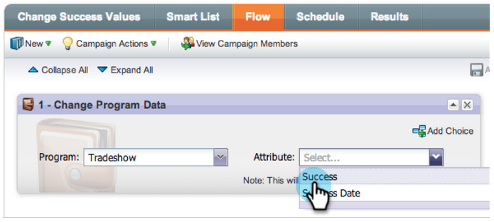
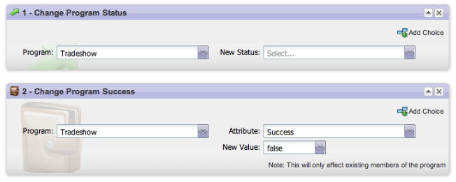
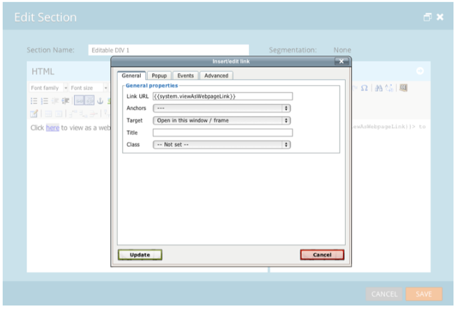
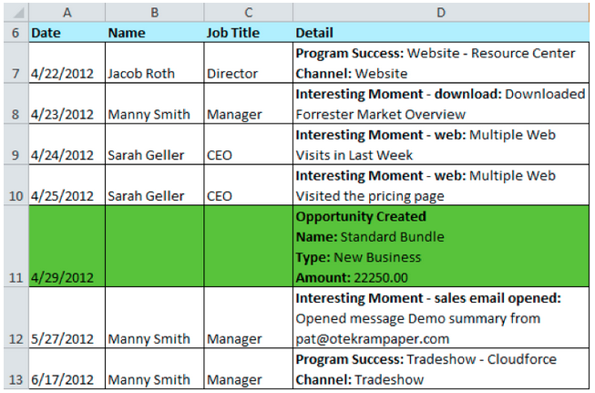

# 2013

## 2013년 1월 {#january}

1월 릴리스는 **추천 오퍼**&#x200B;로 소셜 오퍼를 확장합니다. 또한 [!DNL Marketo Lead Management] 사용자는 표준 시간대, 언어 및 로케일 기본 설정을 설정할 수 있습니다. &#42;(으)로 표시된 기능은 Select Edition에서만 사용할 수 있습니다.

## 추천 오퍼 {#referral-offers}

**추천 제안**&#x200B;은(는) 잠재 고객에게 친구를 추천할 수 있는 인센티브를 제공합니다. 성공적인 추천을 위한 목표 및 보상을 만듭니다. 랜딩 페이지, 웹 사이트 및 Facebook에서 사용할 수 있습니다.

## 시간대 환경 설정 {#time-zone-preference}

개인 Marketo 계정의 기본 시간대를 변경할 수 있습니다. 예를 들어 구독의 기본값이 태평양 표준시라고 해도 자신의 계정에 대해 동부 표준시로 변경할 수 있습니다.

## [!DNL Marketo Lead Management] 언어 선택 {#select-your-marketo-lead-management-language}

Marketo 사용자 계정의 기본 언어를 변경할 수 있습니다. 구독의 기본값이 영어이더라도 독일어나 프랑스어로 변경하여 직접 사용할 수 있습니다.

## 다국어 양식 오류 메시지 {#multi-lingual-form-error-messages}

잠재 고객이 Marketo 양식을 작성하면 일부 유효성 검사 메시지가 자동으로 기본으로 제공됩니다. 이러한 오류 메시지에 대해 다른 표시 언어를 선택할 수 있습니다. 이제 영어, 독일어 및 프랑스어를 지원합니다.

프랑스어 양식의 예:

## [!DNL Sales Insight] 언어 선택([!DNL Salesforce]만) {#select-your-sales-insight-language-salesforce-only}

[!DNL Salesforce] 언어 기본 설정이 프랑스어 또는 독일어로 설정되어 있으면 Marketo [!DNL Sales Insight]에서 이 기본 설정을 적용합니다. 이 기능을 사용하려면 최신 MSI 패키지를 다운로드하십시오(1월 14일 주 사용 가능).

## 필드 표시 이름 {#field-display-name}

필드 표시 이름은 텍스트를 다른 언어로 표시할 수 있습니다(예: 멀티바이트 문자 지원).

## 프로그램 데이터 변경 {#change-program-data}

[!UICONTROL Change Program Data] 흐름 단계를 사용하면 캠페인을 통해 수동으로 프로그램 구성원의 [!UICONTROL Success] 상태 및 [!UICONTROL Success Date]을(를) 변경할 수 있습니다. 이 흐름 단계를 사용하여 실수를 수정하거나 프로그램에 의도한 대로 참여하지 않은 구성원을 수동으로 변경할 수 있습니다.

## 2013년 2월 {#february}

2월 릴리스에는 많이 요청된 기능, [!DNL Apple Safari]에 대한 지원 및 기타 간단한 개선 사항이 포함되어 있습니다.

## [!DNL Apple Safari]에 대한 공식 지원 {#official-support-for-apple-safari}

Mac 및 [!DNL Windows]용 [!DNL Apple Safari]의 최신 버전은 Marketo 리드 관리에서 사용할 수 있도록 완전히 지원됩니다. 참고: iOS의 [!DNL Safari]은(는) 완전히 호환되지 않습니다.

## Webhooks 개선 사항 {#webhooks-enhancements}

Webhooks는 URL/페이로드의 토큰을 이스케이프 처리하도록 개선되었으며 타사 시스템([!DNL Spark SMB Edition]에서는 사용할 수 없음)의 XML/JSON 응답을 구문 분석하여 Marketo 리드 필드를 업데이트할 수도 있습니다.

## SOAP API 엔드포인트 업데이트됨 {#updated-soap-api-endpoint}

기본 SOAP API 끝점이 업데이트되어 [!UICONTROL Admin] -> SOAP API에 표시됩니다. 이 새 끝점을 사용하도록 호출을 업데이트하십시오. 이전 끝점에 대한 API 호출은 더 이상 사용되지 않지만 계속 작동합니다. (SOAP API는 [!DNL Spark SMB Edition]에서 사용할 수 없음)

## [!DNL Facebook] 탭에 대한 모바일 지원 {#mobile-support-for-facebook-tabs}

Marketo에서 게시한 [!DNL Facebook]개 탭이 모바일 장치를 감지하여 랜딩 페이지로 라우팅됩니다. 이렇게 하면 [!DNL Facebook] 탭이 지원되지 않는([!DNL Spark], [!DNL Standard], [!DNL Select SMB Editions] 및 [!DNL Marketo Social Marketing]에서 사용 가능) 모바일 장치에서 사용자가 올바른 콘텐츠를 가져올 수 있습니다.

## 출시 예정: 여러 모델 지원 {#coming-soon-support-for-multiple-models}

향후 릴리스에서 커뮤니티의 RCA에 대한 아이디어#1 투표된 여러 수익 주기 모델을 지원할 수 있는 토대를 마련하고 있습니다. 이 릴리스에서는 모델 및 단계 선택을 지원하기 위해 스마트 목록 필터 및 흐름 단계의 선택 사항 추가 를 비롯한 몇 가지 변경 사항이 표시됩니다. 또한 리드 매출 단계 및 리드 매출 주기 모델 필드를 스마트 목록 리드 그리드 탭에서 이동합니다.

## 2013년 3월 {#march}

3월 릴리스에는 다음 기능이 포함되어 있습니다.

## Marketo 캘린더 파일 {#marketo-calendar-files}

일정 파일을 **내 토큰**(으)로 만들어 이벤트 확인 및 미리 알림 전자 메일에 사용합니다. 이 통합 일정 파일(예: .ics 파일)은 내 토큰 및 `{{member.webinar URL}}` 토큰을 포함한 모든 토큰을 렌더링합니다.

## 다음 시간까지 대기 +/- {#wait-until}

날짜 토큰 이전 또는 이후의 지정된 일 수를 실행할 수 있는 대기 단계를 만듭니다. 예를 들어 이벤트 날짜 3일 전에 대기한 다음 미리 알림을 전송하는 대기 단계를 만들 수 있습니다.

잠재 고객의 생일 14일 전에 대기하는 대기 단계를 만들 수 있습니다. &quot;이 날짜의 다음 연도 사용&quot;을 선택하면 시스템이 해당 날짜와 연관된 연도를 자동으로 무시하고 현재 또는 다음 달력 연도를 대신 사용합니다.

## 소셜 경품 행사 {#social-sweepstakes}

경품 추첨을 하면 리드가 상품을 받고 친구들에게 당신에 대해 말할 수 있는 기회가 생깁니다. 참가자들로부터 무작위 당첨자를 선정하여 이메일을 보내면 됩니다.

## 추가 양식 [!UICONTROL Error Message] 언어 {#additional-form-error-message-languages}

12개 이상의 언어가 양식 오류 메시지에 추가되었습니다!

## 뉴스 및 알림 지원 {#support-news-and-alerts}

P1 경고에 대한 지원 뉴스 및 경고, 알려진 문제, 지원 전문가의 힌트 및 팁, Marketo 고객 지원 센터의 업데이트를 구독하면 Marketo 고객 지원에 계속 연결할 수 있습니다.

## 2013년 4월 {#april}

다음 기능은 4월 릴리스에 포함되어 있습니다.

## [!DNL Box] 통합 {#box-integration}

Marketo을 [!DNL Box] 계정에 연결하여 파일을 디자인 스튜디오로 쉽게 복사할 수 있습니다.

## [!DNL Gmail] 플러그 인 {#gmail-plugin}

[!DNL Gmail]뿐만 아니라 Marketo [!DNL Sales Insight]을(를) 사용하는 경우 [!DNL Chrome] 스토어를 통해 새 [!DNL Gmail] 플러그인을 설치할 수 있습니다. 플러그인을 사용하면 Marketo으로 메시지를 기록하고, Marketo 이메일 템플릿을 로드하고, Marketo 추적 기능이 포함된 메시지를 보낼 수 있습니다.

## 이메일 분석 {#email-analysis}

클릭 활동 열 격자 보고서와 같은 고급 전자 메일 보고서를 [!UICONTROL Revenue Explorer]에 만듭니다. 이 보고서는 insight에 사람들이 이메일에 있는 링크를 클릭하는 요일 및 시간을 알려줍니다.

2012년 및 2013년 이메일 데이터를 마이그레이션함에 따라 전체 이메일 분석 기능이 4월과 5월 동안 단계적으로 켜집니다. 즉, 일부 고객은 다른 고객보다 이 기능에 더 빨리 액세스할 수 있습니다.

## 프로그램 API {#program-apis}

프로그램 멤버십 카운트, 획득, 성공, 설정, 채널, 태그, 토큰 및 비용과 같은 프로그램 데이터에 대한 읽기 전용 액세스를 포함하여 SOAP API 호출에서 프로그램을 지원합니다. 자세한 내용은 SOAP API 설명서 를 참조하십시오.

## [!DNL ON24] 개선 사항 {#on-enhancement}

직책 및 회사 이름이 Marketo 등록 양식에서 [!DNL ON24]에 동기화됩니다.

## 2013년 5월 {#may}

5월 릴리스에는 다음과 같은 기능이 포함되어 있습니다.

## 랜딩 페이지용 달력 파일 {#calendar-files-for-landing-pages}

달력 파일을 내 토큰으로 만들어 랜딩 페이지에 추가할 수 있습니다. 이 통합 달력 파일(예: .ics 파일)은 로컬 자산 랜딩 페이지의 내 토큰을 포함한 모든 토큰을 렌더링합니다.

## 모델 멤버십 탭 {#model-membership-tab}

모든 모델 구성원의 데이터를 한 곳에 표시하여 쉽게 모니터링하고 문제를 해결할 수 있습니다. 새 [!UICONTROL Members] 탭은 승인된 수익 주기 모델을 선택할 때 사용할 수 있는 읽기 전용 보기입니다.

## 재구성된 흐름 작업 트리 {#reorganized-flow-action-tree}

새로 재구성된 플로우 작업 트리를 사용하여 플로우 작업을 보다 빠르게 찾을 수 있습니다.

## 이름이 변경된 흐름 작업 {#renamed-flow-actions}

진행 상태 변경은 이제 [!UICONTROL Change Program Status]입니다. 이제 프로그램 데이터 변경은 [!UICONTROL Change Program Success]입니다.

## 2013년 6월 {#june}

6월 릴리스에는 다음 기능이 포함되어 있습니다.

## 추가 사용자 언어 {#additional-user-languages}

원하는 언어로 Marketo 리드 관리 인터페이스를 볼 수 있습니다. 이제 스페인어와 포르투갈어를 지원합니다.

## 코발트 사용자 인터페이스 {#cobalt-user-interface}

다음 몇 개월 동안 애플리케이션의 여러 부분에서 새로운 테마가 롤아웃되는 것을 볼 수 있습니다.

## 하위 폴더 복제 {#subfolder-cloning}

자산을 하위 폴더에 복제합니다.

## 여러 모델 {#multiple-models}

커뮤니티에서 RCA(Revenue Cycle Analytics)에 대한 최상위 아이디어로서 이 기능을 사용하면 여러 모델을 만들어 제품 라인, 비즈니스 단위 또는 지역별 funnel 매출을 보다 자세히 이해할 수 있습니다. 이제 매출 단계, 성공 경로 분석기, 프로그램 분석기 및 매출 탐색기 보고서별 잠재 고객 수가 보고를 위한 특정 모델을 선택하는 기능을 지원합니다.

기본적으로 Select SMB Edition에는 두 가지 모델이, Enterprise Edition에는 15가지 모델이 제공됩니다. 추가 모델을 구입할 수도 있습니다.

## 2013년 7월 {#july}

다음 기능은 7월 26일 금요일에 롤아웃이 예정된 7월 릴리스에 포함되어 있습니다.

## 대시보드에서 콘텐츠 위젯이 모두 사용됨 {#exhausted-content-widget-on-the-dashboard}

잠재 고객이 스트림 내의 콘텐츠를 소진하는 시기에 대한 정보를 제공합니다. 시스템은 얼마나 많은 리드가 소진된 콘텐츠에 도달하려고 하는지 또는 얼마나 오랫동안 리드가 소진되었는지에 대한 정보를 제공합니다.

## 커뮤니케이션 제한 {#communication-limits}

잠재 고객 과다 이메일 전송을 중단하시겠습니까? 이제 각 개인에게 자동으로 빈도를 제한하는 것이 쉬워졌다. 간단히 일별 및 주별 통신 한도를 설정하기만 하면 시스템이 나머지 작업을 수행합니다. Select, Enterprise 및 Standard 고객을 위한 추가 기능 패키지와 함께 제공됩니다.

## 코발트 사용자 인터페이스 {#cobalt-user-interface-july}

다음 몇 달 동안 애플리케이션의 여러 부분에서 새로운 테마가 롤아웃되는 것을 볼 수 있습니다. 이동 또는 제거되지 않는 기능이 있습니다.

## 프로그램 구성원 날짜 열 {#program-member-date-column}

잠재 고객이 추가된 날짜별로 멤버 그리드를 보고 정렬합니다.

## WYSIWYG 편집기의 맞춤법 검사 변경 사항 {#changes-to-spell-check-in-wysiwyg-editor}

맞춤법 검사를 위해 WYSIWYG 편집기에서 사용한 서비스가 중단되었습니다. 대체물을 찾을 때까지 편집기에서 맞춤법 검사 단추를 제거했습니다.

## 2013년 8월 {#august}

다음 기능은 2013년 8월 릴리스에 포함되어 있습니다.

**텍스트 전용 전자 메일**

이제 [텍스트 버전만](/help/marketo/product-docs/email-marketing/general/creating-an-email/create-a-text-only-email.md) 전자 메일을 보낼 수 있습니다. 이 옵션을 사용할 때는 링크가 데코레이트되지 않는다는 점을 유의하십시오.

## 고객 참여 엔진 개선 사항 {#customer-engagement-engine-enhancements}

### 소진된 콘텐츠 무시 {#ignore-exhausted-content}

알림 제거를 포함하여 참여 프로그램을 [소진을 무시](/help/marketo/product-docs/email-marketing/drip-nurturing/using-engagement-programs/disable-and-enable-exhausted-content-notifications.md)하도록 구성하십시오.

## 참여 스트림 테스트 {#engagement-stream-testing}

[새 테스트 기능](/help/marketo/product-docs/email-marketing/drip-nurturing/engagement-program-streams/test-an-engagement-stream.md)을 사용하여 캐스트를 시뮬레이션하고 새로 추가된 콘텐츠를 실시간 스트림으로 테스트하세요.

## 개인화된 전송 테스트 {#personalized-send-test}

이메일 테스트를 보낼 때 잠재 고객의 이름을 선택하여 테스트 이메일을 개인화할 수 있습니다.

## &quot;이메일을 웹 페이지로 보기&quot; 및 &quot;구독 취소&quot; 시스템 토큰 {#view-email-as-web-page-and-unsubscribe-system-tokens}

이 [새 토큰](/help/marketo/product-docs/email-marketing/general/using-tokens/system-tokens-glossary.md)을 활용하여 전자 메일 배치를 보다 세밀하게 제어할 수 있습니다.

## 자동 트리거 캠페인 정리 {#automatic-trigger-campaign-cleanup}

이제 Marketo에서 주기적으로 알림을 보내고 지난 6개월 동안 실행되지 않은 [자동으로 트리거 캠페인을 비활성화](/help/marketo/product-docs/core-marketo-concepts/smart-campaigns/using-smart-campaigns/automatic-trigger-campaign-cleanup.md)합니다.

## Marketo Financial Management 개선 사항 {#marketo-financial-management-enhancement}

### 프로그램 비용 업데이트  {#program-cost-update}

프로그램 비용 동기화를 통해 여러 플랫폼에서 프로그램 비용을 추적할 수 있습니다.

### 코발트 사용자 인터페이스 {#cobalt-user-interface-august}

우리는 새로운 코발트 인터페이스의 롤아웃을 계속하고 있다. 이 프로젝트는 Marketo의 모든 것을 매우 빠르게 만듭니다! 업그레이드는 남은 기간 동안 계속됩니다.

## 2013년 9월 {#september}

9월 릴리스에는 다음 기능이 포함되어 있습니다.

## 짧은 URL {#shorter-urls}

이메일 URL은 모든 추적 기능을 유지하면서 수신자에게 친숙한 클릭 트리밍이 제공되었습니다

>[!CAUTION]
>
>짧은 URL로 전환하면 9월 릴리스 이전에 전송된 이메일의 링크는 이 릴리스 이후 90일 후에 만료됩니다.

Marketo 사용자 지정 개체의 데이터를 사용하거나 Velocity 템플릿 언어를 사용하여 이메일 콘텐츠에 조건부 논리를 추가하십시오.

## 테스트 보내기를 샘플 보내기로 변경 {#change-send-test-to-send-sample}

테스트 보내기 작업의 이름을 샘플 보내기로 변경했습니다.

## 개인화된 [!UICONTROL Send Sample Email] {#personalized-send-sample-email}

이메일 샘플을 보낼 때 잠재 고객의 이름을 선택하여 샘플 이메일을 개인화할 수 있습니다.

## [!DNL GoToWebinar]에 대한 추가 필드 동기화 {#additional-field-sync-for-gotowebinar}

Marketo 양식에서 회사 이름 및 직함을 [!DNL GoToWebinar]&#x200B;(으)로 동기화할 수 있습니다. 이러한 추가 필드를 활성화하려면 이벤트 파트너로 이동하여 &quot;추가 필드 활성화&quot;를 선택하십시오.

## SSO로만 사용자 로그인 제한 {#restrict-user-login-to-sso-only}

구독을 구성하여 Marketo 사용자가 SSO를 통해 로그인하고 일반 로그인 화면을 통하지 않도록 합니다.

## 업로드된 파일의 바이러스 검사 {#virus-scan-of-uploaded-files}

이제 Design Studio에 업로드된 파일이 바이러스에 감염된 경우 자동으로 검사되고 차단됩니다

## 영업 기회 영향 분석기 내보내기 {#export-opportunity-influence-analyzer}

이제 영업 기회 영향 분석기의 데이터를 [!DNL Excel]&#x200B;(으)로 내보낼 수 있습니다. 내보낸 각 [!DNL Excel] 파일에는 분석기에서 선택한 계정에 속한 모든 기회뿐만 아니라 모든 잠재 고객(기회에 역할이 없는 고객 포함)에 대한 모든 마케팅 상호 작용이 포함되어 있습니다. 영업 기회 행은 녹색으로 강조 표시됩니다. 특정 리드 또는 마케팅 활동에 집중해야 하는 경우 [!DNL Excel]의 기본 데이터 필터링 기능을 사용할 수 있습니다.

## 프로그램 속성 설정 {#program-attribution-settings}

계정 기반 속성을 수행하는 기능을 포함하여 첫 번째 및 다중 터치 속성 지표에 대해 Marketo이 연락처와 기회를 연결하는 방식을 변경할 수 있습니다. 이러한 설정은 프로그램 영업 기회 분석 영역 및 영업 기회 분석 영역 아래의 [!UICONTROL Revenue Explorer] 보고서에 있는 속성 지표에 영향을 줍니다. 이는 프로그램 분석기의 속성 지표에도 영향을 줍니다.

프로그램 속성 설정을 세 가지 선택 사항 중 하나로 변경할 수 있습니다. 이 설정을 변경해도 Marketo 또는 CRM 데이터는 수정되지 않습니다. 보고서가 실행되는 방식만 변경하면 언제든지 되돌릴 수 있습니다.

명시적 설정은 역할이 있는 연락처(현재 동작)만 검사합니다. 암시적 은 역할에 관계없이 계정과 연결된 모든 연락처를 검사합니다. 가능하면 명시적 모드를 사용하는 것이 좋습니다. 암시적 사용을 사용하면 기회에 실질적인 영향력이 없음에도 불구하고 기회에 대한 신용을 가진 사람들이 거짓 긍정을 만들 수 있다.

## 프랑스어 및 독일어로 사용 가능한 [!UICONTROL Sales Insight]&#x200B;([!DNL Salesforce]만) {#sales-insight-available-in-french-and-german-salesforce-only}

[!DNL AppExchange]에서 최신 버전의 Marketo 리드 관리 및 Marketo [!UICONTROL Sales Insight]을(를) 다운로드하면 프랑스어 및 독일어 영업 사원이 선호하는 언어로 [!UICONTROL Sales Insight] 콘텐츠를 볼 수 있습니다.

## 코발트 사용자 인터페이스 {#cobalt-user-interface-september}

다음 몇 달 동안 애플리케이션의 여러 부분에서 새로운 테마가 롤아웃됩니다. 이번 달에는 더 많은 파란색 모달 창이 표시될 수 있습니다.

## 2013년 10월 일 {#october}

다음 기능은 2013년 10월 릴리스에 포함되어 있습니다.

## templates.marketo.com {#templates-marketo-com}

[Templates.marketo.com](/help/marketo/product-docs/demand-generation/landing-pages/landing-page-templates/guided-landing-page-template-list.md)은(는) [!DNL Marketo Program Library]에서 다운로드할 수 있는 전자 메일 및 랜딩 페이지 템플릿(응답형 모바일 전자 메일 템플릿 포함)을 소개합니다. 매월 템플릿을 추가할 예정입니다. 자주 다시 확인하십시오.

## developers.marketo.com {#developers-marketo-com}

[Developer.adobe.com](https://experienceleague.adobe.com/ko/docs/marketo-developer/marketo/home)은(는) Marketo에 통합을 빌드하려는 개발자용입니다. Munchkin JavaScript API, SOAP API 코드 예제, 웹후크 및 이메일 스크립팅을 비롯한 다양한 통합 옵션을 참조할 수 있습니다. Java SDK은 [GitHub](https://github.com/Marketo/SOAP-API-Java-Client)에서도 사용할 수 있습니다.

## [!DNL BrightTALK] 이벤트 어댑터를 업데이트했습니다. {#updated-brighttalk-event-adapter}

회사 이름, 직함, 업종 및 회사 규모를 포함하여 [!DNL BrightTALK]의 추가 필드를 Marketo에 동기화합니다.

## Android 태블릿 이벤트 체크인 앱 {#android-tablet-event-check-in-app}

Google Play에서 사용할 수 있는 새로운 Android 기반 체크인 앱을 사용하여 등록자를 이벤트에 체크 인합니다.

## 2013년 12월 {#december}

다음 기능은 12월 릴리스에 포함되어 있습니다.

릴리스 후에는 커뮤니티에서 새 릴리스 탭을 사용하여 각 기능에 대한 자세한 기술 자료 문서를 확인하십시오.

## 이메일 프로그램 {#email-program}

전자 메일을 보내는 것이 더 쉬워진 적이 없습니다. 기본 프로그램 대신 일괄 처리 전자 메일을 보내려면 새 [전자 메일 프로그램](/help/marketo/product-docs/email-marketing/email-programs/creating-an-email-program/understanding-email-programs.md)을 사용하세요. 스마트 목록, 이메일을 정의하고 예약하면 해제됩니다!

또한 새 [전자 메일 지표 대시보드](/help/marketo/product-docs/email-marketing/email-programs/email-program-data/view-the-email-program-dashboard.md)를 확인하여 전자 메일이 어떻게 수행되었는지 확인하세요.

## 이메일 A/B 테스트 {#email-a-b-testing}

새 전자 메일 프로그램에서 전체 전자 메일 전송 모집단의 백분율로 [A/B 테스트](/help/marketo/product-docs/email-marketing/email-programs/email-program-actions/email-test-a-b-test/add-an-a-b-test.md)를 실행합니다. 제목 줄, 보낸 사람 주소, 날짜/시간 및 전체 이메일의 4가지 테스트 유형 중에서 선택합니다. 우승자를 수동으로 승격하도록 선택하거나, 미리 정의된 우승 기준에 따라 승격하도록 시스템에서 선택할 수도 있습니다. A/B 테스트를 포함한 새 이메일 프로그램은 이벤트 및 기본 프로그램에 중첩되어 이메일을 매우 간단하게 보낼 수 있습니다.

## 이메일 챔피언/챌린저 테스트 {#email-champion-challenger-testing}

[챔피언/챌린저 테스트](/help/marketo/product-docs/email-marketing/general/functions-in-the-editor/email-tests-champion-challenger/add-an-email-champion-challenger.md)는 A/B 테스트와 유사하지만 트리거된 이메일에 사용되며 자동으로 승자를 보내지 않는다는 점이 다릅니다. 이 테스트를 통해 챔피언이라는 기존의 방식에 도전할 수 있으며, 챌린저를 도입하여 여전히 최고인지 테스트합니다. 또한 참여 프로그램 스트림 내에서 챔피언/챌린저 이메일 테스트를 사용할 수 있습니다.

## [!UICONTROL Email Analysis]의 잠재 고객 세부 정보 {#lead-details-in-email-analysis}

[!UICONTROL Email Analysis]에 추가 리드 및 회사 특성을 도입했습니다. 이제 [!UICONTROL Industry] 및 [!UICONTROL Lead Source]과(와) 같은 새 특성별로 그룹화된 전자 메일 통계를 볼 수 있습니다.

## 향상된 [!DNL BrightTALK] 이벤트 어댑터 {#enhanced-brighttalk-event-adapter}

이제 등록자를 [!DNL BrightTALK] 채널 및 이벤트에서 Marketo으로 가져올 수 있습니다. 이 정보를 사용하여 다른 마케팅 캠페인에 알릴 수 있습니다!

