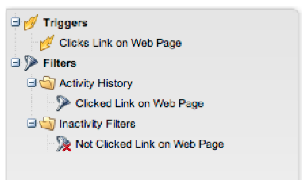
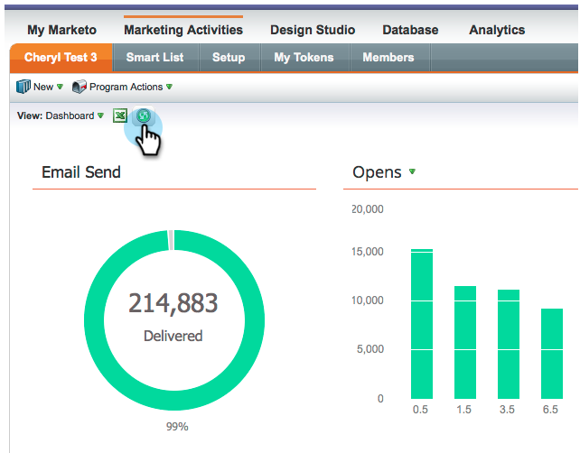
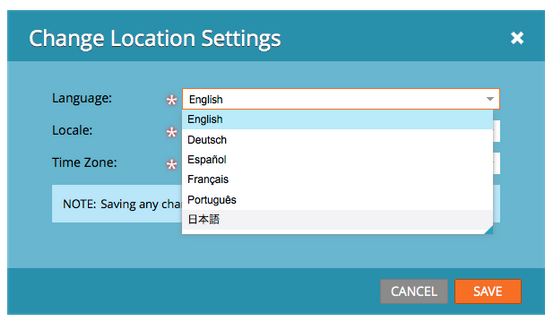
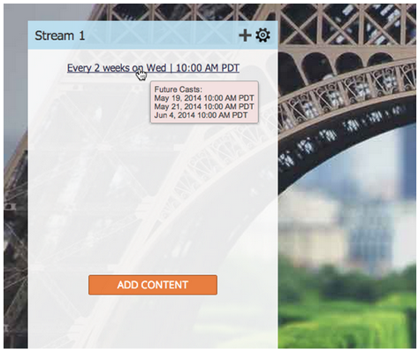
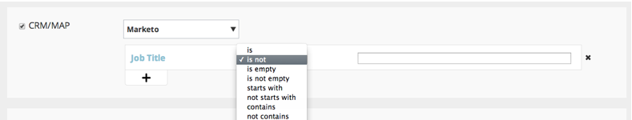
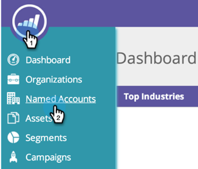

# 2014

## 2014년 1월 {#january}

다음 기능은 2014년 1월 릴리스에 포함되어 있습니다. [Marketo 버전](https://www.marketo.com/pricing/)에서 사용 가능한 기능을 확인하십시오.

## Forms 2.0 {#forms}

앞으로 표시: Forms 2.0 설명서가 곧 제공됩니다!

양식 만들기 프로세스를 제어하고 웹 개발자에게 휴식을 제공합니다. Forms 2.0은 마케터가 프로그래밍 지식 없이도 시각적으로 및 기능적으로 강력한 양식을 만들 수 있도록 설계되었습니다.

**Forms에 필요한 시각적 변경 사항을 제공하십시오.**

테마 디자인, 단추 사용자 지정 및 유연한 레이아웃을 통해 사이트의 모양과 느낌에 바로 어울리는 모던한 스타일의 양식을 디자인할 수 있습니다.

**조건부 표시 및 후속 페이지 논리:**

사용자가 미국을 &quot;국가&quot;로 선택하는 경우에만 &quot;국가&quot;가 표시되기를 원하십니까? 양식에 대한 질문에 답변하는 방법에 따라 고객에게 다양한 백서를 제공하는 것은 어떻습니까? 편집기에서 바로 양식에 조건부 논리를 빌드합니다. [!DNL javascript]은(는) 필요하지 않습니다!

**랜딩 페이지에 Forms을 쉽게 포함:**

Marketo 랜딩 페이지에 배치된 양식에서 html 코드를 들어 올려 [!DNL iFrame]에 놓는 시대는 지났습니다. 포함 코드를 가져와서 양식을 렌더링할 랜딩 페이지에 배치하면 됩니다. 표준 및 Lightbox의 두 가지 모드를 사용하면 사이트에서 Marketo 양식을 더욱 유연하게 사용할 수 있습니다.

## 이메일 프로그램에 대한 통신 제한 {#communication-limits-for-email-program}

[전자 메일 프로그램에 대한 통신 제한을 설정](/help/marketo/product-docs/email-marketing/email-programs/email-program-actions/enable-disable-communication-limits-in-an-email-program.md)하여 데이터베이스에 대해 과도한 통신을 하지 않도록 하십시오. 정의된 한도를 초과하는 사용자는 이메일을 받지 못합니다.

## 프로그램 멤버십 분석의 추가 필드 {#additional-fields-in-program-membership-analysis}

이제 리드 및 회사 특성별로 프로그램 멤버십 분석 지표를 추가하고 그룹화할 수 있습니다. 예를 들어 산업 필드를 추가하여 프로그램 멤버 및 성공 수를 분할할 수 있습니다.

## 2014년 2월 {#february}

다음 기능은 2014년 2월 릴리스에 포함되어 있습니다. Marketo 버전에서 사용 가능한 기능이 있는지 확인하십시오. 릴리스 후에 다시 돌아와 각 기능에 대한 자세한 기술 자료 문서에 대한 링크를 찾으십시오.

## 우승 기준으로 [!UICONTROL Engagement Score] {#engagement-score-as-winning-criteria}

[참여 점수를 사용](/help/marketo/product-docs/email-marketing/email-programs/email-program-actions/email-test-a-b-test/define-the-a-b-test-winner-criteria.md)하여 A/B 분할 테스트 또는 챔피언/챌린저 테스트에서 채택 변형을 결정하십시오. 적절한 참여 점수를 부여하려면 테스트를 최소 24시간 실행해야 합니다.

## 전자 메일 프로그램 [!UICONTROL Results] 탭 {#email-program-results-tab}

전자 메일 프로그램에 대해 기록된 [결과를 봅니다](/help/marketo/product-docs/email-marketing/email-programs/email-program-data/view-email-program-results.md).

## 메일링이 차단된 사용자/[!UICONTROL Leads]명 {#people-leads-blocked-from-mailing}

[메일링이 차단된 사람/잠재 고객](/help/marketo/product-docs/email-marketing/email-programs/managing-people-in-email-programs/define-an-audience-with-a-smart-list.md) 번호를 클릭하여 구독 취소되거나, 블랙리스트에 등록되거나, 이메일 주소가 잘못되었거나 비어 있거나, 마케팅이 일시 중단되어 이메일을 받지 못할 사용자를 확인하십시오.

## 이메일 프로그램 데이터 내보내기 {#export-email-program-data}

AB 테스트 변형 데이터를 포함하여 [전자 메일 지표를  [!DNL Excel]](/help/marketo/product-docs/email-marketing/email-programs/email-program-data/export-email-program-dashboard-to-excel.md)에 내보냅니다.

## [!UICONTROL Engagement Stream Performance] 보고서의 [!UICONTROL Engagement Score] {#engagement-score-in-engagement-stream-performance-report}

참여 프로그램의 콘텐츠가 얼마나 효과적인지 확인하는 데 도움이 되도록 [[!UICONTROL Engagement Stream Performance] 보고서](/help/marketo/product-docs/email-marketing/drip-nurturing/reports-and-notifications/engagement-stream-performance-report.md)에 참여 점수를 추가했습니다.

## 이메일 분석의 프로그램 세부 정보 {#program-details-in-email-analysis}

이제 이메일 지표를 프로그램 이름, 채널 및 태그로 그룹화할 수 있습니다. 이메일이 프로그램의 로컬 자산인 경우 프로그램 이름이 이메일 이름 필드에 추가됩니다. 새 프로그램 이름 필드에는 이메일을 보낸 스마트 캠페인의 프로그램 이름이 표시됩니다. 이메일이 다른 프로그램의 로컬 자산인 경우 이메일 이름 필드에 있는 프로그램과 다를 수 있습니다.

## 링크 필터 및 트리거 클릭 업데이트 {#update-to-clicks-link-filters-and-trigger}

다음 필터 및 트리거 이름이 업데이트되었습니다.

* [!UICONTROL Clicks Link on Web Page] 링크 클릭
* [!UICONTROL Clicked Link on Web Page]에 연결된 링크를 클릭함
* [!UICONTROL Not Clicked Link on Web Page]에 대한 링크를 클릭하지 않음

## Forms 2.0 개선 사항 {#forms-enhancements}

이 릴리스에서는 Forms 2.0에 몇 가지 &quot;삶의 질&quot; 업데이트를 제공했습니다. 포함된 양식에 점진적 프로파일링을 사용할 수 있을 뿐만 아니라, [가시성 규칙 포함](/help/marketo/product-docs/demand-generation/forms/form-fields/dynamically-toggle-visibility-of-a-form-field.md), 고급 감사 페이지 및 숨겨진 필드를 포함하는 편집기에서 고급 기능을 더 쉽게 사용할 수 있도록 워크플로 및 UX 변경 사항이 적용되었습니다.

## 2014년 3월 {#march}

다음 기능은 2014년 3월 릴리스에 포함되어 있습니다. Marketo 버전에서 사용 가능한 기능이 있는지 확인하십시오. 릴리스 후에 각 기능에 대한 기술 자료 문서에 대한 링크를 다시 확인하십시오.

## 이메일 프로그램 대시보드 새로 고침 단추 {#email-program-dashboard-refresh-button}

[새로 고침 단추](/help/marketo/product-docs/email-marketing/email-programs/email-program-data/use-the-email-program-dashboard.md)를 사용하여 전자 메일 보내기 또는 AB 테스트에 대한 최신 전자 메일 지표를 가져옵니다!

## 이메일 편집기 및 코드 조각 편집기에서 실행 취소/다시 실행 {#undo-redo-in-the-email-editor-and-snippet-editor}

현재 세션에 대해 최대 50개의 작업을 [실행 취소 또는 다시 실행](/help/marketo/product-docs/email-marketing/general/email-editor-2/edit-elements-in-an-email.md)합니다.

## 프로그램 성과 보고서의 프로그램 상태 열 {#program-status-columns-in-program-performance-report}

이제 [프로그램 성과 보고서](/help/marketo/product-docs/core-marketo-concepts/programs/program-performance-report/add-program-status-columns-to-a-program-report.md)를 사용할 때 프로그램 상태에 있는 사람 수를 확인할 수 있습니다.

## Analytics를 위한 포괄적 및 운영 프로그램 {#inclusive-and-operational-programs-for-analytics}

이제 프로그램 채널을 편집할 때 분석 동작 옵션을 &quot;포함&quot;으로 설정하여 [!UICONTROL Revenue Explorer] 및 분석기에 기간 비용이 없는 프로그램을 포함할 수 있습니다. &quot;작동&quot;을 선택하여 작동 프로그램을 모두 보고에서 제외할 수도 있습니다.

## 잠재 고객 전환을 위한 하이브리드 및 암시적 옵션 {#hybrid-and-implicit-options-for-lead-conversion}

리드 분석에서 Marketo이 리드 전환 지표에 대해 연락처 및 기회를 연결하는 방식을 변경할 수 있습니다. 속성 설정을 [변경](/help/marketo/product-docs/administration/settings/change-attribution-settings-for-analytics.md)할 수 있습니다. 이 설정을 변경해도 Marketo 또는 CRM 데이터는 수정되지 않습니다. 보고서가 실행되는 방식만 변경하면 언제든지 되돌릴 수 있습니다.

명시적 설정은 기회에 역할이 있는 연락처만 전환된 잠재 고객(기본 동작)으로 처리합니다. 암시적 은 역할에 관계없이 영업 기회에서 계정과 연결된 모든 연락처를 전환된 것으로 처리합니다. Hybrid는 사용 가능한 경우 역할이 전환된 연락처를 처리합니다. 그렇지 않은 경우 계정의 모든 연락처가 전환된 것으로 처리됩니다.

다시 말해서 이 설정은 프로그램 속성 지표도 변경합니다.

## 추가 사용자 언어 {#additional-user-language}

[Marketo 응용 프로그램 언어](/help/marketo/product-docs/administration/settings/change-time-zone.md)를 선택하세요. Marketo 리드 관리 인터페이스를 원하는 언어로 볼 수 있습니다. 이제 일본어가 지원됩니다.

## Marketo 개발자 블로그 {#marketo-developer-blog}

[Marketo 개발자 블로그](https://developers.marketo.com/blog/)는 최신 마케터의 빠르게 진화하는 요구 사항을 지원하는 웹 개발자 및 소프트웨어 엔지니어를 위한 것입니다. 새로운 통합 옵션, API 버전 업데이트 및 Marketo 플랫폼과의 통합에 대한 코드 샘플 및 모범 사례를 포함하는 새로운 일련의 사용 방법 문서에 대한 공지를 구독할 수 있습니다.

이 시리즈의 [첫 번째 문서](https://developers.marketo.com/blog/retrieving-customer-and-prospect-information-from-marketo-using-the-api/)에서는 API를 사용하여 Marketo 내에 저장된 사람(고객/연락처/잠재 고객)에 대한 정보를 효율적으로 검색하는 방법을 설명합니다.

## 2014년 5월 {#may}

다음 기능은 2014년 5월 릴리스에 포함되어 있습니다. Marketo 버전에서 사용 가능한 기능이 있는지 확인하십시오. 릴리스 후에 다시 돌아와 각 기능에 대한 자세한 기술 자료 문서에 대한 링크를 찾으십시오.

## Workspace 삭제 {#delete-workspace}

이제 [사용하지 않은 작업 영역을 삭제](/help/marketo/product-docs/administration/workspaces-and-person-partitions/delete-a-workspace.md)할 수 있습니다. 작업 영역을 삭제하기 전에 모든 자산을 다른 작업 영역으로 이동해야 합니다.

## 첫 번째 캐스트 예약 {#schedule-first-cast}

참여 프로그램에서는 [첫 번째 캐스트 실행](/help/marketo/product-docs/email-marketing/drip-nurturing/engagement-program-streams/set-stream-cadence.md)의 날짜를 예약할 수 있습니다. 예를 들어 케이던스를 2주마다 지정하고 첫 번째 캐스트 날짜를 선택합니다.

## 향상된 참여 프로그램 {#enhanced-engagement-programs}

이제 모든 사람이 여러 프로그램, 스트림 및 통신 제한을 받습니다.

## 텍스트 이메일의 링크 추적 {#link-tracking-in-text-emails}

링크가 리디렉션된 Marketo 추적 링크로 변환되어야 하는 시기를 나타내기 위해 전자 메일의 텍스트 버전에서 URL 주위에 [이중 대괄호](/help/marketo/product-docs/email-marketing/general/functions-in-the-editor/add-tracked-links-to-a-text-email.md)를 추가하십시오.

>[!NOTE]
>
>**예**
>
>`[[https://www.marketo.com]]`

기본적으로 이메일의 텍스트 버전에서는 링크가 추적되지 않습니다. 링크가 추적 링크로 변환되어야 하는 시기를 나타내려면 이 새 구문을 추가합니다. HTML 링크의 동작은 변경되지 않습니다.  이메일에 추적된 링크를 추가하려면:

* **HTML 버전:** 링크를 삽입하세요. 기본적으로 추적됩니다.
* **텍스트 버전:** 이중 대괄호로 둘러싸인 URL을 입력하십시오.

이메일에 추적되지 않은 링크를 추가하려면:

* **HTML 버전:** 링크를 삽입하고 &quot;mktNoTrack&quot; 클래스를 링크에 추가합니다.
* **텍스트 버전:** URL을 입력하세요. 기본적으로 추적 해제됩니다.

## 샘플 이메일의 링크 마크업 {#link-markup-in-sample-emails}

미리 이메일에서 링크가 어떻게 작동하는지 확인하십시오. 이제 샘플 이메일에 잠재 고객에게 표시되는 것과 동일한 링크가 표시됩니다. 추적 링크로 변환된 링크를 미리 보기하여 메시지가 실제로 수신자에게 표시되는 방식을 보다 잘 이해할 수 있습니다.

## [!UICONTROL Abort Campaign] {#abort-campaign}

당황하지 마! 오류가 발견되면 새로운 [캠페인 중단](/help/marketo/product-docs/core-marketo-concepts/smart-campaigns/using-smart-campaigns/abort-a-smart-campaign.md) 버튼을 사용하여 해당 트랙에서 캠페인을 즉시 중지하십시오. 캠페인이 중단되었을 때 각 흐름 단계에서 몇 개의 리드가 보류 중이었는지에 대한 개요를 설명하는 알림을 받게 됩니다.

## [!UICONTROL Sales Insight]&#x200B;(일본어, 포르투갈어 및 스페인어) {#sales-insight-in-japanese-portuguese-and-spanish}

AppExchange에서 최신 버전의 [!UICONTROL Sales Insight]을(를) 다운로드하면 일본어, 포르투갈어 및 스페인어를 사용하는 영업 상담원이 기본 언어로 [!UICONTROL Sales Insight] 콘텐츠를 볼 수 있습니다.

## 프로그램 멤버십 분석의 프로그램 상태 및 성공 일정 {#program-status-and-success-timeframe-in-program-membership-analysis}

프로그램 성공을 달성한 날짜를 포함하여 각 프로그램 상태에 있는 구성원 수와 각 상태로 변경된 시기를 확인합니다.

## [!UICONTROL Email Analysis]의 A/B 테스트 전자 메일 {#a-b-test-emails-in-email-analysis}

[!UICONTROL Email Analysis]에서 각 A/B 테스트 전자 메일 변형에 대해 보고합니다.

## Analytics 패키징 변경 사항 {#analytics-packaging-changes}

수익 주기 Modeler 및 Success Path Analyzer 가 이제 MA Standard Edition에 포함됩니다.

## 모바일 플랫폼 정보 {#mobile-platform-info}

모바일 장치에서 이메일을 열고 클릭하는 리드의 [세그먼트 및 트리거](/help/marketo/product-docs/reporting/basic-reporting/report-activity/build-a-people-performance-report-with-mobile-platform-columns.md)

## 2014년 6월 {#june}

다음 기능은 2014년 6월 릴리스에 포함되어 있습니다. Marketo 버전에서 사용 가능한 기능이 있는지 확인하십시오.

## UI 업데이트됨 - 곧 제공 예정! {#updated-ui-coming-soon}

[!DNL Marketo Lead Management]에 대한 탐색을 포함하여 새로운 모양과 느낌이 곧 다음 릴리스에서 제공될 예정입니다.

## [!DNL Outlook] 2013에 대한 [!DNL Sales Insight] 플러그 인 {#sales-insight-plugin-for-outlook}

이렇게 하려면 새 플러그인의 다운로드가 필요합니다. [여기](/help/marketo/product-docs/marketo-sales-insight/msi-outlook-plugin/install-the-marketo-email-add-in-for-outlook-with-a-registration-code.md)에서 다운로드할 수 있습니다.

## 토큰 확인 {#token-resolution}

[!DNL Sales Insight]에서 테스트 전자 메일을 보낼 때 현재 전자 메일의 토큰이 확인되지 않고 기본값이 전송됩니다. 이 개선 사항을 통해 테스트 이메일에서 토큰이 확인됩니다.

## 별과 불꽃에 대한 비율 사용자 정의 {#customize-percentages-for-stars-and-flames}

[별 1, 별 2 또는 별 3개를 얻는 리드의 비율을 설정](/help/marketo/product-docs/marketo-sales-insight/msi-for-salesforce/features/stars-and-flames/customize-stars-and-flames.md)합니다.

## 리드 REST API {#lead-rest-api}

새로운 ReST API를 통해 프로그래밍 방식으로 리드를 만들고, 읽고, 업데이트합니다. ReST를 시작하려면 Marketo에서 [사용자 지정 서비스를 만들기](/help/marketo/product-docs/administration/additional-integrations/create-a-custom-service-for-use-with-rest-api.md)해야 합니다. 그런 다음 [개발자 사이트](https://experienceleague.adobe.com/ko/docs/marketo-developer/marketo/rest/rest-api)&#x200B;(으)로 이동하여 이 API 사용에 대한 자세한 내용을 확인하십시오.

## Marketo 실시간 Personalization(RTP) 캠페인 페이지 업데이트 {#marketo-real-time-personalization-rtp-campaigns-page-update}

이제 RTP Campaign에 썸네일 보기와 캠페인 성능이 포함된 새로운 디자인이 포함됩니다. 또한 날짜 또는 최고 성과에 따라 [캠페인을 구성](/help/marketo/product-docs/web-personalization/working-with-web-campaigns/sort-web-campaigns-by-latest-or-top-performing.md)할 수 있습니다.

## 웹 분석 통합 {#web-analytics-integrations}

웹 분석 플랫폼 내에 모든 RTP 데이터를 추가합니다.

GA([Google Analytics](/help/marketo/product-docs/web-personalization/reporting-for-web-personalization/web-analytics-integrations/integrate-rtp-with-google-analytics.md))와의 통합이 이제 기본적으로 사용되므로 [계정 설정]에서 GA 사용자 지정 변수 및 이벤트로 전송할 데이터의 스위치를 켭니다.

[Adobe SiteCatalyst](/help/marketo/product-docs/web-personalization/reporting-for-web-personalization/web-analytics-integrations/integrate-with-adobe-analytics.md)과의 통합도 완료했습니다.

## 2014년 7월 {#july}

다음 기능은 2014년 7월 릴리스에 포함되어 있습니다. Marketo 버전에서 사용 가능한 기능이 있는지 확인하십시오. 자세한 기능 설명서에 대한 링크를 보려면 릴리스 이후 다시 돌아오십시오.

## 마케팅 캘린더 {#marketing-calendar}

프로그램 전체에서 모든 이벤트, 이메일 등을 볼 수 있습니다. [이 새 제품](/help/marketo/product-docs/core-marketo-concepts/marketing-calendar/understanding-the-calendar/navigating-the-marketing-calendar.md)은(는) 10명 이하의 [!DNL Marketo Lead Management] 또는 대화 상자를 사용하는 고객에게 무료로 제공됩니다.

마케팅 캘린더에 대한 설명서는 릴리스 시 사용할 수 있습니다.

## 새로운 디자인 {#new-look-and-feel}

[!DNL Marketo Lead Management]은(는) 현대적이고 세련된 새로운 모양과 느낌으로 업데이트되며 업데이트된 탐색이 포함됩니다.

## 날짜 연산자 {#date-operators}

&quot;[!UICONTROL in past before]&quot;, &quot;[!UICONTROL in future]&quot; 및 &quot;[!UICONTROL in future after]&quot;에 대한 [고급 필터](/help/marketo/product-docs/core-marketo-concepts/smart-lists-and-static-lists/creating-a-smart-list/smart-list-filter-operators-glossary.md). 예를 들어, 생년월일이 3개월 이내인 잠재 고객 또는 6개월 후 만료되는 계약을 찾습니다.

## 프로그램 일정 보기 {#program-schedule-view}

마케팅 달력 이외에도 를 사용하여 이벤트 및 기본 프로그램을 관리할 수 있으며, 프로그램의 새 일정 보기 권한도 있습니다.

* 한 번에 모든 일자 예약 조정
* 새로운 임시 일자 - 연필로 입력해 보십시오.
* 사용자 지정 항목 유형 - 할 일, 보도 자료 등 원하는 모든 것

## REST API의 목록 작업 {#list-operations-in-the-rest-api}

ReST의 목록 작업과 관련하여 아래에 호출을 추가했습니다. 전체 설명서는 [https://experienceleague.adobe.com/en/docs/marketo-developer/marketo/rest/rest-api](https://experienceleague.adobe.com/ko/docs/marketo-developer/marketo/rest/rest-api)을(를) 참조하십시오.

* ID별 목록 가져오기
* 여러 목록 가져오기
* 목록으로 가져오기
* 목록 상태로 가져오기

## 빠른 목록 가져오기 {#fast-list-import}

**50배 더 빠르게**&#x200B;하면 파일이 Marketo으로 확대/축소됩니다! 이전 &quot;일반&quot; 및 &quot;새 리드에 맞게 최적화&quot; 가져오기 옵션이 &quot;기본값(빠른 가져오기)&quot;으로 대체되었습니다.

새 리드 및 업데이트 건너뛰기 옵션은 변경되지 않습니다.

## 새롭게 향상된 Munchkin! {#new-improved-munchkin}

롤아웃은 7월 중순부터 시작하여 향후 몇 달 동안 진행될 예정입니다.

* 전체 및 향후 호환성을 위해 [!DNL jQuery] 종속성을 제거합니다.
* 사이트의 다른 JavaScript과 더 호환됩니다.
* 지난 1년 동안 많은 사이트에서 완전히 테스트되었습니다!

## RTP: 실시간 Personalization Campaign 템플릿 {#rtp-real-time-personalization-campaign-templates}

이제 RTP Set Campaign 페이지 [준비된 템플릿을 포함합니다](/help/marketo/product-docs/web-personalization/using-templates/using-templates-to-create-web-campaigns.md). 웨비나, 사례 연구, 전자 책을 포함한 다양한 스타일 중에서 선택하십시오.

## RTP: JavaScript API 개선 사항 {#rtp-javascript-api-enhancements}

조직, 업계, 위치 및 세그먼트 코드 일치와 같은 실시간 방문자 데이터를 가져오기 위한 새로운 RTP API 호출입니다. 또한 세그먼트 페이지의 세그먼트 이름 위로 마우스를 가져가면 세그먼트 코드를 보여주는 도구 설명이 표시됩니다. 자세한 내용은 [개발자 사이트](https://experienceleague.adobe.com/en/docs/marketo-developer/marketo/javascriptapi/rich-media-recommendation)를 참조하십시오.

## RTP: Campaign 컨텐츠 편집기의 HTML5 지원 {#rtp-html-support-in-campaign-content-editor}

이제 캠페인 설정 페이지의 콘텐츠 WYSIWYG 편집기에 전체 HTML5 호환성이 있습니다. 편집기 내의 &quot;HTML&quot; 아이콘을 클릭하여 HTML5 코드를 삽입합니다.

## 2014년 8월 {#august}

다음 기능은 2014년 8월 릴리스에 포함되어 있습니다. Marketo 버전에서 사용 가능한 기능이 있는지 확인하십시오. 자세한 기능 설명서에 대한 링크를 보려면 릴리스 이후 다시 돌아오십시오.

## 마케팅 캘린더 라이선스 {#marketing-calendar-licenses}

2014년 9월 5일 이후에는 5명의 사용자만 마케팅 캘린더에 무료로 액세스할 수 있습니다. 그 전에 선택한 사용자에게 마케팅 일정 라이선스를 [발급/취소](/help/marketo/product-docs/core-marketo-concepts/marketing-calendar/understanding-the-calendar/issue-revoke-a-marketing-calendar-license.md)하여 계속 액세스하십시오.

## 새 사용자 권한 {#new-user-permissions}

다음과 같은 새 사용자 권한이 추가되었습니다.

| 사용 권한 | 설명 |
|---|---|
| 매출 탐색기 액세스 | RCA를 구매한 경우 이제 액세스할 수 있는 사용자를 제어합니다. |
| 목록 가져오기 | 목록을 리드 데이터베이스로 가져오지 않도록 사용자를 제한합니다. |
| 목록 가져오기 | 마케팅 활동에서 프로그램을 통해 목록을 가져오지 못하도록 사용자를 제한합니다. |
| 트리거 캠페인 활성화 | 트리거 캠페인을 활성화할 수 있고 활성화할 수 없는 사용자를 제어합니다. |
| 배치 캠페인 예약 | 배치 캠페인 실행을 예약할 수 있는 사용자와 예약할 수 없는 사용자를 제어합니다. |

## [!UICONTROL Admin]에서 사용자 및 역할 내보내기 {#export-users-and-roles-from-admin}

이제 Marketo에서 [사용자 및 역할 목록을 내보내기](/help/marketo/product-docs/administration/users-and-roles/export-a-list-of-users-and-roles.md)할 수 있습니다. 내보내기에 포함할 &quot;마지막 로그인&quot; 타임스탬프를 포함할 수도 있습니다.

## 채널 및 태그 삭제 {#delete-channels-and-tags}

이제 사용하지 않는 채널 및 상태를 삭제할 수 있습니다. 항상 그렇듯이 현재 사용 중인 하나만 숨길 수 있습니다.

## 자동화된 [!DNL DKIM] {#automated-dkim}

게재 기능을 개선하기 위해 모든 발신 전자 메일은 [!DNL DKIM]&#x200B;(DomainKeys Identified Mail)이(가) 서명됩니다. 기본적으로 전자 메일은 Marketo의 공유 [!DNL DKIM] 서명을 사용합니다. 이 서명을 사용자 지정할 수 있습니다.

>[!NOTE]
>
>[!DNL DKIM]이(가) 느리게 롤아웃됩니다. 몇 주 동안 표시되지 않을 수 있습니다.

## 실시간 Personalization 업데이트 {#real-time-personalization-updates}

하트 콘텐츠에 태그를 지정할 수 있도록 캠페인 페이지에 레이블을 추가했습니다.

## 모바일 타깃팅 {#mobile-targeting}

커뮤니티에 문의했고 배달을 했습니다! 이제 모바일 및 태블릿 사용자를 위한 특정 call to action을 포함, 제외 또는 설정할 수 있습니다.

## 향상된 1:1 세분화 및 타깃팅 {#enhanced-segmentation-and-targeting}

이제 알려진 방문자를 타깃팅하는 데 고급 필터 연산자를 사용할 수 있습니다.

## 캠페인 공유 {#campaign-sharing}

이제 RTP Campaign 미리 보기 링크를 빠르고 쉽게 공유할 수 있습니다.

## 콘텐츠 추천 엔진 보고서 {#content-recommendation-engine-report}

멋진 요약을 볼 수 있도록 새 콘텐츠 추천 엔진 보고서가 추가되었습니다.

## 향상된 사용자 관리 {#enhanced-user-administration}

이제 관리자 사용자는 여러 번 로그인 실패 때문에 사용자를 잠글 수 있습니다. 원하는 경우 해당 사용자의 잠금을 해제할 수도 있습니다.

## 추적 제어 {#tracking-control}

이제 Real-Time Personalization에서 특정 IP를 모든 추적 및 보고에서 제외할 수 있습니다.

## 2014년 10월 일 {#october}

Marketo 버전에서 사용 가능한 기능이 있는지 확인하십시오. 설명서는 릴리스 시점에 제공됩니다.

## 마케팅 캘린더의 프로그램 포커스 {#program-focus-in-marketing-calendar}

마케팅 일정에서 바로 [항목을 만들고 편집](/help/marketo/product-docs/core-marketo-concepts/marketing-calendar/understanding-the-calendar/understand-enable-program-focus.md)합니다.

## 새 REST API 호출 {#new-rest-api-calls}

API를 사용하여 잠재 고객에 대한 새 활동 또는 변경 사항을 가져올 수 있습니다.

* 리드 변경 사항 가져오기
* 리드 활동 가져오기
* 활동 유형 가져오기
* 페이징 토큰 가져오기

전체 세부 정보는 [https://experienceleague.adobe.com/en/docs/marketo-developer/marketo/rest/rest-api](https://experienceleague.adobe.com/ko/docs/marketo-developer/marketo/rest/rest-api)에 릴리스된 후에 사용할 수 있습니다.

## MSI - [!DNL Microsoft Dynamics]에 대한 Marketo 이메일 보내기 {#msi-send-marketo-email-for-microsoft-dynamics}

[!DNL Microsoft Dynamics]의 잠재 고객 및 연락처로 [판매 전자 메일을 보내고 추적](/help/marketo/product-docs/marketo-sales-insight/msi-for-microsoft-dynamics/setting-up-and-using/send-a-marketo-sales-email-from-microsoft-dynamics.md)합니다.

## MSI - [!DNL Microsoft Dynamics]에 대한 Marketo 캠페인에 추가 {#msi-add-to-marketo-campaigns-for-microsoft-dynamics}

[!DNL Microsoft Dynamics] 내에서 직접 [Marketo 스마트 캠페인에 리드 및 연락처 추가](/help/marketo/product-docs/marketo-sales-insight/msi-for-microsoft-dynamics/setting-up-and-using/add-a-lead-contact-to-a-marketo-campaign-from-microsoft-dynamics.md). 마케팅은 영업에 사용할 수 있는 Marketo 캠페인을 선택할 수 있습니다.

## [!DNL Microsoft Dynamics] 동기화에 대한 사용자 지정 엔터티 지원 {#custom-entity-support-for-microsoft-dynamics-sync}

스마트 목록, 스마트 캠페인, 프로그램에서 필터링 및 트리거하려면 [!DNL Microsoft Dynamics]의 사용자 지정 개체 데이터를 [사용합니다](/help/marketo/product-docs/crm-sync/microsoft-dynamics-sync/microsoft-dynamics-sync-details/enable-sync-for-a-custom-entity.md)...

## [!DNL Microsoft Dynamics] 동기화에 대한 주주 지원 {#shareholder-support-for-microsoft-dynamics-sync}

[!DNL Dynamics]에서 영업 기회 주주 데이터를 동기화합니다. 또한 &quot;기본 계정&quot; 필드를 사용하여 계정에 연결된 기회와 &quot;기본 담당자&quot; 동기화를 사용하여 연락처에 연결된 기회도 지원됩니다.

## RTP - 대시보드 개선 사항 {#rtp-dashboard-enhancements}

이제 대시보드가 더 많은 요약 데이터를 포함하도록 개선되었습니다.

* 총 조직 방문 횟수
* 상위 5대 성과 산업
* 총 참여 방문자 수

## RTP - 캠페인용 새 모바일 템플릿 {#rtp-new-mobile-templates-for-campaigns}

이러한 새로운 템플릿을 사용하여 빠르고 간편하게 [모바일 캠페인을 만들기](/help/marketo/product-docs/web-personalization/using-templates/using-templates-to-create-web-campaigns.md)하세요.

## RTP - 사용자 컨텍스트 API {#rtp-user-context-api}

방문자의 과거 방문 기록을 추적하는 새 호출을 사용합니다. 방문자의 수에 따라 캠페인을 개인화합니다.

* 지난 페이지 조회수
* 다음에 관심이 있는 제품
* 본 RTP 캠페인

자세한 내용을 보려면 [https://experienceleague.adobe.com/en/docs/marketo-developer/marketo/javascriptapi/rich-media-recommendation](https://experienceleague.adobe.com/en/docs/marketo-developer/marketo/javascriptapi/rich-media-recommendation)을(를) 방문하십시오.

## 2014년 12월 {#december}

다음 기능은 2014년 12월 릴리스에 포함되어 있습니다. Marketo 버전에서 사용 가능한 기능이 있는지 확인하십시오. 릴리스 후에 다시 돌아와 각 기능에 대한 자세한 문서에 대한 링크를 찾으십시오.

## [!DNL Sales Insight]개 보고서 {#sales-insight-reports}

[[!DNL Sales Insight] 이메일 성과 보고서](/help/marketo/product-docs/marketo-sales-insight/msi-for-salesforce/features/performance-reports/sales-insight-email-performance-report.md)를 통해 이메일 및 영업 담당자별로 이메일 지표를 볼 수 있습니다. [!DNL Salesforce], [!DNL Microsoft Dynamics], [!DNL Outlook] 플러그 인 및 [!DNL Gmail] 플러그 인을 통해 전송된 전자 메일을 지원합니다.

## [!DNL Facebook]개의 사용자 지정 대상 {#facebook-custom-audiences}

Marketo 관리자가 [!UICONTROL Admin] > [!UICONTROL LaunchPoint]](/help/marketo/product-docs/demand-generation/ad-network-integrations/add-facebook-custom-audiences-as-a-launchpoint-service.md)을(를) 통해 [[!DNL Facebook] 을(를) 추가하면 [사용자 지정 대상을 쉽게 만들거나 업데이트하거나  [!DNL Facebook] Marketo 정적 또는 스마트 목록의 리드로 바꾸기](/help/marketo/product-docs/demand-generation/facebook/create-a-custom-audience-in-facebook.md)할 수 있습니다. 정적 또는 스마트 목록의 잠재 고객 그리드 하단에서 새 [!DNL Facebook] 아이콘을 찾습니다.

## 작업 영역 간 클론 작업 개선  {#improved-cloning-across-workspaces}

[프로그램을 다른 작업 영역에 복제](/help/marketo/product-docs/core-marketo-concepts/programs/working-with-programs/clone-a-program.md)하는 것이 더 쉬워졌습니다! 복제를 클릭하면 대상 작업 영역을 선택합니다. 더 이상 폴더로 복제한 다음 폴더를 이동하지 마십시오!

>[!NOTE]
>
>이 새로운 복제 기능은 현재 프로그램에서만 사용할 수 있습니다.

## 참조 스마트 목록 {#reference-smart-list}

스마트 목록 또는 흐름을 작성할 때 [다른 작업 영역과 공유되는 스마트 목록을 참조할 수 있습니다](/help/marketo/product-docs/core-marketo-concepts/smart-lists-and-static-lists/using-smart-lists/reference-a-list-or-smart-list-across-workspaces.md).

## 목록 가져오기 개선 사항 {#list-import-improvements}

UTF-16, Shift-JIS 또는 EUC-JP로 인코딩된 [파일 가져오기](/help/marketo/getting-started/quick-wins/import-a-list-of-people.md). UTF-8 인코딩 파일을 계속 지원합니다.

## 이메일 스크립팅의 링크 추적 {#link-tracking-in-email-scripting}

이제 이메일 스크립트 내의 링크를 추적하여 이메일 링크 성능 보고서 내에서 사용할 수 있습니다.

## 토큰 인코딩 설정 {#token-encoding-setting}

2015년 3월에 기본적으로 활성화되는 HTML 인코딩 토큰을 자동으로 활성화하는 새로운 보안 기능을 배포했습니다. 그때까지 필드 관리에서 이 기능을 전환하여 미리 동작을 테스트하십시오. 모든 리드 및 회사 토큰은 이메일 또는 랜딩 페이지에 삽입되면 인코딩됩니다. 옵션은 개별 필드에도 사용할 수 있습니다.

## 새 REST API 호출 {#new-rest-api-calls-december}

리드 및 활동 REST API에 대한 세 가지 새로운 호출:

· 리드 파티션 가져오기

· 리드 연결

· 잠재 고객 병합

전체 세부 정보는 [https://experienceleague.adobe.com/en/docs/marketo-developer/marketo/home](https://experienceleague.adobe.com/ko/docs/marketo-developer/marketo/home)에 릴리스된 후에 사용할 수 있습니다.

## [!DNL Munchkin Javascript] 호환성 개선 사항 {#munchkin-javascript-compatibility-enhancements}

페이지의 다른 JavaScript에 있는 경우 [!DNL Munchkin]이(가) 계속 빠르게 로드되고 원하는 대로 작동하도록 몇 가지 사항을 개선했습니다.

롤아웃은 12월 중순부터 시작하여 향후 몇 달 동안 진행될 예정입니다.

## [!UICONTROL Revenue Explorer] 업그레이드된 모양과 느낌 {#revenue-explorer-upgraded-look-and-feel}

## RTP: 명명된 계정 목록 모듈 {#rtp-named-account-list-module}

새 [!UICONTROL Named Accounts] 페이지에서 주요 고수익 계정을 관리하고 모니터링합니다. 명명 계정의 새 목록을 업로드하여 이러한 조직을 식별하고 타겟팅합니다. Dell은 고객 기반 마케팅 계획을 구현하고 다양한 채널(웹 및 광고)에서 주요 고객을 타깃팅할 수 있도록 더욱 세밀한 제어와 유연성을 제공하는 프로세스를 자동화했습니다.

## RTP: 영역 내 캠페인에 대한 슬라이딩 효과 {#rtp-sliding-effect-for-in-zone-campaigns}

페이지 로드 시 개인화된 콘텐츠가 제자리에 미끄러질 수 있도록 영역 내 캠페인에 대한 새로운 슬라이딩 효과를 추가했습니다.

