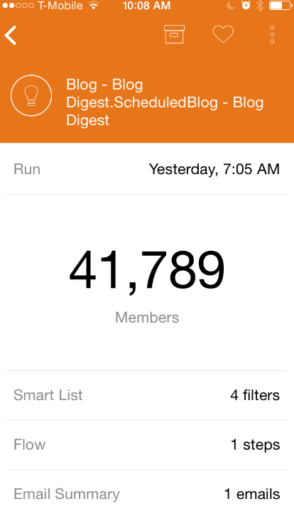
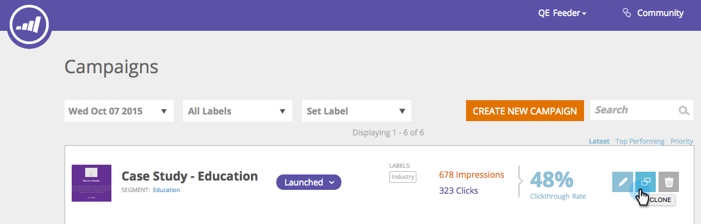

# 2015

## 2015년 1월 {#january}

다음 기능은 2015년 1월 릴리스에 포함되어 있습니다. Marketo 버전에서 사용 가능한 기능이 있는지 확인하십시오. 릴리스 후에 다시 돌아와 각 기능에 대한 자세한 문서에 대한 링크를 찾으십시오.

## Marketing Automation 업데이트 {#marketing-automation-updates}

**모바일 랜딩 페이지**

이제 랜딩 페이지 편집기 내에서 [랜딩 페이지의 모바일 보기를 빌드](/help/marketo/product-docs/demand-generation/landing-pages/free-form-landing-pages/add-a-mobile-view-for-your-free-form-landing-page.md)할 수 있습니다. 장치에 관계없이 메시지를 효과적으로 전달하고, 콘텐츠를 맞춤화하여 이동 중에도 쉽게 사용할 수 있도록 하여 참여도를 높이십시오. 이 기능은 릴리스 후 일주일 동안 점진적으로 롤아웃됩니다.

[-랜딩 페이지 안내 비디오-](https://youtu.be/aPQHlG2X6c0)

**새 REST API 호출**

리드 및 활동 REST API에 대한 세 가지 새로운 호출:

* 리드 삭제
* 프로그램 ID로 리드 가져오기
* 삭제된 리드 가져오기

또한 더 빠른 API 호출을 위해 리드 변경을 비동기식으로 작성하는 새로운 리드 동기화 옵션이 있습니다. 전체 세부 정보는 [https://experienceleague.adobe.com/ko/docs/marketo-developer/marketo/home](https://experienceleague.adobe.com/ko/docs/marketo-developer/marketo/home)에 릴리스된 후에 사용할 수 있습니다.

**전자 메일 스크립팅 사용자 지정 개체 지원**

이제 이메일 스크립트 내에서 계정 개체와 연관된 사용자 정의 개체에 액세스할 수 있습니다!

## Real-Time Personalization {#real-time-personalization}

Google 및 [!DNL Facebook]&#x200B;**에 대해**&#x200B;개인화된 리마케팅

리마케팅은 웹 사이트를 방문한 사람에게 광고를 표시합니다. 이제 Real-Time Personalization의 데이터를 사용하여 [Google](/help/marketo/product-docs/web-personalization/website-retargeting/personalized-remarketing-in-google.md) 및 [[!DNL Facebook]](/help/marketo/product-docs/web-personalization/website-retargeting/personalized-remarketing-in-facebook.md)에서 리마케팅 캠페인을 개인화할 수 있습니다. 다른 업계의 대상, 명명된 계정 목록, 회사 규모 또는 알려진 잠재 고객의 데이터를 리마케팅합니다.

[명명된 계정 목록 모듈](/help/marketo/product-docs/web-personalization/account-based-web-marketing/create-a-new-account-list.md)

Named Accounts 모듈의 개선 사항은 사용자의 일치율과 유효성 검사를 향상시킵니다. 추가 사항은 다음과 같습니다.

* 잠재 고객의 이메일 주소를 사용하여 명명 계정 목록에서 조직을 일치시킵니다(RTP 전용 고객도 해당).
* 계정당 최대 10만 개의 레코드 지원
* 보고 다운로드할 CSV 파일 템플릿


**업데이트된 RTP 태그 옵션**

계정 설정 아래의 RTP 태그 옵션이 다음을 포함하도록 업데이트되었습니다.

1. CDN 및 비동기(권장 태그)
1. CDN 및 동기(고속)
1. CDN이 없는 비동기 태그
1. CDN 없이 동기식 태그

최상의 성능을 위해 태그를 웹 페이지의 헤더 맨 위에 `<head>` 뒤에 배치하는 것이 좋습니다. 모든 태그는 [RTP API](https://experienceleague.adobe.com/ko/docs/marketo-developer/marketo/javascriptapi/rich-media-recommendation) 사용을 허용합니다. RTP 태그를 배포하는 방법에 대한 자세한 내용은 [여기](/help/marketo/product-docs/web-personalization/rtp-tag-implementation/deploy-the-rtp-javascript.md)를 참조하십시오.


## 2015년 2월 {#february}

다음 기능은 2015년 2월 릴리스에 포함되어 있습니다. Marketo 버전에서 사용 가능한 기능이 있는지 확인하십시오. 릴리스 후에 다시 돌아와 각 기능에 대한 세부 문서에 대한 링크를 찾으십시오. 드럼 롤...

## 향상된 마케팅 자동화 {#marketing-automation-enhancements}

**[스마트 캠페인 이동](/help/marketo/product-docs/core-marketo-concepts/smart-campaigns/using-smart-campaigns/move-a-smart-campaign.md)**

기뻐하라! 이제 트리의 드래그 앤 드롭 또는 이동 기능을 사용하여 스마트 캠페인을 프로그램 안과 밖으로 이동할 수 있습니다.

**[[!DNL Dynamics] 2015(온라인)](https://docs.marketo.com/display/docs/microsoft+dynamics+2013+on-premises)** - 지원됨!

**HTTPS 인증서 변경**

고객 데이터와 SaaS 서비스의 기밀성과 무결성을 보호하기 위해 Marketo은 SaaS 업계 모범 사례를 따릅니다

및 은 현재 사용되는 보안 프로토콜(SHA-1 및 SSL)을 다음 도메인에 대한 더 안전한 버전(SHA-2(SHA-256)과 TLS)로 대체합니다.

* marketo.net (암호화된 [!DNL Munchkin] 트래픽)

* [marketo.com](https://marketo.com)&#x200B;(기본 SaaS 애플리케이션)

이 문제는 이 릴리스 직후 발생합니다. SHA-1 프로토콜은 레거시 시스템 및 응용 프로그램의 소유자가 SHA-2 호환성으로 시스템을 업데이트할 수 있도록 2015년 12월까지 [mktoapi.com](https://mktoapi.com) 도메인에서 임시로 지원됩니다.

**보안[!DNL Munchkin]**

SSL3에 대한 지원이 제거되었습니다. 이전 웹 브라우저에 대한 지원을 유지하기 위해 지금까지 SSL3을 유지했지만 2015년에는 더 이상 해당 브라우저에서 상당한 웹 트래픽이 발생하지 않습니다. 이는 보안 페이지에서 사용할 경우 [!DNL Munchkin]에만 영향을 주며 2월 릴리스 이후 느리게 롤아웃됩니다.

## 실시간 Personalization 개선 사항 {#real-time-personalization-enhancements}

**[캠페인용 Target URL](/help/marketo/product-docs/web-personalization/working-with-web-campaigns/adding-a-target-url-to-a-web-campaign.md)**

&#39;Target URL 추가&#39;를 사용하여 실시간 캠페인에 표시할 페이지를 선택합니다. 이 기능은 모든 캠페인 유형(대화 상자, 영역, 위젯)에 작동하지만, 특히 선택한 대상 URL에 대해서만 영역 ID로 캠페인이 렌더링되는 영역 내 캠페인에 유용합니다. 여러 URL을 추가하여 다른 웹 페이지를 타깃팅할 수 있습니다.


**계정 기반 타깃팅에 추가된 국가 및 상태**

이제 국가와 주를 명명 계정 목록에 추가할 수 있습니다. 특정 지역의 주요 잠재 고객을 대상으로 합니다.

## 2015년 3월 {#march}

다음 기능은 2015년 3월 릴리스에 포함되어 있습니다. Marketo 버전에서 사용 가능한 기능이 있는지 확인하십시오. 릴리스 후에 다시 돌아와 각 기능에 대한 세부 문서에 대한 링크를 찾으십시오.

## 캘린더 HD {#calendar-hd}

달력의 새 프레젠테이션 모드로 팀의 마케팅 활동을 표시합니다. 이것들은 사무실 주변의 TV나 거대한 모니터에 아주 좋습니다! 스마트 목록 또는 사용자 지정 지표를 기반으로 목표를 설정하고 표시합니다.

>[!NOTE]
>
>이 기능은 Spark 및 [!DNL Standard] 버전에서 사용할 수 없습니다.


## [!DNL Google Adwords] 통합 {#google-adwords-integration}

[[!DNL Google AdWords] 계정을 Marketo에 연결](/help/marketo/product-docs/administration/additional-integrations/add-google-adwords-as-a-launchpoint-service.md)하여 Marketo에서 [!DNL Google AdWords]&#x200B;(으)로 오프라인 전환 데이터를 자동으로 업로드합니다. 그런 다음 [!DNL AdWords] UI에서 자격을 갖춘 리드, 기회 및 신규 고객(또는 추적하려는 매출 단계)을 일으킨 클릭 수를 쉽게 확인할 수 있습니다.


## [!UICONTROL Revenue Explorer] 다시 디자인 {#revenue-explorer-redesign}

[!UICONTROL Revenue Explorer]은(는) 새로운 Sunburst 차트 유형과 새로운 모양과 느낌을 가지고 있습니다. 4월 첫 2주 동안 이 프로젝트를 진행할 예정입니다.

## 새 자산 REST API {#new-asset-rest-apis}

[새 자산 REST API](https://experienceleague.adobe.com/ko/docs/marketo-developer/marketo/rest/assets/assets)

이제 API를 통해 [전자 메일, 템플릿, 내 토큰, 파일 및 코드 조각을 만들고 편집할 수 있습니다](https://developer.adobe.com/marketo-apis/api/asset/)!

## [!DNL Microsoft Dynamics] 2015 On Premise {#microsoft-dynamics-on-premise}

이제 최신 설치 관리자로 지원되며 [앱을 통해 액세스할 수 있습니다](/help/marketo/product-docs/crm-sync/microsoft-dynamics-sync/sync-setup/update-the-marketo-solution-for-microsoft-dynamics.md).


## RTP - 잠재 고객 데이터가 있는 개인화된 웹 참여 {#rtp-personalized-web-engagement-with-lead-data}

Marketo 리드 데이터베이스에서 보유하고 있는 [리드 데이터 필드](/help/marketo/product-docs/web-personalization/using-web-segments/manage-person-data.md)를 활용하여 실시간 세분화 및 개인화된 콘텐츠 캠페인을 만드십시오. RTP에서 리드 데이터 필드를 관리하고 관련 리드 필드를 추가/삭제합니다.

## RTP - 이메일 또는 프로그램 캠페인 이름으로 웹 컨텐츠 개인화 {#rtp-personalize-web-content-by-email-or-program-campaign-name}

이메일과 웹의 채널을 통해 잠재 고객과 대화를 계속합니다. [Marketo의 마케팅 활동에 사용된 이메일 캠페인 또는 프로그램을 기반으로 인바운드 콘텐츠 개인화](/help/marketo/product-docs/web-personalization/using-web-segments/web-segments.md) 이름.

## 2015년 4월 {#april}

다음 기능은 2015년 4월 릴리스에 포함되어 있습니다. Marketo 버전에서 사용 가능한 기능이 있는지 확인하십시오. 릴리스 후에 다시 돌아와 각 기능에 대한 자세한 문서에 대한 링크를 찾으십시오.

## Analytics 홈 재디자인

[Analytics 홈 재디자인](/help/marketo/product-docs/reporting/basic-reporting/creating-reports/navigating-the-analytics-home-page.md)

>[!NOTE]
>
>이 기능은 4월 28일 화요일에 릴리스됩니다.

새 [[!UICONTROL Analytics] 홈 페이지](/help/marketo/product-docs/reporting/basic-reporting/creating-reports/navigating-the-analytics-home-page.md)을(를) 사용하면 사용 가능한 보고서 유형에서 임시 보고서를 실행할 수 있습니다.


또한 이제 비공개 및 공유 보고서 조직을 사용할 수 있습니다. 보고서를 만들거나 [!UICONTROL My Reports] 폴더로 드래그하여 다른 사용자가 보거나 편집하거나 삭제할 수 없도록 잠급니다. [!UICONTROL Group Reports]이(가) 모든 사용자에게 공유됩니다.

## Marketo Mobile Engagement {#marketo-mobile-engagement}

**Marketo Mobile Engagement**

Marketo Mobile Engagement를 사용하면 매력적인 모바일 경험을 쉽게 제공할 수 있습니다. 앱 개발 팀에 의존할 필요 없이 매력적인 콘텐츠를 제공하는 고도로 개인화된 캠페인을 만들 수 있습니다. 새로운 필터 및 트리거를 사용하면 푸시 알림을 통해 모바일 채널에서 수신 및 응답할 수 있습니다.


## [!DNL LinkedIn] 리드 가속기 통합

[[!DNL LinkedIn] 리드 가속기 통합](/help/marketo/product-docs/demand-generation/social/social-functions/use-a-marketo-list-or-smart-list-as-a-linkedin-audience-segment.md)

리드 육성 전략을 유료 디스플레이 및 소셜 광고로 확장하십시오. [!DNL LinkedIn] 리드 가속기와 [광고 네트워크 통합](/help/marketo/product-docs/demand-generation/ad-network-integrations/add-linkedin-matched-audiences-as-a-launchpoint-service.md)을(를) 사용하면 모든 스마트 또는 정적 목록의 구성원을 기반으로 [!DNL LinkedIn] 내에 대상 세그먼트를 안전하게 만들 수 있습니다. 그런 다음 [!DNL LinkedIn] 대상 세그먼트 내의 구성원을 관련 광고 시퀀스로 육성할 수 있습니다.


## [!DNL Salesforce1]용 Marketo [!DNL Sales Insight] {#marketo-sales-insight-for-salesforce}

[!DNL Sales Insight] 기능(리드 피드, 최고의 선택, 즐거운 순간 및 Marketo 캠페인에 추가)을 모두 [!DNL Salesforce1] 앱에서 사용할 수 있습니다.

 

## RTP - Account-Based Marketing Analytics {#rtp-account-based-marketing-analytics}

**RTP - Account-Based Marketing Analytics**

구매 주기의 각 단계에 따라 주요 명명 계정 목록의 성능을 즉시 확인할 수 있으며, 명명 계정 목록에 대한 새로운 성능 그래프가 제공됩니다. 그래프는 방문 횟수와 방문자 상태에 따라 인식에서 시작해 행동까지 이어지는 주요 조직의 방문 단계를 보여줍니다.

## 2015년 5월 {#may}

다음 기능은 2015년 5월 릴리스에 포함되어 있습니다. Marketo 버전에서 사용 가능한 기능이 있는지 확인하십시오. 릴리스 후에 다시 돌아와 각 기능에 대한 자세한 문서에 대한 링크를 찾으십시오.

## 완전히 응답형 랜딩 페이지

[완전히 응답형 랜딩 페이지](/help/marketo/product-docs/demand-generation/landing-pages/guided-landing-pages/create-a-guided-landing-page.md)

새로운 랜딩 페이지 편집 모드 및 템플릿 구문을 출시합니다. &quot;자유 형식&quot; 랜딩 페이지 편집기와 달리, 새로운 &quot;안내식&quot; 랜딩 페이지 편집기는 완전한 응답형 랜딩 페이지를 위한 구조화된 편집 환경을 제공합니다.


## 이메일 프로그램 중단

[이메일 프로그램 중단](/help/marketo/product-docs/email-marketing/email-programs/email-program-actions/abort-email-program.md)

이메일 프로그램이 준비되기 전에 보내기 버튼을 눌렀습니까? 새로운 abort email program 버튼을 사용하여 브레이크를 당깁니다. 이렇게 하면 해당 트랙에서 바로 진행 중인 이메일 프로그램이 중지됩니다.

## 이메일 전달성  {#email-deliverability}

이제 Marketo에서 추가된 도메인에 대해 매주 자동 [!DNL SPF] 및 [!DNL DKIM] 검사를 실행합니다. 알림을 확인하여 이 문제를 해결하십시오.

## 이메일 템플릿 동작 변경 {#email-template-behavior-change}

이번 릴리스부터 유효한 HTML 댓글이 허용되며 새 이메일을 만들 때 제거되지 않습니다.

## RTP: 세그먼트 편집기 드래그 앤 드롭 {#rtp-drag-and-drop-segment-editor}

RTP: [세그먼트 편집기 드래그 앤 드롭](/help/marketo/product-docs/web-personalization/using-web-segments/web-segments.md)

기준을 세그먼트 빌더에 끌어다 놓고 값을 정의하면 실시간 세그먼트를 만드는 데 도움이 됩니다.

## RTP: 예측 컨텐츠 권장 사항 {#rtp-predictive-content-recommendations}

[예측 콘텐츠 권장 사항](/help/marketo/product-docs/predictive-content/enabling-predictive-content/enable-predictive-content-for-web-rich-media.md)

RTP의 머신 러닝 및 예측 분석 알고리즘을 사용하여 올바른 컨텐츠를 올바른 잠재 고객에게 추천합니다. 이미지 및 텍스트 설명을 통해 콘텐츠 에셋을 시각적으로 개선하고 두 개 이상의 콘텐츠 에셋을 추천합니다.

## 2015년 6월 {#june}

다음 기능은 2015년 6월 릴리스에 포함되어 있습니다. Marketo 버전에서 사용 가능한 기능이 있는지 확인하십시오. 릴리스 후에 다시 돌아와 각 기능에 대한 자세한 문서에 대한 링크를 찾으십시오.

## [속성 전자 메일 보고서](/help/marketo/product-docs/web-personalization/reporting-for-web-personalization/email-reports.md) {#attribution-email-report}

마케팅 활동에 제공하는 개인화 및 권장 콘텐츠 가치를 참조하십시오. [속성 이메일 보고서](/help/marketo/product-docs/web-personalization/reporting-for-web-personalization/email-reports.md)에는 RTP의 개인화 및 권장 콘텐츠 캠페인으로 인한 직접 및 지원 리드가 표시됩니다. RTP의 사용자 설정 및 이메일 보고서에서 속성 이메일 보고서를 추가하여 월별 또는 분기별 이메일을 수신합니다.

## 2015년 7월 {#july}

## [!DNL Marketo Moments] {#marketo-moments}

점심에 나가는데 이메일 일정을 조정해야 하나요? App Store 또는 [!DNL Google Play]에서 사용할 수 있는 [!DNL Marketo Moments] 앱을 사용하면 iPhone, iPad 또는 Android 휴대폰에서 이메일 및 이벤트 캠페인의 실시간 실행뿐만 아니라 향후 출시될 내용을 확인할 수 있습니다.


## 리치 텍스트 편집기 업데이트 {#rich-text-editor-update}

간소화된 텍스트 서식 지정, 이미지 편집, 링크 삽입 및 HTML 편집을 포함하여 현대적인 모양과 느낌으로 텍스트 편집기를 업데이트했습니다. 이제 HTML 편집기에서는 최소한의 유효성 검사만 지원되므로 보다 제한적인 코드 편집이 가능합니다.
`<iframe width="420" height="315" src="https://www.youtube.com/embed/LmmBN6IQrII" frameborder="0" allowfullscreen></iframe>` 이 업데이트는 7월 릴리스 후 며칠 내에 자동으로 롤아웃됩니다. 나중에 **[!UICONTROL Admin]> [!UICONTROL Email] >[!UICONTROL Edit Editor Settings]**&#x200B;에서 편집기의 새 버전과 이전 버전 간을 전환할 수 있습니다.


링크 및 이미지 대화 상자가 업데이트되었습니다.


텍스트 편집기 버전을 전환합니다.


## 이메일 전달성 단일 사인온 {#email-deliverability-single-sign-on}

이메일 게재 가능성 타일을 클릭하면 더 이상 로그인 자격 증명을 제공할 필요가 없습니다.

## 캠페인 우선 순위 {#campaign-prioritization}

개인화된 RTP 캠페인을 여러 개 설정했으며 이러한 캠페인 중 일부가 다른 캠페인과 겹칠 수 있음을 알게 되었습니까? 계속 진행하여 다른 캠페인의 RTP가 표시되는 우선 순위를 설정하십시오.


## 회사 API {#company-api}

**REST API를 통한 회사 개체 액세스**: 이제 REST API는 Marketo 회사(계정) 개체에 대한 액세스를 제공합니다. 즉, 업데이트된 [!DNL Lead] API를 사용하여 Marketo에서 만든 회사 개체를 읽고, 업데이트하고, 삭제하고, 해당 회사와 리드를 연결할 수 있습니다.

회사 API에 대한 참조 안내서에서 [자세히]<https://developer.adobe.com/marketo-apis/api/mapi/#tag/Companies>)를 알아보세요.

## 이메일 전달성 액세스 {#access-email-deliverability}

**이메일 게재 기능 도구에 액세스**: 이 새 권한을 통해 관리자는 사용자에게 이메일 게재 기능 도구에 대한 액세스 권한을 부여할 수 있습니다.

## 2015년 가을 {#fall}

다음 기능은 15년 가을 릴리스에 포함되어 있습니다. Marketo 버전에서 사용 가능한 기능이 있는지 확인하십시오.

## 스마트 목록 구독 {#subscribe-to-a-smart-list}

[스마트 목록 구독](/help/marketo/product-docs/reporting/basic-reporting/report-subscriptions/subscribe-to-a-smart-list.md)

스마트 목록 구독을 통해 마케터는 스마트 목록을 내보내고 Marketo을 사용하지 않는 관련자(예: 영업 팀 또는 텔레마케팅 팀)에게 이메일로 보낼 수 있습니다.

내보내기는 매일, 매주 또는 매월 예약할 수 있으며, 최종 게재 날짜가 있을 수 있고 제한된 수의 열을 공유하도록 사용자 지정할 수 있습니다.


스마트 목록에 여러 개의 구독을 만들 수 있습니다. 구독당, 전체 작업 공간, Marketo 인스턴스당 10만 개의 리드가 있는 구독은 100개로 제한됩니다.


## Marketo 사용자 정의 오브젝트 {#marketo-custom-objects}

[Marketo 사용자 정의 오브젝트](/help/marketo/product-docs/administration/marketo-custom-objects/understanding-marketo-custom-objects.md)

관리 UI에서 사용자 지정 개체를 쉽게 만들 수 있습니다. 현재 Marketo에서 1:N 사용자 지정 개체를 만들고 이를 리드 또는 회사에 연결하는 기능을 지원합니다.

>[!NOTE]
>
>Marketo 사용자 지정 오브젝트는 Spark에 사용할 수 없습니다.


## [!DNL Google Chrome]에 대한 Marketo Insights {#marketo-insights-for-google-chrome}

[&#x200B; [!DNL Google Chrome]에 대한 Marketo 인사이트](/help/marketo/product-docs/marketo-sales-insight/msi-chrome-plugin/using-marketo-insights-for-google-chrome.md)

[!DNL Google Mail] [!DNL Sales Insight] 확장에 대한 업데이트 릴리스를 발표하게 되어 기쁘게 생각합니다! [[!DNL Chrome Store]](https://chrome.google.com/webstore/detail/marketo-insights-for-goog/jjkfbhajlmoeegbjgjipliamplidmbjb)에서 봅니다.

이 업데이트에는 다음과 같은 많은 새로운 기능이 포함되어 있습니다.

* 영업 사원은 참여하기 전에 직책, Twitter 프로필, 회사 정보, 사진 등 [!DNL Google Mail] 내에서 잠재 고객에 대한 관련 정보를 직접 볼 수 있습니다.
* 영업 사원은 개설되거나 클릭한 이메일, 온라인 또는 직접 참여한 이벤트, 방문한 웹 페이지, 다운로드한 eBook 등과 같은 채널 전반에서 잠재 고객이 관심을 보이는 콘텐츠를 실시간으로 확인할 수 있습니다.
* [!DNL Google Mail]을(를) 통해 전송된 전자 메일은 Marketo에 로그인하여 실시간으로 추적됩니다. 이를 통해 영업 사원은 잠재 고객이 이메일을 언제 확인하는지 파악하여 적절한 시기에 후속 조치를 수행할 수 있습니다. [!DNL Google Mail]용 Marketo [!DNL Sales Insight]을(를) 사용하면 영업 사원이 마케팅으로 만든 템플릿을 활용하여 멋진 초대, 오퍼 및 기타 유형의 콘텐츠를 쉽게 보낼 수 있습니다.


## Marketo Mobile Engagement - 토큰, 샘플 전송 및 미리보기 {#marketo-mobile-engagement-tokens-send-sample-preview}

* [토큰](/help/marketo/product-docs/mobile-marketing/push-notifications/configure-mobile-push-notification.md)
* [샘플 보내기](/help/marketo/product-docs/mobile-marketing/push-notifications/send-a-push-notification-sample.md)
* [미리보기](/help/marketo/product-docs/mobile-marketing/push-notifications/preview-a-push-notification.md)

[토큰](/help/marketo/product-docs/mobile-marketing/push-notifications/configure-mobile-push-notification.md)을 사용하여 푸시 알림을 손쉽게 개인화할 수 있습니다.


고객에게 푸시 알림을 배포하기 전에 [미리 보기](/help/marketo/product-docs/mobile-marketing/push-notifications/preview-a-push-notification.md)하거나 [샘플](/help/marketo/product-docs/mobile-marketing/push-notifications/send-a-push-notification-sample.md) 푸시 알림을 보낼 수도 있습니다.


## 순간의 스마트 캠페인 {#smart-campaigns-in-moments}

[순간의 스마트 캠페인](/help/marketo/product-docs/core-marketo-concepts/mobile-apps/marketo-moments/understanding-moments/understanding-smart-campaign-cards.md)

이제 Smart Campaign을 통해 보낸 이메일에 대한 통계를 실시간으로 사용할 수 있습니다. 이 업그레이드의 다른 기능은 다음과 같습니다.

* 살짝 밀어 완료. 스트림에 카드가 너무 많습니까? 이제 쓸어넘길 수 있습니다!
* 미리보기 화면에서 바로 샘플 보내기
* 이메일 프로그램 카드에 추가된 스마트 목록 세부 정보
* 이메일 프로그램에 대해 중단됨 상태에 대한 지원이 추가되었습니다



## RTP - Content Analytics 및 권장 사항 {#rtp-content-analytics-and-recommendations}

[Content Analytics](/help/marketo/product-docs/web-personalization/understanding-web-personalization/understanding-content-analytics.md) 및 권장 사항

RTP Content Analytics은 일반 웹 방문과 RTP의 컨텐츠 권장 사항 엔진에서 생성된 방문 횟수의 웹 컨텐츠 자산 성능을 보여 줍니다.

* 성과가 가장 좋은 콘텐츠와 가장 많은 리드를 가져오는 콘텐츠 확인
* RTP의 예측 콘텐츠 엔진에서 콘텐츠를 활성화하여 올바른 방문자에게 최상의 콘텐츠를 자동으로 추천함으로써 콘텐츠 소비를 늘립니다
* 각 콘텐츠 에셋을 드릴다운하여 보다 심층적인 지표, 그래프 및 성능을 확인합니다

RTP의 Assets 페이지는 이제 Content Analytics 및 컨텐츠 권장 사항으로 분할됩니다.

* **Content Analytics:** 검색 및 정의된 모든 웹 콘텐츠의 보기 및 직접 잠재 고객을 표시하여 최상의 성과를 분석하는 데 도움을 줍니다.
* **콘텐츠 권장 사항:** RTP의 권장 콘텐츠 및 관련 잠재 고객 속성의 노출 횟수 및 클릭 수를 표시합니다. [표시줄](/help/marketo/product-docs/predictive-content/enabling-predictive-content/enable-the-content-recommendation-bar.md) 및 [리치 미디어](/help/marketo/product-docs/predictive-content/enabling-predictive-content/enable-predictive-content-for-web-rich-media.md) 권장 사항에 대해 이 페이지에서 콘텐츠 권장 사항을 편집하고 활성화할 수도 있습니다.

* 이 두 페이지의 모든 직접 잠재 고객 데이터는 해당 연도의 시작 (2015년 1월 1일) 이후로 소급하여 업데이트되었습니다.

## RTP - RTP Campaign 복제 {#rtp-clone-an-rtp-campaign}

[RTP - RTP Campaign 복제](/help/marketo/product-docs/web-personalization/working-with-web-campaigns/clone-a-web-campaign.md)

RTP 캠페인을 복제하면 보다 개인화된 웹 캠페인을 더 빠르고 효율적으로 만들 수 있습니다. RTP의 Campaign 페이지에서 복제 기능을 사용하여 캠페인 설정을 복사하고 분할 테스트 최적화를 위한 콘텐츠를 변경하거나 동일한 콘텐츠로 캠페인을 복제하고 다른 세그먼트로 타깃팅할 수 있습니다. 캠페인 생성(초)!



## 리치 텍스트 편집기 개선 사항 {#rich-text-editor-improvements}

리치 텍스트 편집기에 대한 몇 가지 사항을 개선하고 있습니다. 7월에 업데이트된 편집기를 릴리스한 후 좋은 피드백을 받았으며 이러한 변경 사항을 이 업그레이드에 사용할 수 있었습니다. 앞으로 몇 달 동안 더 많은 것을 볼 수 있습니다. 4분기의 새로운 기능은 다음과 같습니다.

* 이제 VML이 HTML 코드 내에서 지원됩니다.

```
<v:background xmlns:v="urn:schemas-microsoft-com:vml" fill="t">
<v:fill type="tile" src="<a href="https://i.imgur.com/YJOX1PC.png" rel="nofollow">https://i.imgur.com/YJOX1PC.png</a>" color="#7bceeb"/>
</v:background>
```

* 이제 모든 항목을 유효한 HTML 주석에 삽입할 수 있습니다(아래에 표시된 특정 구문은 이전에 제거됨).

`<!--[if gte mso 9]> <![endif]-->`

* 빈 테이블 셀을 `&nbsp;`(으)로 패딩하지 않음

* HTML 소스 편집기에 추가된 최대화/최소화 단추
* 이제 기존 테이블 속성이 식별되어 테이블 속성 대화 상자에 표시됩니다
* 이제 두 단추 행이 기본적으로 표시됩니다.
* 이제 편집기에서 모든 요소(더 이상 사용되지 않는 요소 또는 비표준 요소)를 허용합니다.

`<myCustomElement>Hello World!</myCustomElement>`

* 이제 편집기에서 모든 특성(더 이상 사용되지 않는 특성 또는 비표준 특성)을 허용합니다.

```
<myCustomElement myCustomAttribute="foo">Hello World!</myCustomElement>
<td background="someImage.png">
```

## [!DNL Microsoft Dynamics] - 동기화 확인 {#microsoft-dynamics-validate-sync}

[[!DNL Microsoft Dynamics] - 동기화 확인](/help/marketo/product-docs/crm-sync/microsoft-dynamics-sync/sync-setup/validate-microsoft-dynamics-sync.md)

이 새 관리 도구는 동기화 구성이 올바르게 설정되었는지 확인하기 위해 일련의 검사를 실행합니다.


## CRM 사용자 지정 개체 동기화에 필드 추가 {#add-fields-to-crm-custom-object-sync}

[!DNL Salesforce] 및 [!DNL Dynamics]에서 동기화된 사용자 지정 개체에 새 필드를 쉽게 추가하십시오. 이제 전체 사용자 지정 개체를 비활성화하고 활성화하지 않고도 사용자 지정 개체 동기화에 새 필드를 추가할 수 있습니다.

## 보안 기능 변경 사항 {#changes-to-security-features}

* 암호 시도는 5회로 제한됩니다. 5번째 시도 후에는 사용자가 잠깁니다.
* 이제 구독에 대해 비활성 세션 시간 제한을 구성할 수 있습니다.


## IE 11 지원(및 IE 9에 대한 지원 중단) {#ie-support-and-deprecating-support-for-ie}

이제 공식적으로 [!DNL Microsoft Internet Explorer] 11 브라우저를 지원하며 [!DNL Microsoft Internet Explorer] 9 브라우저에 대한 지원을 제거합니다.

## MSI에 대한 라이트닝 UI 지원 {#lightning-ui-support-for-msi}

앱 교환의 최신 MSI 패키지는 [!DNL Salesforce] UI의 Lightning 및 Legacy 버전과 모두 작동합니다.

## 새 [!DNL Dynamics] 플러그 인 {#new-dynamics-plug-in}

이 새 플러그인은 비동기 모드에서 다양한 작업을 실행하여 성능을 향상시킵니다.

## Design Studio에서 랜딩 페이지의 URL로 검색 {#search-by-url-of-landing-page-in-design-studio}

이제 Design Studio 랜딩 페이지 그리드에서 페이지 URL별로 검색하여 랜딩 페이지를 찾을 수 있습니다. 이것은 수출용이기도 합니다.
