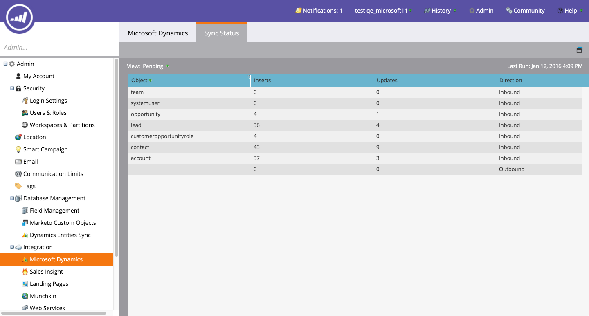
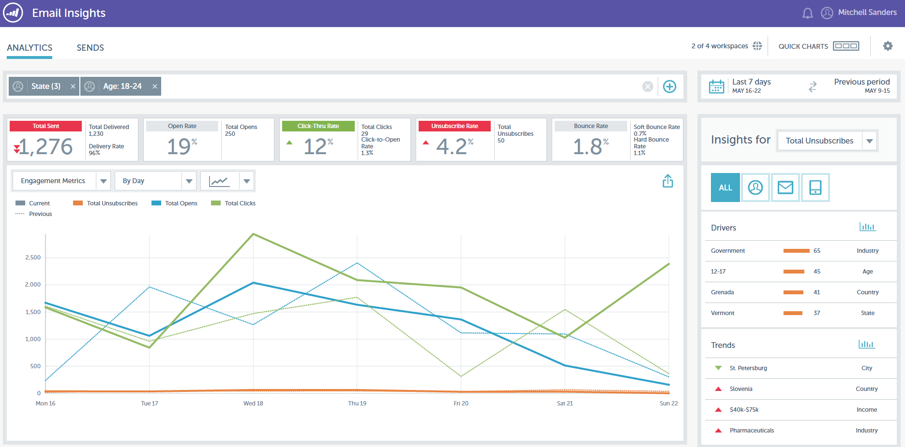
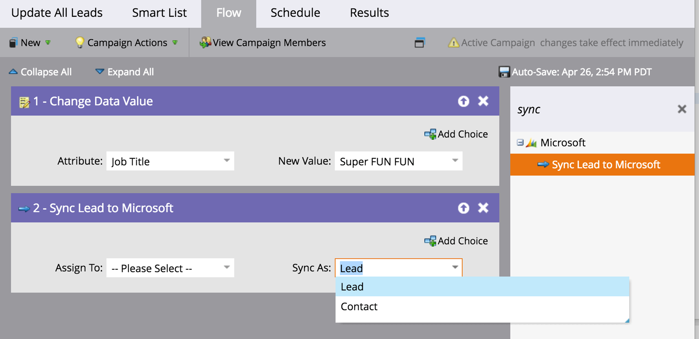

# 2016

## 2016 겨울 {#winter}

다음 기능은 16년 겨울 릴리스에 포함되어 있습니다. 각 기능에 대한 자세한 문서를 보려면 제목 링크를 클릭하십시오.

## [익명 필터임](/help/marketo/product-docs/administration/additional-integrations/add-munchkin-tracking-code-to-your-website/next-generation-munchkin-tracking-faq.md) {#is-anonymous-filter}

스마트 목록에 대해 익명 여부 필터가 제거되었습니다. 자세한 내용은 [차세대 Munchkin 추적 FAQ](/help/marketo/product-docs/administration/additional-integrations/add-munchkin-tracking-code-to-your-website/next-generation-munchkin-tracking-faq.md) 문서를 참조하십시오. 이 변경 사항은 익명 및 알려진 웹 방문자를 계속 식별하고 이러한 방문자에게 실시간으로 콘텐츠를 개인화하는 웹 Personalization(RTP)에는 영향을 주지 않습니다.

## [데이터베이스 대시보드](/help/marketo/product-docs/core-marketo-concepts/smart-lists-and-static-lists/managing-people-in-smart-lists/database-dashboard.md)  {#database-dashboard}

[!UICONTROL Lead Database]에 총 사용자 데이터베이스 크기, 마케팅 가능한 잠재 고객 수 및 상위 5개 소스별 잠재 고객 분류가 포함된 업데이트된 요약 대시보드가 있습니다.

## [Microsoft Edge 브라우저](/help/marketo/product-docs/administration/setup-administration/supported-browsers.md) {#microsoft-edge-browser}

Marketo에서 지원하는 [브라우저 목록](https://docs.marketo.com/display/public/DOCS/Supported+Browsers)에 [!DNL Microsoft Edge]을(를) 추가했습니다.

## [Microsoft Outlook 2016](/help/marketo/product-docs/marketo-sales-insight/msi-outlook-plugin/install-the-marketo-email-add-in-for-outlook-with-a-registration-code.md) {#microsoft-outlook}

이제 [[!DNL Microsoft Outlook] 2016](/help/marketo/product-docs/marketo-sales-insight/msi-outlook-plugin/install-the-marketo-email-add-in-for-outlook-with-a-registration-code.md)이(가) 지원됩니다.

## [전자 메일 프로그램 시작](/help/marketo/product-docs/email-marketing/email-programs/email-program-actions/head-start-for-email-programs.md) {#email-program-head-start}

[!UICONTROL Head Start]을(를) 사용하여 전송 처리가 미리 수행되어야 함을 나타냅니다. [!UICONTROL Head Start]은(는) 리드 자격을 확보하고 프로그램의 예약된 시간에 이메일을 준비하는 대신 이러한 작업이 미리 수행되도록 합니다. 이렇게 하면 대상자가 예약된 시간에 이메일을 받기 시작합니다.

이 기능을 사용하려면 최소 12시간 전에 이메일 프로그램을 예약해야 하며 보내기 12시간 전에 스마트 목록이 잠깁니다.

>[!NOTE]
>
>이 기능은 16년 겨울 릴리스 이후 1주일 동안 점진적으로 출시될 예정입니다. 스마트 캠페인 또는 API에서는 사용할 수 없습니다.

## [모바일 마케팅 개선 사항](/help/marketo/product-docs/mobile-marketing/admin/add-a-mobile-app.md) {#mobile-marketing-enhancements}

**[!DNL PhoneGap]지원:** 이제 모바일 앱에 대한 [!DNL PhoneGap] 지원을 제공합니다. [자세히 알아보기](https://developers.marketo.com/documentation/mobile/phonegap-plugin/)

**샌드박스 앱 지원**:

## [프로그램 API](https://developers.marketo.com/documentation/programs/) {#program-api}

REST API를 통해 프로그램을 만들고, 업데이트하고, 복제합니다. 프로그램 내에서 스마트 목록과 스마트 캠페인을 만들거나 업데이트하는 것은 여기에 포함되지 않습니다.

## [Microsoft Dynamics 개선 사항](/help/marketo/product-docs/crm-sync/microsoft-dynamics-sync/microsoft-dynamics-sync-details/sync-status.md) {#microsoft-dynamics-enhancements}

**[[!UICONTROL Sync Status]](/help/marketo/product-docs/crm-sync/microsoft-dynamics-sync/microsoft-dynamics-sync-details/sync-status.md)**: 동기화 프로세스의 현재 처리량과 백로그를 탭으로 유지합니다. 개체별 삽입 및 업데이트 횟수로 분류합니다.

**[[!UICONTROL Notifications]](/help/marketo/product-docs/core-marketo-concepts/miscellaneous/understanding-notifications/notification-types.md)**: 해당 오류가 있는 잠재 고객 목록과 함께 일반적인 동기화 오류에 대한 알림을 받습니다.

## [사용자 지정 개체 개선 사항](/help/marketo/product-docs/administration/marketo-custom-objects/create-marketo-custom-objects.md) {#custom-objects-enhancements}

이제 여러 링크 필드가 있는 중간 개체를 사용하여 리드/계정과 사용자 지정 개체 간의 다대다 관계를 만들 수 있습니다.

## [Facebook 리드 광고](/help/marketo/product-docs/demand-generation/facebook/set-up-facebook-lead-ads.md) {#facebook-lead-ads}

[[!UICONTROL Facebook Lead ads]](https://www.facebook.com/business/a/lead-ads)은(는) 비즈니스에서 [!DNL Facebook]에 리드 생성 캠페인을 더 직접적으로 실행할 수 있는 방법입니다. 사람들이 제품이나 서비스에 관심을 표현하기 위해 양식을 작성하기 때문에, 사업체들은 그것들을 따라 할 수 있다. [!UICONTROL Facebook Lead Ads]과(와) Marketo 통합은 잠재 고객이 제공한 정보를 잠재 고객 광고 양식 내에서 자동으로 캡처합니다. 그런 다음 새 [!UICONTROL Fills Out Facebook Lead Ads] 트리거를 사용하여 후속 작업 및 알림을 자동화할 수 있습니다.

## [웹(실시간 Personalization) Campaign 스케줄러](/help/marketo/product-docs/web-personalization/working-with-web-campaigns/schedule-a-web-campaign.md) {#web-real-time-personalization-campaign-scheduler}

캠페인을 미리 예약하십시오. 개인화된 웹 콘텐츠의 시작 및 종료 날짜를 설정하고 특정 날짜 및 시간에 캠페인을 반복하십시오. 웹 방문자의 시간 또는 선택한 시간대에 따라 캠페인을 표시하도록 일정을 개인화합니다.

## 2016 봄 {#spring}

2016년 봄 릴리스에는 다음 기능이 포함되어 있습니다. 각 기능에 대한 자세한 문서를 보려면 제목 링크를 클릭하십시오.

## [이메일 인사이트](/help/marketo/product-docs/reporting/email-insights/email-insights-overview.md) {#email-insights}

이메일 인사이트는 완전히 새롭게 디자인된 새로운 내역 집계 데이터 이메일 분석 경험으로, 매우 빠른 성능을 제공합니다. 이메일 마케터의 요구 사항과 워크플로에 맞게 최적화된 완전히 새로운 사용자 인터페이스 디자인을 특징으로 합니다.

>[!NOTE]
>
>6월 3일부터 고객에게 이메일 인사이트 를 일괄적으로 출시합니다. 우리의 목표는 앞으로 몇 달 동안 이것을 완성하는 것이다. 활성화하면 이메일로 알려드리겠습니다.

## [이메일 템플릿 선택기](/help/marketo/product-docs/email-marketing/general/email-editor-2/email-template-picker-overview.md) {#email-template-picker}

새로운 시작 템플릿을 사용하여 멋진 이메일을 만드십시오! 또한 라이브 썸네일에서 템플릿을 빠르게 찾을 수 있습니다.

>[!NOTE]
>
>이메일 편집기 2.0(템플릿 선택기 사용)은 6월 3일부터 점진적으로 롤아웃됩니다. 우리는 6월 30일까지 롤아웃을 완료할 것입니다. 이메일 인사이트와 달리 액세스 권한이 있으면 알림이 전송되지 않습니다. 사용 여부를 확인하려면 [이 문서](/help/marketo/product-docs/email-marketing/general/email-editor-2/transitioning-to-email-editor-2-0.md)의 단계를 따르세요.

## [전자 메일 편집—다시 시도](/help/marketo/product-docs/email-marketing/general/email-editor-2/email-editor-v2-0-overview.md) {#email-editing-re-imagined}

맞습니다. 완전히 새로운 이메일 편집기입니다! 간단한 드래그 앤 드롭 기능을 사용하여 컨텐츠를 추가하고 순서를 변경할 수 있습니다. 이미지, 비디오, 변수 및 모듈을 포함한 새로운 요소는 편집 환경을 향상시킵니다. 업데이트된 코드 편집기, 미리보기 및 프리헤더 지원도 확인하십시오.

## [모바일 인앱 메시지](/help/marketo/product-docs/mobile-marketing/in-app-messages/understanding-in-app-messages.md) {#mobile-in-app-messages}

Marketo 내에서 바로 앱에 대한 멋진 인앱 메시지를 만들 수 있습니다. 인앱 메시지 프로그램을 사용할 때 정확히 누구에게 표시되어야 하는지 정의합니다. 프로그램 대시보드를 사용하여 성능을 쉽게 모니터링할 수 있습니다.

## [초안 코드 조각 없음](/help/marketo/product-docs/administration/users-and-roles/enable-no-draft-for-snippets.md) {#no-draft-snippets}

스니펫이 업데이트될 때마다 모든 것을 다시 승인해야 하는 시대는 지났습니다! 초안을 사용하지 않으면 코드 조각을 사용하는 모든 이메일 및 랜딩 페이지가 코드 조각 업데이트를 받고 이전 상태를 유지합니다. 코드 조각을 승인할 때마다 초안 없음을 실행하고 모든 것을 업데이트하거나 초안을 만들도록 선택할 수 있습니다. 당신에게 달렸어요! 모든 고객이 No-Draft를 사용할 수 있으며 관리자의 새 권한으로 제어됩니다.

## [랜딩 페이지, 랜딩 페이지 템플릿 및 양식 API](https://developers.marketo.com/blog/spring-2016-updates/) {#landing-page-landing-page-template-and-form-apis}

이제 Marketo REST API는 Marketo 랜딩 페이지, 랜딩 페이지 템플릿 및 양식에 대한 제어를 지원합니다. 이제 사용자는 Marketo REST API를 통해 직접 콘텐츠를 만들고, 업데이트하고, 승인하고, 이러한 에셋을 삭제할 수 있습니다.

## [API 액세스용 IP 허용 목록에 추가](/help/marketo/product-docs/administration/additional-integrations/create-an-allowlist-for-ip-based-api-access.md) {#ip-allowlisting-for-api-access}

이제 Marketo 사용자 로그인에 대한 IP 허용 목록에 추가 기능과 유사하게, Marketo 관리자는 Marketo SOAP 및 REST API에 액세스할 수 있는 IP 주소 허용 목록을 설정하여 비인증 IP 주소에서의 액세스를 차단할 수 있습니다. 이렇게 하면 Marketo 인스턴스에 보안 레이어가 추가되고 API 액세스가 조직 네트워크 내에서만 발생할 수 있습니다. 이 설정 방법에 대한 자세한 내용은 [Marketo 설명서 사이트](/help/marketo/product-docs/administration/additional-integrations/create-an-allowlist-for-ip-based-api-access.md)에서 확인할 수 있습니다.

## [새로운 고속 Microsoft Dynamics 동기화 커넥터](/help/marketo/product-docs/crm-sync/microsoft-dynamics-sync/microsoft-dynamics-sync-details/sync-status.md) {#new-high-speed-microsoft-dynamics-sync-connector}

새로운 고속 Dynamics 커넥터는 초기 동기화에는 최대 20배, 증분 동기화에는 최대 5배 더 빠른 속도를 제공합니다. 모든 신규 고객은 릴리스 날짜에 이 커넥터에 온보딩되며, 여름 릴리스 기간 동안 기존 고객에게 점진적으로 배포될 예정입니다.

**새 필드의 데이터 새로 고침**: 이제 언제든지 새 동기화 필드를 사용할 수 있으며 해당 필드의 모든 데이터 값이 [!DNL Dynamics] CRM에서 Marketo으로 새로 고쳐집니다. 초기 설정 중에 모든 필드를 선택해야 하는 것에 대해 걱정할 필요가 없습니다. 기존 동기화 필드를 비활성화했다가 나중에 다시 활성화하면 해당 필드의 모든 데이터 값이 [!DNL Dynamics] CRM에서 Marketo으로 새로 고쳐집니다.

**잠재 고객을 연락처로 동기화**: [!UICONTROL Sync Lead to Microsoft] 흐름 작업에는 잠재 고객 또는 연락처와 동기화할 수 있는 새로운 옵션이 있습니다.

**동기화 오류 관리 탭**: 작업, 방향, 오류 코드 및 오류 메시지와 같은 세부 정보와 동기화하지 못한 리드(및 기타 개체)를 검색, 검색 또는 내보냅니다.

**[!DNL Microsoft Dynamics]2016**: 커넥터가 [!DNL Dynamics] 2016 [!DNL Online] 및 [!DNL On-premise] 버전에 대해 완전히 인증되었습니다.

**플러그 인 업데이트가 이제 문서화되었습니다.** [플러그 인 업데이트 문서 문서 문서](/help/marketo/product-docs/crm-sync/microsoft-dynamics-sync/marketo-plugin-releases-for-microsoft-dynamics.md)를 참조하세요.

## [친숙한 인스턴스 이름](/help/marketo/product-docs/administration/settings/edit-subscription-settings.md) {#friendly-instance-name}

현재는 샌드박스와 프로덕션 인스턴스와 같은 Marketo 인스턴스를 구별하기가 어렵습니다. 이 기능을 사용하면 현재 작업 중인 인스턴스를 알 수 있습니다.

## 구독에 대한 제한된 시간 액세스 {#limited-time-access-for-subscriptions}

이제 사용자는 무기한 Marketo 구독에 초대됩니다. 이 기능을 사용하면 관리자가 2주 또는 1개월과 같은 제한된 기간 동안 사용자를 구독에 초대할 수 있습니다.

## [사용자 지정 개체 격자](/help/marketo/product-docs/administration/marketo-custom-objects/understanding-marketo-custom-objects.md) {#custom-objects-grid}

이제 게시된 모든 사용자 지정 개체에 대한 레코드 및 필드 수를 볼 수 있습니다.

## 사용자 지정 활동 {#custom-activities}

이제 Marketo 관리자는 Marketo 사용자 정의 활동 정의 모델러를 통해 사용자 정의 활동 유형을 정의하고 관리할 수 있습니다. 이제 관리자는 Marketo 사용자 지정 개체 Modeler과 유사하게(과 함께) 정확한 비즈니스 요구 사항에 맞게 데이터 모델을 확장할 수 있습니다. 이 기능을 사용하는 방법에 대한 자세한 내용은 [Marketo 설명서 사이트](/help/marketo/product-docs/administration/marketo-custom-activities/understanding-custom-activities.md)에서 확인할 수 있습니다.

## 2016년 여름 {#summer}

다음 기능은 16년 여름 릴리스에 포함되어 있습니다. Marketo 버전에서 사용 가능한 기능이 있는지 확인하십시오. 각 기능에 대한 자세한 문서를 보려면 제목 링크를 클릭하십시오.

## [계정 기반 마케팅](https://docs.marketo.com/display/docs/account+based+marketing) {#account-based-marketing}

Marketo 계정 기반 마케팅은 하나의 통합 플랫폼에서 모든 핵심 기능을 제공합니다.

* **Target** - 계정 검색, 리드-계정 일치 및 명명된 계정 목록
* **참여** - 계정 기반 Personalization, 크로스 채널 참여 및 계정별 워크플로
* **측정** - 계정 및 목록 수준 인사이트, 계정 참여 점수, 파이프라인 및 매출에 미치는 영향

>[!NOTE]
>
>ABM은 Marketo 구독의 추가 기능으로 사용할 수 있으므로 판매 담당자에게 문의하여 이를 구현하십시오.

## [감사 추적](/help/marketo/product-docs/administration/audit-trail/audit-trail-overview.md) {#audit-trail}

감사 추적은 Marketo 구독 내에서 수행된 변경 사항에 대한 포괄적인 기록을 제공합니다. 사용자 및 관리자 간에 책임감을 조성하고, 예상치 못한 행동의 원인을 식별하며, 누가 무엇을 언제 하고 있는지 알 수 있는 보안을 제공합니다. 이 정보는 언제든지 사용할 수 있으며 다음과 같은 질문에 답변하는 데 사용할 수 있습니다.

* 이 에셋 또는 설정이 어떻게 되었으며 마지막으로 업데이트한 사람은 누구입니까?
* 사용자 X는 어떻게 지내?
* 누가 우리 계정에 로그인하고 있습니까?

## Marketo-Vibes SMS LaunchPoint 통합

Marketo 내에서 SMS 메시지를 쉽게 만들 수 있습니다. 풍부한 Marketo 데이터를 사용하여 메시지를 개인화하고 타겟팅하고 SMS 메시지 대시보드를 사용하여 성과를 쉽게 모니터링할 수 있습니다.

>[!NOTE]
>
>이 기능을 사용하려면 기존 [!DNL Vibes SMS] 계정이 있어야 합니다.

## [전자 메일 2.0 개선 사항](/help/marketo/product-docs/email-marketing/general/email-editor-2/email-editor-v2-0-overview.md) {#email-enhancements}

**모듈 수준 변수**

이전에는 전자 메일 2.0 템플릿에 지정된 모든 변수가 범위에서 &quot;전역&quot;이었습니다. 모듈 내에서 변수를 사용할 때 모듈의 여러 인스턴스를 사용하려는 경우 이 방법이 항상 바람직한 것은 아닙니다. 이번 릴리스에서는 변수를 &quot;모듈 수준&quot;으로 지정할 수 있으므로 사용자가 사용하는 각 모듈에 대해 고유한 값을 설정할 수 있음을 나타낼 수 있습니다.

**구문 업데이트**

* 이제 이메일 2.0 템플릿에 지정된 모듈에서 &quot;mktoAddByDefault&quot;를 사용하여 기본적으로 새 이메일에 표시되어야 하는 모듈을 나타낼 수 있습니다. 많은 모듈을 사용하여 이메일 템플릿을 작성하는 경우 훨씬 편리합니다.
* 이제 이미지 요소에서 기본 `` HTML 요소의 &quot;height&quot; 및 &quot;width&quot; 속성을 최종 사용자가 잠글 것인지 편집할 수 있는지 여부를 지정할 수 있습니다. mktoLockImgSize=&quot;true&quot;로 설정하면 이미지가 변경된 경우에도 높이/너비가 잠깁니다. 마찬가지로 mktoLockImgStyle=&quot;true&quot;이면 &quot;style&quot; 속성이 잠깁니다.

**코드 검색**

새로운 검색 기능을 사용하여 이메일 코드 내에서 콘텐츠를 효율적으로 찾고 바꿀 수 있습니다. 이 기능은 이메일 템플릿 편집기에서도 사용할 수 있습니다.

**이미지 요소에서 토큰 지원**

이제 삽입 이미지 경험의 &quot;외부 URL&quot; 영역에서 토큰을 사용할 수 있습니다! `{{my.tokens}}`을(를) 사용하여 이미지를 지정한 경우 이제 전자 메일 편집기 2.0 내에서 이러한 토큰을 참조할 수 있습니다. 이미지는 이메일 편집기 2.0 캔버스에서 계속 끊어진 상태로 표시됩니다. 그러나 이메일을 보내기 전에 미리 보기 및 샘플 보내기 내에서 렌더링된 메시지가 표시됩니다.

## 여러 브랜딩 도메인 {#multiple-branding-domains}

이메일 추적 링크를 단일 브랜딩 도메인으로만 브랜딩할 수 있던 시대는 지났습니다. 이제 여러 브랜딩 도메인을 추가하여 소비자 신뢰를 고취시키고, 브랜드에 집중할 수 있는 보다 간소화된 디자인을 만들고, 이메일 전달성을 개선하고, 각 이메일의 추적 링크에 사용할 브랜딩 도메인을 이메일 단위로 선택할 수 있습니다.

## [프로그램 토큰](/help/marketo/product-docs/demand-generation/landing-pages/personalizing-landing-pages/tokens-overview.md) {#program-tokens}

프로그램에 대한 새 토큰 유형을 만들었습니다. 이제 에셋 및 스마트 캠페인 흐름 단계에서 프로그램 이름, 설명 및 ID를 렌더링할 수 있습니다.

## [Enterprise 키](/help/marketo/product-docs/marketo-sales-insight/msi-outlook-plugin/authorize-the-marketo-outlook-plugin.md) {#enterprise-key}

영업 팀의 각 사용자가 [!DNL Outlook]에 대한 [!DNL Sales Insight] 플러그인을 설치해야 하는 것은 지루할 수 있습니다. 엔터프라이즈 키를 사용하여 원격으로 [!DNL Outlook]용 플러그인을 설치하는 새로운 방법을 도입했습니다. [!UICONTROL Admin]의 Marketo [!DNL Sales Insight] 섹션에 있는 고유 키를 IT 팀에 보내고 나머지 작업을 수행하도록 합니다.

## [웹 Personalization 캠페인](/help/marketo/product-docs/web-personalization/working-with-web-campaigns/create-a-new-dialog-web-campaign.md) {#web-personalization-campaigns}

웹 캠페인이 웹 사이트에서 반응할 시간 지연을 지정합니다.

## [Content Analytics 및 권장 사항 내보내기](/help/marketo/product-docs/web-personalization/understanding-web-personalization/understanding-content-analytics.md) {#content-analytics-and-recommendations-export}

컨텐츠 분석 및 권장 사항 데이터를 오프라인으로 봅니다.

## 전자 메일 편집기 2.0에 대한 [API 지원](https://developers.marketo.com/documentation/asset-api/) {#api-support-for-email-editor}

이전에 v1.0 이메일 및 템플릿과만 호환되는 기존 에셋 API가 이제 v2.0 이메일 에셋에 대해 활성화됩니다.

## [Marketo 개발자 사이트](https://developers.marketo.com/) {#marketo-developers-site}

새로운 기능과 향상된 기능을 제공합니다.

## [개인 정보 설정](/help/marketo/product-docs/administration/settings/understanding-privacy-settings.md) {#privacy-settings}

마케터는 개인 정보 설정을 사용하여 [!DNL Munchkin] 및 웹 Personalization 기능을 사용하여 방문자를 추적할지 여부를 결정할 수 있습니다. 추적 수준은 브라우저의 추적 안 함 설정, 옵트아웃 쿠키 또는 비특정 IP를 사용하여 제어됩니다. 이러한 방법은 특정 영역에서 Marketo의 가치 및 기능에 영향을 줄 수 있지만 마케터가 변경하지 않으면 Marketo 기능은 그대로 유지됩니다.

이 기능은 6주 동안 점진적으로 고객에게 출시될 예정입니다. 지금 당장 필요한 경우 Marketo 지원 센터에 문의하십시오.

## 2016년 가을 {#fall}

다음 기능은 16년 가을 릴리스에 포함되어 있습니다. Marketo 버전에서 사용 가능한 기능이 있는지 확인하십시오. 각 기능에 대한 자세한 문서를 보려면 제목 링크를 클릭하십시오.

## 전자 메일의 [!UICONTROL Predictive Content] {#predictive-content-in-email}

[!UICONTROL Predictive Content] 응용 프로그램에서는 웹 및 전자 메일 채널에서 머신 러닝 및 예측 알고리즘을 통해 콘텐츠를 추적, 관리 및 추천할 수 있는 새로운 사용자 환경을 제공합니다.

>[!NOTE]
>
>예측 모듈을 사용하는 모든 고객은 1월 10일까지 활성화됩니다.

이제 이메일에 예측 콘텐츠를 추가할 수 있습니다. 이메일이 열리면 수신자는 콘텐츠 참여 및 전환을 늘리는 데 도움이 되는 관련성이 있는 권장 콘텐츠를 자동으로 수신하게 됩니다.

## [Facebook 오프라인 전환](/help/marketo/product-docs/demand-generation/facebook/understanding-facebook-offline-conversions.md) {#facebook-offline-conversions}

[!DNL Facebook] 오프라인 전환 통합을 사용하면 광고 팀이 광고 지출을 최적화할 수 있도록 Marketo의 전환 데이터(잠재 고객 광고 잠재 고객용)가 자동으로 [!DNL Facebook]&#x200B;(으)로 다시 전송됩니다. 이 [!DNL Facebook] 광고 관리자 보고서에서 오프라인 전환이 강조 표시됩니다.

## 유니버설 ID {#universal-id}

범용 ID를 사용하면 단일 로그인으로 여러 Marketo 구독에 액세스하고 구독 간을 빠르게 전환할 수 있습니다. 모든 구독에 단일 커뮤니티 프로필을 사용할 수 있습니다.

>[!NOTE]
>
>이 기능을 활성화하려면 Marketo 지원 센터에 문의하십시오.

## Marketo 계정 기반 마케팅 개선 사항 {#marketo-account-based-marketing-enhancements}

이제 계정 소유자, 영업 개발 담당자, 비즈니스 개발 담당자, 고객 성공 관리자와 같은 ABM(Account Based Marketing)에서 명명된 계정에 계정 팀을 할당할 수 있습니다. 계정 소유자별 계정 목록을 작성하고 개인화된 주별 ABM 보고서를 계정 팀에 보낼 수도 있습니다.

**REST API**

또한 이 릴리스에서는 Marketo REST API를 사용하여 ABM에서 명명된 계정 속성 및 계정 점수를 관리할 수 있습니다. API 작업에 대한 자세한 내용은 [Marketo 개발자 웹 사이트](https://developers.marketo.com/rest-api/lead-database/named-accounts)를 참조하십시오.

## [감사 추적 개선 사항](/help/marketo/product-docs/administration/audit-trail/change-details-in-audit-trail.md) {#audit-trail-enhancements}

감사 추적은 Marketo 구독 내에서 수행된 변경 사항에 대한 포괄적인 기록을 제공합니다. 스마트 캠페인, 스마트 목록, 사용자 및 역할에 대한 변경 사항에 대한 중요한 변경 세부 사항을 표시할 뿐만 아니라 프로그램에 대한 추가 추적 기능을 추가했습니다.

## 새 권한

**전자 메일을 작동 상태로 만들기**

데이터베이스의 구독을 취소한 사용자에게 트랜잭션 이메일을 보내는 사용자를 걱정해야 했던 시대는 지났습니다. 이제 이메일을 작동시킬 수 있는 사용자를 지정하거나 작동 중인 이메일을 편집할 수 있습니다.

**캠페인 제한 편집**

강제 적용할 수 없는 경우 [캠페인 제한](/help/marketo/product-docs/administration/email-setup/enable-person-restrictions-for-smart-campaigns.md)을 설정하는 이유는 무엇입니까? 단일 캠페인으로 타깃팅할 수 있는 데이터베이스 사용자 수를 제한하도록 캠페인 제한 설정 을 설정하면 이제 캠페인을 예약할 때 이러한 설정을 재정의할 수 있는 사용자를 제한할 수 있습니다.

## [모바일 푸시 알림용 사운드](/help/marketo/product-docs/mobile-marketing/push-notifications/configure-mobile-push-notification.md) {#sound-for-mobile-push-notifications}

사운드를 활성화하여 iOS 푸시 알림에 풍부한 기능을 부여합니다. 이 새 기능을 사용하면 푸시 알림이 모바일 장치에 표시될 때 소리를 트리거할 수 있습니다.

>[!NOTE]
>
>* 장치 소유자는 장치 설정에서 사운드가 재생되지 않도록 선택할 수 있으며 앱 개발자는 앱 내에서 장치 소유자에게 사운드가 재생되지 않도록 옵션을 제공할 수 있습니다.
>* 푸시 알림이 Android 디바이스에 표시되면 사운드가 자동으로 재생됩니다.

## [Salesforce 암호화와 호환되는 영업 Insight](/help/marketo/product-docs/marketo-sales-insight/msi-for-salesforce/installation/install-marketo-sales-insight-package-in-salesforce-appexchange.md) {#sales-insight-compatible-with-salesforce-encryption}

이제 [!DNL Sales Insight] 마켓이 [!DNL Salesforce] 실드 암호화와 호환됩니다. 모든 [!DNL Sales Insight] 고객은 이 최신 관리 패키지(버전 1.4359.2)로 업그레이드해야 합니다. 이 패키지는 [에서 사용할 수 있습니다 [!DNL Appexchange]](https://appexchange.salesforce.com/listingDetail?listingId=a0N30000001SVZmEAO).

## [명명된 계정 API](https://developers.marketo.com/rest-api/lead-database/named-accounts/) {#named-accounts-apis}

이번 릴리스를 통해 Marketo ABM 사용자는 명명된 계정 API를 통해 명명된 계정을 관리할 수 있습니다. 사용자는 명명된 계정을 만들고, 업데이트하고, 삭제할 수 있으며 ABM 명명된 계정 점수를 읽고 업데이트할 수 있습니다.

## [전자 메일 편집기 v2.0 API 지원](https://developers.marketo.com/rest-api/assets/emails/) {#email-editor-v-api-support}

Marketo REST API를 사용하여 v2.0 형식의 전자 메일에 대한 변수 및 모듈을 관리합니다.

## [Marketo Salesforce 동기화 변경 내용](https://nation.marketo.com/docs/DOC-3840) {#changes-to-marketo-salesforce-sync}

Marketo의 [!DNL Salesforce] 통합은 Marketo 필드를 [!DNL Salesforce]과(와) 동기화하는 방식을 개선하기 위해 발전하고 있습니다. 이제 필요하거나 필요하지 않은 대규모 필드 그룹을 동기화하는 대신 포함할 필드를 선택하고 선택할 수 있습니다. 자세한 내용은 여기에서 설명서를 확인하십시오. [https://nation.marketo.com/docs/DOC-3840](https://nation.marketo.com/docs/DOC-3840).

