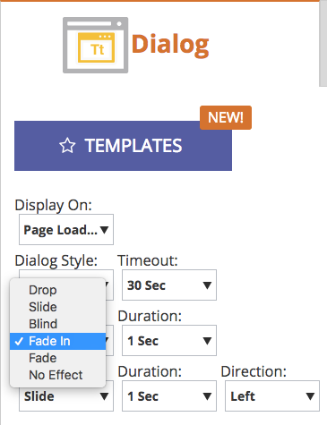

# 2017

## 2017년 겨울 {#winter}

다음 기능은 17년 겨울 릴리스에 포함되어 있습니다. Marketo 버전에서 사용 가능한 기능이 있는지 확인하십시오.

각 기능에 대한 자세한 문서를 보려면 제목 링크를 클릭하십시오.

>[!NOTE]
>
>한 주제에 여러 하위 머리글이 있는 경우 링크가 배치됩니다.

## [Facebook 사용자 지정 대상에 대한 고급 일치](/help/marketo/product-docs/demand-generation/ad-network-integrations/add-facebook-custom-audiences-as-a-launchpoint-service.md) {#advanced-matching-for-facebook-custom-audiences}

기본 일치는 이메일 주소만 사용하지만 새 고급 일치는 7개의 필드를 추가로 사용하므로 더 많은 전환을 위해 일치율이 높아집니다.

## [사용자 지정 개체 가져오기 API](https://developers.marketo.com/rest-api/lead-database/custom-objects/) {#custom-object-import-api}

이 API는 사용자 지정 개체를 Marketo으로 동기화하는 더 빠른 인터페이스를 제공합니다. CSV, TSV 또는 SSV 스프레드시트 파일을 사용자 지정 개체로 Marketo에 가져올 수 있습니다.

## [웹 Personalization 캠페인 내보내기](/help/marketo/product-docs/web-personalization/working-with-web-campaigns/export-web-campaign-data.md) {#web-personalization-campaigns-export}

모든 웹 캠페인 세부 정보 및 분석을 CSV 형식으로 내보냅니다. 그런 다음 데이터를 편리한 레이아웃으로 볼 수 있습니다.

## 로컬라이제이션 {#localization}

이제 웹 Personalization, [!UICONTROL Predictive Content] 및 이메일 인사이트 앱을 일본어, 독일어 및 스페인어로 사용할 수 있습니다. 해당 언어로 콘텐츠를 보려면 [언어 및 로케일을 선택하십시오](/help/marketo/product-docs/administration/settings/change-time-zone.md).

## 계정 기반 마케팅 개선 사항 {#account-based-marketing-enhancements}

**[명명된 계정 가져오기](/help/marketo/product-docs/target-account-management/target/named-accounts/import-named-accounts.md)**

[!UICONTROL Named Account] 가져오기 옵션을 사용하여 CSV 업로드를 통해 한 번에 여러 레코드를 만들거나 업데이트합니다.

**[이메일 인사이트 지원](/help/marketo/product-docs/reporting/email-insights/filtering-in-email-insights.md)**

[!UICONTROL Named Account] 또는 [!UICONTROL Account List]을(를) 전자 메일 통찰력의 차원으로 사용합니다.

## [!UICONTROL Predictive Content] 개선 사항 {#predictive-content-enhancements}

**[필터링 기준:[!UICONTROL Enabled Source]](/help/marketo/product-docs/predictive-content/working-with-predictive-content/understanding-predictive-content.md)**

[!UICONTROL Email], [!UICONTROL Rich Media] 또는 [!UICONTROL Recommendation Bar]에 대해 활성화된 [!UICONTROL Predictive Content]개 조각을 필터링합니다.

**[필터[!UICONTROL Analytics by Source]](/help/marketo/product-docs/predictive-content/working-with-predictive-content/understanding-predictive-content.md)**

특정 원본 [!UICONTROL Email], [!UICONTROL Rich Media] 또는 [!UICONTROL Recommendation Bar]에 대해 [!UICONTROL Predictive Content] 분석을 필터링합니다.

**[!UICONTROL Predictive Content]편집기**

콘텐츠 준비를 소스별로 분할하는 향상된 편집 환경과 레이아웃이 있습니다([!UICONTROL Email], [!UICONTROL Rich Media] 또는 [!UICONTROL Recommendation Bar]).

**[Predictive에 대한 자동 검색 콘텐츠](/help/marketo/product-docs/predictive-content/getting-started/enable-content-discovery.md)**

이제 이미지 URL 및 메타데이터가 콘텐츠 자동 검색 프로세스에서 사용됩니다.

## [SDK 개선 사항](https://developers.marketo.com/mobile/) {#sdk-enhancements}

이제 개발자는 개발자가 푸시 토큰을 제거할 수 있는 새로운 SDK API 호출의 추가로 푸시 알림 전달을 추가로 제어할 수 있습니다.

## SMS LaunchPoint 통합 보기

새로운 필터 옵션 &quot;Vibes 목록 멤버&quot;로 타깃팅을 개선합니다.

## [기존 서식 있는 텍스트 편집기 및 양식 편집기 1.0 사용 중단](https://nation.marketo.com/docs/DOC-4315) {#legacy-rich-text-editor-and-form-editor-deprecation}

2017년 8월 1일부터 기존 리치 텍스트 편집기 및 양식 편집기 1.0을 사용 중인 고객이 자동으로 새 경험으로 전환됩니다.

## [Marketo 활동 API](https://developers.marketo.com/blog/important-change-activity-records-marketo-apis/) {#marketo-activity-apis}

Marketo의 활동 API에 중요한 변화가 오고 있습니다. 준비됐니?

## 2017 봄 {#spring}

2017년 봄 릴리스에는 다음과 같은 기능이 포함되어 있습니다. Marketo 버전에서 사용 가능한 기능이 있는지 확인하십시오.

각 기능에 대한 자세한 문서를 보려면 제목 링크를 클릭하십시오. **참고**: 항목에 여러 개의 하위 제목이 있으면 해당 링크가 배치됩니다.

## [LinkedIn 리드 세대 Forms](/help/marketo/product-docs/demand-generation/social/social-functions/set-up-linkedin-lead-gen-forms.md) {#linkedin-lead-gen-forms}

[[!UICONTROL LinkedIn Lead Gen] Forms](https://business.linkedin.com/marketing-solutions/native-advertising/lead-gen-ads)은(는) 비즈니스에서 [!DNL LinkedIn]에 리드 생성 캠페인을 더 직접적으로 실행할 수 있는 방법입니다. 사람들은 제품이나 서비스에 관심을 표현하기 위해 양식을 작성할 수 있으며, 이를 통해 기업은 개인의 세부 정보를 캡처하고 이를 Marketo에 동기화하여 자동화된 후속 프로세스 및 잠재 고객 라우팅 활동이 발생할 수 있습니다.

[!UICONTROL LinkedIn Lead Gen] Forms과의 Marketo 통합은 잠재 고객이 제공한 정보를 잠재 고객 확보 양식 내에서 자동으로 캡처합니다. 그런 다음 새 **[!DNL LinkedIn Lead Gen] 양식 작성** 트리거 및 필터를 사용하여 후속 작업 및 알림을 자동화할 수 있습니다.

## [MSI 템플릿 만료](/help/marketo/product-docs/marketo-sales-insight/msi-for-salesforce/features/actions-in-the-msi-panel/send-marketo-email/publish-an-email-to-sales-insight.md) {#expire-msi-template}

[!DNL Sales Insight]에서 오래된 템플릿을 정리하던 시대는 지났습니다. 전자 메일을 게시할 때 만료 날짜를 설정하세요. 만료 날짜가 지나면 게시 취소됩니다.

>[!NOTE]
>
>만료 날짜를 5/31/17로 설정하면 해당 날짜가 끝나는 5/31/17에 [!DNL Sales Insight]에서 템플릿이 제거됩니다.

## [사람 및 활동에 대한 API 일괄 추출](https://developers.marketo.com/rest-api/bulk-extract/) {#bulk-extract-apis-for-people-and-activities}

대량의 개인 및 활동 데이터를 Marketo에서 외부 시스템으로 쉽게 전송할 수 있습니다.

## ABM 개선 사항 {#abm-enhancements}

**[ABM 명명된 계정의 사용자 지정 필드](https://docs.marketo.com/x/1wnG)**

이제 Marketo ABM을 사용하여 명명된 계정에 최대 10개의 사용자 지정 필드를 만들 수 있습니다. 이러한 사용자 지정 필드를 CRM 계정 개체의 필드에 매핑할 수 있으며 Marketo ABM에서 데이터를 동기화하여 ABM 명명된 계정을 확장하고 마케팅을 촉진할 수 있습니다.

**[ABM 명명된 계정에 대한 백분위수 점수](https://docs.marketo.com/display/docs/assets/abmpercentiles.png)**

명명 계정 점수는 크게 다를 수 있습니다. 이제 Marketo ABM에서 각 점수에 대해 백분위수를 자동으로 계산하므로 각 명명 계정이 다른 명명 계정 중 어디에 속하는지 한 눈에 볼 수 있습니다.

**[ABM 계정 목록 API](https://developers.marketo.com/rest-api/lead-database/named-account-lists/)**

명명된 계정 목록에 대한 향상된 API 지원과 함께 풍부하고 강력한 ABM 파트너 통합을 활용하십시오.

## 웹 Personalization 개선 사항 {#web-personalization-enhancements}

**[스크롤 시 웹 캠페인](/help/marketo/product-docs/web-personalization/working-with-web-campaigns/set-how-your-web-campaign-displays.md)**

새로운 웹 캠페인 효과는 웹 방문자에게 보다 개인화된 경험을 제공합니다. 웹 방문자가 웹 페이지에서 아래로 스크롤할 때만 표시하도록 개인화된 [!UICONTROL Web Campaigns]을(를) 설정하십시오. 다음을 기준으로 스크롤할 때 대화 상자 [!UICONTROL Web Campaigns]이(가) 표시되도록 설정할 수 있습니다.

* 스크롤된 페이지 비율
* 픽셀 도달
* 페이지 접힌 부분 아래로 스크롤

**[종료 시 웹 캠페인](/help/marketo/product-docs/web-personalization/working-with-web-campaigns/set-how-your-web-campaign-displays.md)**

방문자가 페이지를 닫기 전에 방문자의 관심을 사로잡습니다. 마우스 동작이 방문자가 페이지를 나가는 것을 나타낼 때만 표시하도록 개인화된 [!UICONTROL Web Campaigns]을(를) 설정하십시오.

[!UICONTROL Web Campaigns]](/help/marketo/product-docs/web-personalization/working-with-web-campaigns/create-a-new-dialog-web-campaign.md)**에 대한**[&#x200B;애니메이션 효과

웹 페이지를 입력하거나 종료할 때 캠페인이 표시되는 방식을 사용자 지정하려면 대화 상자 웹 캠페인에 대한 애니메이션 효과를 설정하십시오. 6가지 효과 중에서 선택하고 대화 상자의 타이밍과 방향을 제어할 수 있습니다.

**[대화 상자 닫기 단추 사용자 지정](/help/marketo/product-docs/web-personalization/working-with-web-campaigns/create-a-new-dialog-web-campaign.md)**

대화 상자의 닫기 단추를 사용자 지정합니다. 투명 대화 상자 스타일 [!UICONTROL Web Campaigns]에 사용되는 다양한 옵션 중에서 선택합니다. [닫기] 단추의 아이콘, 색상 및 위치를 선택합니다. 자신만의 버튼 이미지를 추가할 수도 있습니다.

**[웹 캠페인 보관](/help/marketo/product-docs/web-personalization/working-with-web-campaigns/archive-a-web-campaign.md)**

보관 은 [!UICONTROL Web Campaigns]을(를) 보관하고 기본 웹 캠페인 보기에서 숨길 수 있는 새로운 웹 캠페인 상태입니다. 이를 통해 가장 관련성이 높은 활성 캠페인에 집중할 수 있으며 오래된 아카이브 캠페인을 온디맨드로 검색할 수 있습니다.

**[로컬라이제이션](/help/marketo/product-docs/administration/settings/change-time-zone.md)**

Web Personalization은 이제 모든 Marketo 지원 언어(영어, 일본어, 독일어, 스페인어, 프랑스어 및 포르투갈어)로 제공됩니다.

## 예측 개선 사항 {#predictive-enhancements}

**[로컬라이제이션](/help/marketo/product-docs/administration/settings/change-time-zone.md)**

예측 콘텐츠는 이제 Marketo에서 지원하는 모든 언어(영어, 일본어, 독일어, 스페인어, 프랑스어 및 포르투갈어)로 제공됩니다.

## [기존 서식 있는 텍스트 편집기 및 양식 편집기 1.0 사용 중단](https://nation.marketo.com/docs/DOC-4315) {#legacy-rich-text-editor-and-form-editor-deprecation}

2017년 8월 1일부터 기존 리치 텍스트 편집기 및 양식 편집기 1.0을 사용 중인 고객이 자동으로 새 경험으로 전환됩니다.

## 2017 여름 {#summer}

다음 기능은 17년 여름 릴리스에 포함되어 있습니다. Marketo 버전에서 사용 가능한 기능이 있는지 확인하십시오.

각 기능에 대한 자세한 문서를 보려면 제목 링크를 클릭하십시오. 참고: 이 릴리스에 포함된 일부 기능에는 관련 문서가 없습니다. 한 주제에 여러 하위 머리글이 있는 경우 링크가 배치됩니다.

## [추가 Facebook 오프라인 전환 단계](/help/marketo/product-docs/demand-generation/facebook/set-up-facebook-offline-conversions.md) {#additional-facebook-offline-conversion-stages}

최대 7개의 추가 오프라인 전환 단계를 선택하여 Marketo 라이프사이클 단계(현재 사용 가능한 3단계 이상)에 매핑합니다. 고객 여정 간 전환을 기반으로 [!DNL Facebook] 광고 지출을 최적화하여 ROI를 개선합니다.

## [판매 Insight 템플릿 잠금](/help/marketo/product-docs/marketo-sales-insight/msi-for-salesforce/features/actions-in-the-msi-panel/send-marketo-email/lock-sales-template.md) {#lock-sales-insight-template}

판매 템플릿을 편집하지 않도록 하여 메시지 및 콘텐츠의 일관성을 보장합니다. 이를 통해 템플릿을 표준화하고 전문적인 커뮤니케이션을 유지할 수 있습니다.

## ABM 개선 사항 {#abm-enhancements}

**일본 회사 조회를 위한 데이터 Source**

현지 언어로 사람을 일본어 회사 이름과 일치시키십시오.

**[ABM 및 LeanData 통합](https://docs.marketo.com/x/pKmt)**

이제 [!DNL LeanData] 통합에서 Marketo의 리드-계정 일치를 허용합니다. 영업 및 마케팅 시스템 기록 내에서 계정과 연결된 동일한 리드를 확보하여 마케팅 및 판매를 정렬합니다. 보다 유연한 옵션을 통해 마케팅 및 판매 운영에서 리드-계정 일치 규칙을 보다 잘 제어할 수 있으므로 원하는 수준의 정밀도를 달성할 수 있습니다.

## 웹 Personalization 개선 사항 {#web-personalization-enhancements}

**[캠페인 미리 보기 개선 사항](/help/marketo/product-docs/web-personalization/working-with-web-campaigns/preview-and-test-a-web-campaign.md)**

이제 마케팅 담당자는 웹 캠페인이 출시되기 *전* 모든 장치에서 제대로 보이는지 확인할 수 있습니다. 이러한 향상된 기능을 통해 데스크탑, 모바일 디바이스 및 태블릿 간에 웹 캠페인이 어떻게 렌더링되는지 확인할 수 있습니다. [!DNL Chrome]의 새 플러그인은 보다 일관되고 정확한 미리 보기도 제공합니다.

**[위젯 캠페인 개선 사항](/help/marketo/product-docs/web-personalization/working-with-web-campaigns/create-a-new-widget-web-campaign.md)**

이제 다음을 포함하여 위젯 캠페인에 대한 새로운 옵션을 사용할 수 있습니다.

* 캠페인 트리거(지연, 스크롤)
* 캠페인 표시(화면 주변의 모든 위치)
* 확장/최소화 화살표를 모든 CTA 텍스트로 변경

## ContentAI {#contentai}

**[ContentAI 분석 및 제안](/help/marketo/product-docs/predictive-content/predictive-content-analytics-overview.md)**

심층적인 분석 및 AI 기반 콘텐츠 제안을 통해 콘텐츠 마케팅에 대한 수익률을 높여 참여를 높일 수 있습니다. 강력한 분석 기능은 인기, 트렌드 및 대상 기반 보기를 포함하여 권장 컨텐츠가 수행되는 방식을 보여 줍니다. 포함할 추가 콘텐츠에 대한 제안도 표시됩니다.

## Analytics {#analytics}

**[!UICONTROL Email Insights]개 개선 사항**

데이터를 준비하고 공유하는 새로운 방법을 통해 [!UICONTROL Email Insights] 경험에서 더 많은 것을 얻을 수 있습니다. 이제 [!UICONTROL Email Insights] 결과를 [!DNL Microsoft Excel] 및 [!DNL PowerPoint]&#x200B;(으)로 다운로드하여 Marketo 외부의 데이터로 작업할 수 있습니다.

## Federated ID 구성 지원 {#federated-identity-configuration-support}

클라우드에서 [!DNL Microsoft Dynamics] CRM을 계속 사용하는 동안 방화벽 온-프레미스에 인증(Active Directory)을 유지합니다.

## 2017년 가을 {#fall}

다음 기능은 17년 가을 릴리스에 포함되어 있습니다. Marketo 버전에서 사용 가능한 기능이 있는지 확인하십시오.

각 기능에 대한 자세한 문서를 보려면 제목 링크를 클릭하십시오. 참고: 이 릴리스에 포함된 일부 기능에는 관련 문서가 없습니다. 한 주제에 여러 하위 머리글이 있는 경우 링크가 배치됩니다.

## 시스템 안정성 {#system-reliability}

시퀀싱 개선, 불일치 감소, [!DNL Munchkin] 안정성 개선 등 핵심 Marketo 인프라에 대한 추가 개선 사항이 있습니다.

## SFDC 동기화 성능 {#sfdc-sync-performance}

Marketo 및 [!DNL Salesforce]에서 풍부하고 빠른 동기화를 활용하십시오. 계정이나 잠재 고객에 대한 대량 업데이트가 필요한 데이터 변경 사항은 병렬 대기열로 분할하여 백로그를 방지할 수 있습니다. 이제 이벤트와 작업도 최대 50% 더 빠르게 동기화됩니다.

## Analytics 성능 개선 {#analytics-performance-improvements}

최근의 인프라 개선 사항은 Marketo 보고 및 분석 도구 내에서 가동 시간과 안정성을 높여 애드혹 보고서를 보다 신속하게 작성할 수 있도록 해 줍니다.

## [받는 사람 시간대](/help/marketo/product-docs/email-marketing/email-programs/email-program-actions/scheduling-with-recipient-time-zone/understanding-recipient-time-zone.md) {#recipient-time-zone}

이제 이 새로운 기능을 사용하여 현지 시간대에 따라 이메일을 보류하고 게재할 수 있습니다. 수신자의 시간대에 이메일 및 참여 프로그램을 전달하도록 구성할 수 있으므로 여러 프로그램을 만들 필요가 없습니다. 한 번만 보내면 Marketo에서 올바른 현지 시간까지 이메일을 자동으로 유지합니다. 이메일 지표를 상승시키고, 로컬 사례를 관찰하며, 전 세계에 하나의 프로그램을 사용하여 시간을 절약할 수 있습니다.

>[!NOTE]
>
>아직 이메일 및 참여 프로그램에서 수신자 시간대를 활성화할 수 없다면 당황하지 마십시오! 모든 고객에게 이 기능을 점차 활성화하고 있습니다.

## [세그먼트별로 샘플 전자 메일 검토](/help/marketo/product-docs/email-marketing/general/creating-an-email/send-a-sample-email.md) {#review-sample-emails-by-segment}

Marketo에는 검토를 위해 샘플 이메일을 보낼 때 세그먼트를 선택하는 새로운 옵션이 있습니다. 더 이상 잠재 고객이 속한 세그먼트를 수동으로 확인할 필요가 없어 다이내믹 콘텐츠가 포함된 이메일을 다른 세그먼트로 더 쉽게 보낼 수 있습니다.

## [LinkedIn 리드 세대 사용자 지정 질문](/help/marketo/product-docs/demand-generation/social/social-functions/set-up-linkedin-lead-gen-forms.md) {#linkedin-lead-gen-custom-questions}

[!UICONTROL LinkedIn Lead Gen] 양식을 사용자 지정하여 사용자 지정 리드 특성을 수집하십시오. 이제 양식당 최대 3개의 사용자 정의 질문을 하고, 한 줄 텍스트 입력 또는 다중 선택 질문 중에서 선택하고, Marketo 리드 필드에 다시 매핑할 수 있습니다.

## Slack 통합 {#slack-integration}

새로운 Slack 통합의 일부로 다음 두 가지 기능이 릴리스되었습니다.

* 시스템 알림: 현재 캠페인 상태 및 즉각적인 주의가 필요한 문제에 대한 경고와 같은 Marketo 인스턴스의 중요한 이벤트에 대한 Slack 알림을 받습니다.
* 흥미로운 순간: Marketo Insight이 판매 계정의 알려진 개인에 의해 트리거되면 Slack을 통해 잠재 고객 소유자에게 알릴 수 있습니다. 알림에는 잠재 고객 정보와 판매 계정에 대한 세부 정보가 포함됩니다.

## ABM 개선 사항 {#abm-enhancements}

**[연락처가 없는 계정 표시](https://docs.marketo.com/x/fKCt)**

이제 Marketo ABM이 동기화되어 연락처 없이 CRM 계정을 표시합니다. 이전 판매 또는 마케팅 기록이 없는 새 계정을 포함하고 후속 리드를 계정에 대응시켜 진행 상황을 추적합니다.

## ContentAI 분석 {#contentai-analytics}

**[새 ABM 계정 목록 필터](https://docs.marketo.com/x/1BPG)**

ABM 계정 목록에서 컨텐츠 성능을 보고 비교하여 기존 컨텐츠를 최적화합니다. ContentAI는 다음을 보여줍니다.

* 조회한 상위 콘텐츠
* 상위 변환 콘텐츠
* 마케팅 활동을 위한 AI 기반 제안 콘텐츠

## 웹 Personalization 개선 사항 {#web-personalization-enhancements}

웹 캠페인용 토큰 **[개](/help/marketo/product-docs/web-personalization/working-with-web-campaigns/using-the-web-personalization-rich-text-editor.md)**

이제 웹 캠페인 내에서 토큰을 사용할 수 있습니다. 토큰을 활용하여 개인화된 메시지와 콘텐츠를 전달하여 웹 캠페인에 대한 참여도를 높일 수 있습니다.

**[웹 캠페인 편집기의 Studio 이미지 디자인](/help/marketo/product-docs/web-personalization/working-with-web-campaigns/using-the-web-personalization-rich-text-editor.md)**

Marketo 내의 여러 채널에서 크리에이티브 에셋 및 이미지를 재사용하여 시간을 절약할 수 있습니다.

## 통합  {#integration}

**[전자 메일 미리 보기 API](https://experienceleague.adobe.com/en/docs/marketo-developer/marketo/email-scripting)**

이제 Marketo 외부에서 이메일을 원격으로 미리 볼 수 있으므로 이메일 콘텐츠 현지화 프로세스를 단순화하고 오류를 줄일 수 있습니다.

**[HTML API 바꾸기](https://experienceleague.adobe.com/en/docs/marketo-developer/marketo/email-scripting)**

개발자는 이메일 에셋의 HTML 콘텐츠를 원격으로 업데이트할 수 있으므로 에셋을 유지 관리하기 위해 단일 시스템 내에서 작업할 수 있습니다.

## 4월 ABM 개선 사항 {#april-abm}

다음 기능은 2017년 4월 ABM 개선 릴리스에 포함되어 있습니다. Marketo 버전에서 사용 가능한 기능이 있는지 확인하십시오.

## CRM 매핑 표준 필드 동기화 {#synching-of-crm-mapped-standard-fields}

Marketo ABM이 CRM과 관련된 동작을 변경하고 있습니다. 앞으로 Marketo ABM은 ABM 계정과 CRM의 계정 간에 1 대 1 관계를 설정하고 유지합니다. 이렇게 하면 Marketo이 매핑된 계정 필드를 CRM과 동기화하도록 유지할 수 있습니다.

## CRM 검색을 위한 사용자 지정 필드 {#custom-fields-for-crm-discovery}

이제 계정에 사용자 지정 필드를 추가하고, CRM에 매핑하고, Marketo에서 CRM 계정 검색에 사용할 수 있습니다.

## 명명된 계정 그리드의 계정 기반 필터 {#account-based-filters-in-the-named-account-grid}

이제 계정 목록을 기반으로 명명 계정을 쉽게 필터링할 수 있습니다.

## 8월 ABM 개선 사항 {#august-abm}

다음 기능은 2017년 8월 ABM 개선 릴리스에 포함되어 있습니다. Marketo 버전에서 사용 가능한 기능이 있는지 확인하십시오.

각 기능에 대한 자세한 문서를 보려면 제목 링크를 클릭하십시오.

## [!DNL Account Insight] {#account-insight}

**[[!DNL Account Insight]](/help/marketo/product-docs/target-account-management/setup-tam/account-insight-plug-in-overview.md)**&#x200B;은(는) 실행 가능한 ABM과 계정 통찰력을 판매 팀에 제공하는 [!DNL Google Chrome] 플러그인으로, 마케팅 팀과 긴밀히 협력하여 계정을 효과적으로 참여시킬 수 있습니다. 영업 팀은 보유하고 있는 각 명명 계정에 대해 생성된 데이터와 통찰력을 확인할 수 있습니다. 여기에는 계정 점수 백분위, 명명된 계정의 우선 순위 목록, 해당 계정 내의 참여 사용자 및 계정의 최근 활동에 대한 라이브 활동 스트림이 포함됩니다.

 

## [동적 계정 목록](/help/marketo/product-docs/target-account-management/target/account-lists.md) {#dynamic-account-lists}

ABM에서 계정 목록을 만드는 새로운 방법을 추가하고 있습니다. 이제 기존 계정 목록 외에도 공개 CRM 계정 보기에서 생성된 동적 계정 목록을 만들 수 있습니다. CRM 계정 보기는 계정을 표시할 때 필터 역할을 하는 규칙 세트입니다. 예를 들어, 업종이 의료 분야인 _과(와)_ 매출액이 1억 달러 이상인 계정을 찾는 데 사용할 수 있습니다.

